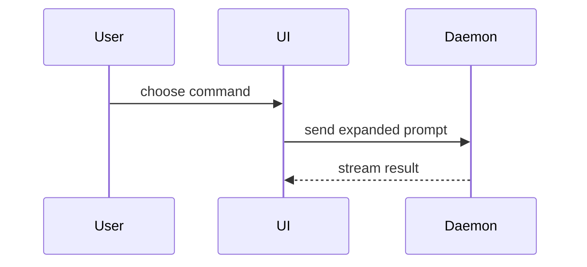

Use this template for writing the PR body:

```markdown
## Summary

<one sentence on why>

<diagram, diff-sketch, or tree>

## Evidence

**Before:** <one line on the old behavior, or the failing test>
**After:** <screenshot, video, or passing test>

**Verified live:** <what was exercised, against what>

## Merge Danger

**Door:** <one-way or two-way>

<optional: description>

**Impact:** <one-word description>

<optional: potential ramifications of merge>

## Related

- Closes #123
- Related to #456
```

## Sections

Skip all preambles and keep prose brief. Use the domain language from `GLOSSARY.md` when present. Scale depth to diff size: a 3-line fix gets a sentence and a danger line, a 20-file feature gets the full set. Describe the **final diff** against the target branch, not the commit-by-commit journey.

### Summary

Open with one sentence on why: the problem or goal. If the session context cannot explain why, pause and ask the user.

Then pick the smallest view that makes the key point clear.

- Show logic or an algorithm as pseudocode:

```text
on(save)
  if content is unchanged
    return cached result
  write new content
  return fresh result
```

- Show runtime control flow as a call tree:

```text
submitForm
  createSession
    persistPrompt
    launchAgent
  navigateToSession
```

- Show UI structure as a component tree, including state and module boundaries that matter:

```text
<SessionPage> (apps/example/src/routes/session.tsx)
  useSessionEvents()
  <SessionToolbar>
    <RunSkillButton> (packages/ui)
```

- Show file responsibility or a broad refactor as a shallow file tree:

```text
src/
├── commands/       # parses user actions
├── sessions/       # owns session state
└── transport/      # sends API requests
```

- Show component interaction, control flow, or data flow with Mermaid:



- Use `diff` when the point is what changes and the surrounding shape already exists. Match the diff shape to the topic.

For a component change:

```diff
 <SessionPage>
   useSessionEvents()
   <SessionToolbar>
+    <RunSkillButton />
   <SessionTimeline>
+    <SkillResultCard />
```

For a file-layout change:

```diff
 src/
 ├── commands/
+│   └── show-me.ts       # expands the slash command
 ├── sessions/
-└── transport.ts
+└── transport/
+    ├── client.ts
+    └── stream.ts
```

For a call-tree or call-stack change:

```diff
 submitForm
   createSession
     persistPrompt
+    expandSkillMention
     launchAgent
-  navigateToSession
+  navigateToSession
+    subscribeToEvents
```

For a state or control-flow change:

```diff
 on(save)
-  write content
+  if content is unchanged
+    return cached result
+  write new content
+  invalidate cache
```

- Show the whole block when most of it is new, when omitted context would hide ownership or order, or when the reader needs a copyable target shape:

```ts
function expandSkill(command: string): string {
  const skillName = command.slice(1);
  return `use the ${skillName} skill`;
}
```

#### Guidance

Place each visual next to the short text it supports. Keep only the calls, files, props, states, and boundaries a reviewer needs to follow the change.

You may use one of these, you may use several, it is unlikely you will use all of them. Use your judgement and don't overwhelm the reader.

### Evidence

Concrete evidence that this change works. Before is one line on the old behavior.

- **Screenshots are S-tier.** When the diff changes anything a user can see in the UI, including behavior that shows through the UI, the After is a screenshot, or a video when the point is an interaction or motion. Done when every UI-visible change has an After. Capture them with the session's browser tooling; when there is none, ask the user for the files. See [references/evidence.md](references/evidence.md) for attaching them.
- **Execution-based evidence is A-tier.** Show the exact test that failed before and passes now, using pseudocode, or the console output that changed.
- **Verified live**: when this session exercised the change by hand, such as clicking through it in a browser or running it against a real database or service, name what was exercised and against what. Omit the line when nothing ran live.

Evidence is specific to this change. CI reports the suite, lint, and typecheck.

Omit the section when there is nothing observable to show, such as docs or a pure refactor.

### Merge Danger

Describe whether it's a one-way or two-way door. You can walk back through two-way doors, but not one-way doors. A PR that is cheap to roll back is lower risk. Changes that involve destructive actions or hard-to-reverse decisions are one-way doors.

The impact is the potential scope of the changes introduced by this PR. Consider all possibilities. Examples are layout shift, breakage for consumers, data or migration impact, mobile responsiveness. Add a line of ramifications only when they are not obvious.

### Related

The classified issues from step 3 as a bulleted list, required for GitHub's title expansion. Omit the section when there are none.

### Redaction

Never mention these in the title or body, Merge Danger included:

- Security fixes, CVEs, CWEs, or how an issue is triggered. Frame impact as consumer breakage, data or migration impact, or rollback cost.
- Secrets, API keys, tokens.
- PII (personally identifiable information): names of real users, email addresses, phone numbers, physical addresses, IP addresses, account IDs, or any data that could identify a specific person.

## Workflow

Requires the `gh` CLI, installed and authenticated. If missing, stop and tell the user.

### 1. Pre-flight checks

1. **Target branch**: `gh repo view --json defaultBranchRef -q .defaultBranchRef.name`. Refuse if the current branch is the target branch.
2. **Uncommitted changes**: Run `git status --porcelain`. If dirty, show the user what's uncommitted and ask whether to commit or abort.
3. **Remote**: Use the branch's upstream tracking remote if set, otherwise default to `origin`.
4. **Branch name**: when `/language-rules` is available, screen the branch name with it now. The name goes public the moment step 2 runs and stays in the remote's reflog and in any notification sent after a delete. Rename with `git branch -m <new-name>` when it needs one. When an earlier run already pushed the flagged name, say so and let the user choose: delete the remote branch and push the new name, or accept that the old one stays.

### 2. Push

Push the branch to the remote. Use `git push -u <remote> HEAD`.

### 3. Search backlog for related issues

Determine the tracker from `docs/agents/issue-tracker.md` if present; otherwise use whatever issue tooling is available (e.g., `gh`, an MCP server).

Gather issue references from two sources:

1. **Explicit references** — scan commit messages and branch name for issue references (e.g., `#<number>`).
2. **Backlog search** — extract 2–4 keywords from the diff (changed module names, feature area, error being fixed) and search open issues. Run multiple searches if the diff spans unrelated areas. Include recently closed issues if the diff is a follow-up fix.

**Completion criterion**: every issue that a reviewer would say "this is related" has been found. Err toward inclusion — a spurious "Related to" link is cheap; a missing "Closes" leaves an issue open.

Classify each found issue:
- **Closes** — this PR fully resolves the issue.
- **Related to** — the PR touches the same area or partially addresses it.

Discard issues that share only surface keywords but describe unrelated work.

### 4. Write the PR

**Title**: Generate from the diff — concise, imperative mood. Apply a conventional prefix only when `CONTRIBUTING.md` or recent merged PR titles use one.

**Body**: the template above. Capture every screenshot and video now, saved outside the repo, since they upload in step 6.

### 5. Screen

When `/language-rules` is available, apply it to the title, body, and every screenshot and video. These are written from session context, so a ticket id, a doc name, or a system name can reach them without ever appearing in the code. The why sentence and the Related lines are the likeliest places.

- Rewrite replaceable terms on the spot.
- A term quoted from the diff stays, since the text describes code that already carries it. Name it once as separate diff cleanup and keep publishing.
- When a reference is load-bearing and has no public form, show the user the sentence and ask.
- Open each screenshot, and the screens each video passes through, and check the browser chrome and page content for hostnames, account ids, aliases, and ticket ids. Retake or crop rather than attach.

Show the final title and body, separated from your own text by horizontal rules, with any screening changes called out in one line.

### 6. Publish

Create the PR once, open for review, with the final body. Screenshots and video upload in this same call with `--attach`.

```bash
gh pr create --title "<title>" --body "<body>" --base <target-branch> \
  --attach './after.png#After'
```

No labels, reviewers, or assignees. Print the PR URL when done.
