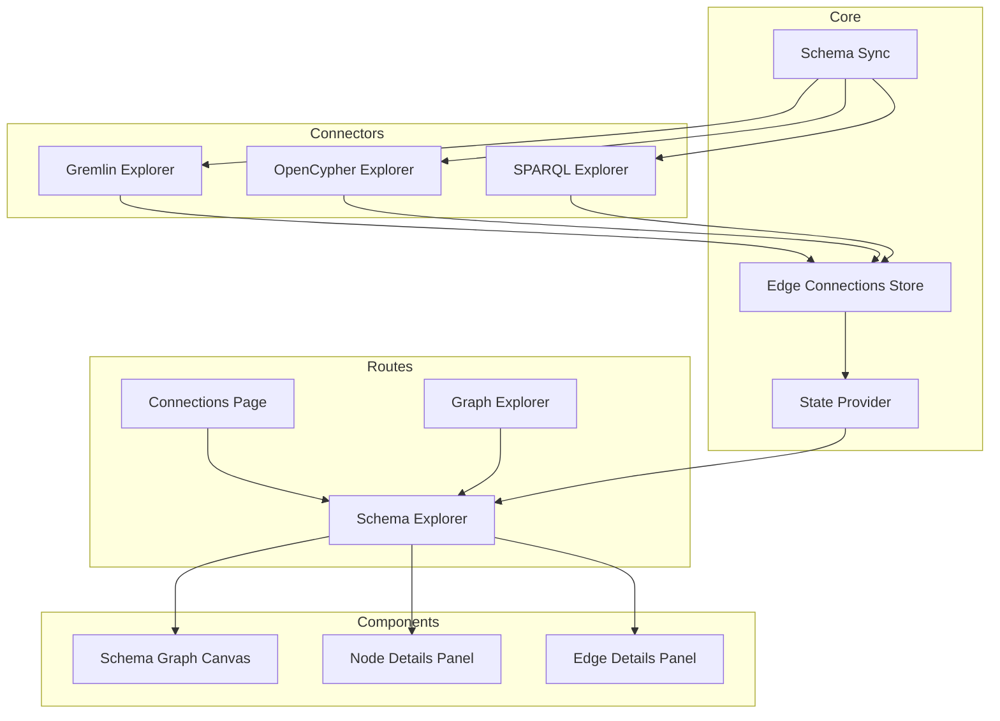

# Schema Explorer Design Document

## Overview

The Schema Explorer is a new route in Graph Explorer that visualizes the
database schema as an interactive graph. Node labels from the schema become
nodes in the visualization, and edge types become edges connecting those nodes.
This provides users with an intuitive way to understand their graph database
structure without writing queries.

The feature requires:

1. A new route (`/schema-explorer`) with navigation from existing pages
2. Enhancement to schema sync to discover edge connections (source label → edge
   type → target label)
3. A graph canvas component similar to Graph Explorer but displaying schema data
4. Details panels for viewing node label and edge type information

## Architecture



## Components and Interfaces

### New Route: SchemaExplorer

Location: `packages/graph-explorer/src/routes/SchemaExplorer/`

```typescript
// SchemaExplorer.tsx - Main route component
interface SchemaExplorerProps {
  // No props - uses context for configuration
}

// Renders:
// - NavBar with navigation back to connections/graph explorer
// - Schema graph canvas
// - Details sidebar (node or edge details based on selection)
```

### Schema Graph Module

Location: `packages/graph-explorer/src/modules/SchemaGraph/`

```typescript
// SchemaGraph.tsx - Graph canvas for schema visualization
interface SchemaGraphProps {
  // No props - derives data from schema in context
}

// Transforms schema data into graph nodes and edges:
// - Each VertexTypeConfig becomes a node
// - Each EdgeConnection becomes an edge
```

### Edge Connection Types

Location: `packages/graph-explorer/src/core/ConfigurationProvider/types.ts`

```typescript
// New type for edge connections discovered during schema sync
interface EdgeConnection {
  /** The edge type name */
  edgeType: string;
  /** The source node label */
  sourceLabel: string;
  /** The target node label */
  targetLabel: string;
  /** Optional count of edges with this connection pattern */
  count?: number;
}

// Extended Schema type
interface Schema {
  // ... existing fields
  /** Edge connections discovered during schema sync */
  edgeConnections?: EdgeConnection[];
}
```

### Schema Response Extension

Location: `packages/graph-explorer/src/connector/useGEFetchTypes.ts`

```typescript
// Extended SchemaResponse to include edge connections
interface SchemaResponse {
  // ... existing fields
  /** Edge connections between node labels */
  edgeConnections?: EdgeConnection[];
}
```

### Details Panels

Location: `packages/graph-explorer/src/modules/SchemaGraph/`

```typescript
// NodeLabelDetails.tsx
interface NodeLabelDetailsProps {
  nodeLabel: string;
}

// EdgeTypeDetails.tsx
interface EdgeTypeDetailsProps {
  edgeType: string;
  sourceLabel: string;
  targetLabel: string;
}
```

## Data Models

### Schema Graph Node

Represents a node label in the schema graph:

```typescript
interface SchemaGraphNode {
  id: string; // Node label name (unique identifier)
  label: string; // Display label
  type: string; // Node label type
  attributes: AttributeConfig[];
  total?: number; // Count of nodes of this type
  color?: string; // Configured color
  iconUrl?: string; // Configured icon
}
```

### Schema Graph Edge

Represents an edge connection in the schema graph:

```typescript
interface SchemaGraphEdge {
  id: string; // Unique ID: `${sourceLabel}-${edgeType}-${targetLabel}`
  source: string; // Source node label
  target: string; // Target node label
  type: string; // Edge type name
  label: string; // Display label for the edge
  attributes: AttributeConfig[];
  total?: number; // Count of edges of this type
}
```

### Edge Connection Discovery Queries

#### Multi-Label Node Handling

Nodes in graph databases can have multiple labels/types:

- **Neptune Gremlin**: Multiple labels stored as a single string separated by
  `::`
- **OpenCypher**: Labels returned as an array
- **RDF/SPARQL**: Multiple `rdf:type` triples for a resource

For the schema explorer, we need to handle these cases:

1. Parse multi-label strings (Gremlin `::` separator)
2. Handle label arrays (OpenCypher)
3. Query all type combinations (SPARQL)

The edge connection discovery will create connections for each label
combination, meaning a node with labels `[A, B]` connected to a node with labels
`[C]` via edge type `E` will produce connections: `A-E->C` and `B-E->C`.

#### Gremlin Query

Neptune Gremlin stores multiple labels as `::` separated strings. We need to
handle this in the response parsing.

```groovy
g.E().groupCount().by(
  project('source', 'edge', 'target')
    .by(outV().label())
    .by(label())
    .by(inV().label())
)
```

Response parsing must split labels by `::` and create edge connections for each
label combination.

#### OpenCypher Query

OpenCypher returns labels as arrays. We query all labels and handle combinations
in the response.

```cypher
MATCH (source)-[edge]->(target)
RETURN labels(source) AS sourceLabels,
       type(edge) AS edgeType,
       labels(target) AS targetLabels,
       count(*) AS count
```

Response parsing creates edge connections for each combination of source and
target labels.

#### SPARQL Query

SPARQL resources can have multiple `rdf:type` triples. We query all type
combinations.

```sparql
SELECT DISTINCT ?sourceType ?predicate ?targetType (COUNT(*) AS ?count)
WHERE {
  ?source a ?sourceType .
  ?source ?predicate ?target .
  ?target a ?targetType .
  FILTER(?predicate != rdf:type)
}
GROUP BY ?sourceType ?predicate ?targetType
```

Each source-predicate-target type combination becomes a separate edge
connection.

## Correctness Properties

_A property is a characteristic or behavior that should hold true across all
valid executions of a system-essentially, a formal statement about what the
system should do. Properties serve as the bridge between human-readable
specifications and machine-verifiable correctness guarantees._

### Property Reflection

After analyzing the prework, the following properties were identified as
redundant or combinable:

- Properties 3.2 and 3.3 (node details attributes and count) can be combined
  into a single property about node details completeness
- Properties 7.2, 7.3, 7.4, and 7.5 (edge details fields) can be combined into a
  single property about edge details completeness
- Properties 5.4 and 5.5 (serialization/deserialization) form a round-trip
  property

### Property 1: Schema nodes match node labels

_For any_ schema with N vertex type configurations, the schema graph SHALL
display exactly N nodes, one for each vertex type.

**Validates: Requirements 2.1**

### Property 2: Node display labels are applied

_For any_ vertex type configuration with a display label, the corresponding
schema graph node SHALL display that configured display label.

**Validates: Requirements 2.2**

### Property 3: Node details show all attributes and count

_For any_ selected node label with attributes and a total count, the details
panel SHALL display all attribute names with their data types and the total
count.

**Validates: Requirements 3.2, 3.3**

### Property 4: Schema edges match edge connections

_For any_ schema with edge connections, the schema graph SHALL display an edge
for each unique edge connection (source label, edge type, target label
combination).

**Validates: Requirements 4.1, 4.2**

### Property 5: Multiple edge types between same labels

_For any_ pair of node labels with N distinct edge types connecting them, the
schema graph SHALL display N separate edges between those node labels.

**Validates: Requirements 4.3**

### Property 6: Edge connection discovery extracts correct data

_For any_ edge in the database, the edge connection discovery SHALL correctly
identify and return the source node label, edge type, and target node label.

**Validates: Requirements 5.2**

### Property 6a: Multi-label edge connections are expanded

_For any_ edge connecting a source node with M labels to a target node with N
labels, the edge connection discovery SHALL produce M × N edge connections, one
for each combination of source and target labels.

**Validates: Requirements 5.2**

### Property 7: Edge connections are stored in schema

_For any_ set of discovered edge connections, all connections SHALL be stored in
the schema data structure and accessible for rendering.

**Validates: Requirements 5.3**

### Property 8: Edge connection serialization round-trip

_For any_ schema with edge connections, serializing and then deserializing the
schema SHALL preserve all edge connection data (source label, edge type, target
label, count).

**Validates: Requirements 5.4, 5.5**

### Property 9: Edge details show complete information

_For any_ selected edge in the schema graph, the details panel SHALL display the
edge type name, source node label, target node label, all attributes with data
types, and total count (if available).

**Validates: Requirements 7.2, 7.3, 7.4, 7.5**

## Error Handling

### No Active Connection

When no active connection exists:

- Redirect to connections page
- Display toast notification explaining the redirect

### Schema Sync Failure

When schema sync fails:

- Display error state with message
- Provide "Retry" button to re-trigger schema sync
- Log error details for debugging

### Empty Schema

When schema has no node labels:

- Display empty state with helpful message
- Suggest checking connection or running schema sync

### Partial Schema (No Edge Connections)

When schema has node labels but no edge connections:

- Display nodes without edges
- Show informational message that no relationships were discovered

### Edge Connection Query Failure

When edge connection discovery fails but vertex/edge schema succeeds:

- Continue with partial schema (nodes only)
- Log warning about missing edge connections
- Display informational message in UI

## Testing Strategy

### Dual Testing Approach

This feature requires both unit tests and property-based tests:

- **Unit tests**: Verify specific examples, edge cases, and integration points
- **Property-based tests**: Verify universal properties that should hold across
  all inputs

### Property-Based Testing Library

Use **fast-check** for property-based testing in TypeScript/JavaScript.

Configure each property-based test to run a minimum of 100 iterations.

### Test Annotations

Each property-based test MUST be tagged with a comment explicitly referencing
the correctness property:

- Format: `**Feature: schema-explorer, Property {number}: {property_text}**`

### Unit Test Coverage

1. **Route Tests**
   - Navigation links render correctly
   - Route redirects when no connection
   - Route renders schema graph when connection exists

2. **Schema Graph Tests**
   - Transforms vertex type configs to graph nodes
   - Transforms edge connections to graph edges
   - Handles empty schema
   - Handles schema with no edge connections

3. **Details Panel Tests**
   - Node details display correct information
   - Edge details display correct information
   - Panels show/hide based on selection

4. **Edge Connection Discovery Tests**
   - Gremlin query returns correct format
   - OpenCypher query returns correct format
   - SPARQL query returns correct format
   - Handles empty results
   - Handles query errors

### Property-Based Test Coverage

1. **Schema to Graph Transformation**
   - Property 1: Node count matches vertex type count
   - Property 2: Display labels are applied
   - Property 4: Edge count matches edge connection count
   - Property 5: Multiple edges between same labels

2. **Edge Connection Discovery**
   - Property 6: Correct extraction of source, type, target

3. **Data Persistence**
   - Property 8: Serialization round-trip

4. **Details Panel Content**
   - Property 3: Node details completeness
   - Property 9: Edge details completeness

### Test Data Generation

Use existing test utilities:

- `createRandomVertexTypeConfig()` for generating vertex type configs
- `createRandomEdgeTypeConfig()` for generating edge type configs
- Create new `createRandomEdgeConnection()` for edge connection test data

```typescript
// New test utility
function createRandomEdgeConnection(): EdgeConnection {
  return {
    edgeType: createRandomName("edgeType"),
    sourceLabel: createRandomName("sourceLabel"),
    targetLabel: createRandomName("targetLabel"),
    count: createRandomInteger(1, 1000),
  };
}
```
