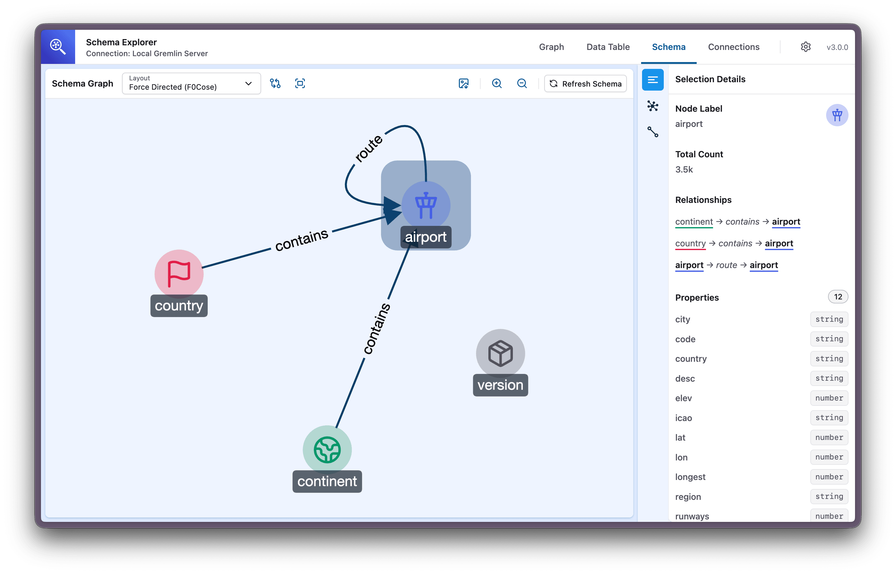
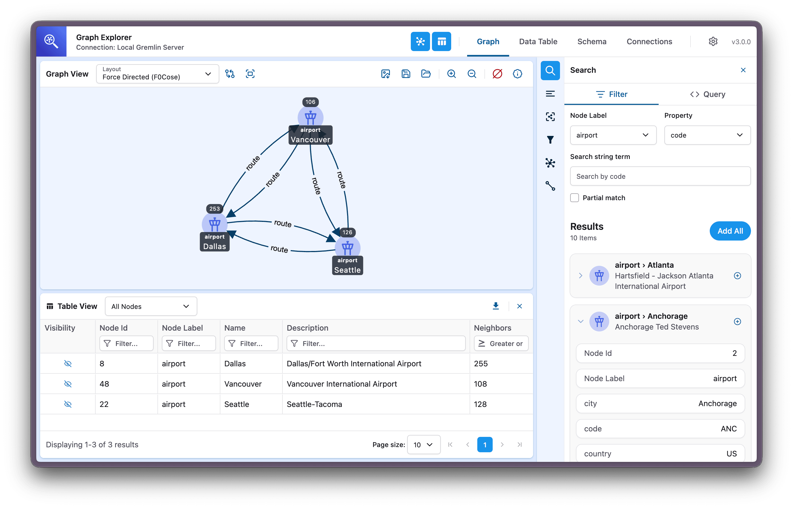
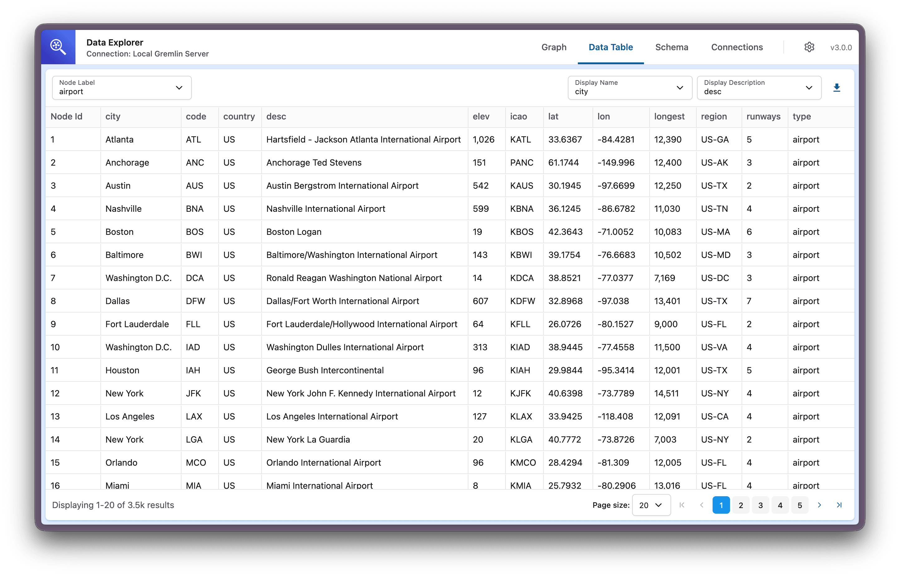

# Graph Explorer Change Log

## Release 3.3.0

Connecting to your database should be the easy part, and for a long time it wasn't. You had to tell Graph Explorer where its own server lived, tick a "Using Proxy-Server" checkbox that never explained itself, and make sure two different URLs lined up. Release 3.3.0 removes all of that. Graph Explorer now finds its own server, so a new connection is just a name, a database URL, and a query language.

The rest of the release builds on that. Other tools can now send you a link that opens Graph Explorer already pointed at your data. One Docker image serves every deployment, SageMaker notebooks included. Edge discovery finishes on the largest Neptune graphs, and error messages now tell you what went wrong and what to do about it.

### Simpler Connections

- **No more proxy endpoint.** The "Public or Proxy Endpoint" field and the "Using Proxy-Server" checkbox are gone. The "Graph Connection URL" field is now called Database URL, and it's the only address you enter. Your existing connections carry over unchanged.
- **Choose how you connect.** Two cards make the choice plain. **Through the Graph Explorer server** is recommended for every database, including Amazon Neptune. **Directly from your browser** is for databases that accept queries from web pages, such as a public SPARQL endpoint. AWS IAM authentication sits below the cards and works with the server option.
- **Advanced options out of the way.** The fetch timeout and neighbor expansion limit now live in a collapsible Advanced options section, with names and descriptions that say what each one does. If a connection already overrides one of them, the section opens on its own so nothing is hidden.
- **Any query language for Neptune Analytics.** Choosing Neptune Analytics used to force openCypher, and unchecking IAM hid the control that caused it, leaving no way to undo it. The service type and query language are now independent.
- **Direct connections to Gremlin Server.** These now work. Before, Gremlin Server turned away the browser's preflight check, so the query was never sent and schema sync failed.
- **Exports that older versions can read.** Connection files you export from 3.3.0 import into older versions of Graph Explorer, so you can share them with teammates who haven't upgraded yet.

### Connection Links

If you build tools around your graph, you can now hand people a link that opens Graph Explorer already pointed at the right database. Nobody has to copy URLs or walk through the connection form.

```
https://<graph-explorer-host>/explorer/#/connect?graphDbUrl=https%3A%2F%2Fmy-cluster.us-east-1.neptune.amazonaws.com%3A8182&queryEngine=gremlin&awsRegion=us-east-1&serviceType=neptune-db&name=My%20Database
```

- **It matches what you have.** If the link matches an existing connection, Graph Explorer switches to it.
- **It asks before adding.** If nothing matches, a prefilled connection form opens. Nothing is saved until you click Add Connection.
- **It explains what's wrong.** If a parameter is invalid, a card lists each problem and the link is ignored.

See [Connection Links](docs/features/connections.md#connection-links) for the parameters and matching rules.

### One Docker Image

There used to be two Docker images, one for SageMaker notebooks and one for everything else. Now there's one.

- **One image for every deployment.** The same image serves standalone, SageMaker, and reverse proxy deployments at any path prefix, with no build-time configuration. The `sagemaker-*` tags are still published as aliases of the standard image.
- **A runtime notebook preset.** `NEPTUNE_NOTEBOOK=true` now sets port 9250, CloudWatch logs, and HTTP when the container starts.
- **Reverse proxies keep you in the app.** Behind a path prefix, visiting `/explorer` without a trailing slash no longer redirects you to the proxy's root.

### Large Graphs

Release 3.2.2 was about scale, and this release keeps going.

- **Edge discovery that finishes.** A Gremlin graph with three edge types and nearly 20 million edges used to run Neptune out of memory in about 30 seconds. Each edge type is now sampled with its own limit, 10 types per request.
- **No wasted requests.** When one schema sync request fails, Graph Explorer stops sending the rest of the batch.
- **Pickers that keep up.** The node type and attribute pickers in the Data Explorer and the search sidebar open instantly on schemas with thousands of types, and filter as you type (thanks @mjuarros!).

### Layouts Per Tab

Release 3.2.0 gave each browser tab its own connection. Layouts now follow the same rule.

- **Each tab keeps its own layout.** Graph View and Schema View layouts, such as the active sidebar tab and its width, belong to the tab you set them in, so one tab no longer overwrites another's. A new tab starts from the layout you used most recently.
- **The Schema View remembers your layout algorithm** (thanks @mjuarros!).

### Proxy Server Safeguards

The proxy server sits between your browser and your database, so it checks where it sends requests and says what it's doing.

- **Link-local addresses are refused.** The proxy server refuses database URLs whose host is a link-local address, whether or not an allowlist is set.
- **Credentials in URLs are rejected.** Database URLs that contain a username or password never worked. They now fail up front with a clear error.
- **The allowlist is easier to find.** The first time the proxy server signs a request with IAM and no `PROXY_SERVER_ALLOWED_DB_ORIGINS` is set, it logs a warning. A request to an origin outside the allowlist now gets an error that names the setting.
- **Startup problems say why.** The container refuses to start, and explains itself, when `NEPTUNE_NOTEBOOK` and `PROXY_SERVER_HTTPS_CONNECTION` are both true, or when it can't write to its configuration folder. Before, these failed with a misleading error.
- **Invalid settings name the fix.** An invalid boolean environment variable now lists the accepted values.

### Clearer Error Messages

An error message is only useful if it points you toward the fix.

- **Two kinds of timeout.** A fetch timeout and a database query timeout now show different messages, "Fetch timeout exceeded" and "Database query timed out", because you fix one in the connection and the other in the database.
- **Unreachable databases.** An unresolvable hostname or a timed-out connection through the proxy server now shows "Database unreachable" instead of a generic "Network Response 500".
- **Direct connection failures.** A direct connection that fails shows "Database not reachable from the browser" or "Insecure database URL", along with what to change.
- **Cancel means cancel.** Cancelling a query no longer brings back the previous query's error.

### Bug Fixes

- Non-square custom icons now scale to fit instead of being stretched into a square (thanks @mjuarros!).
- The code viewer no longer appears with a white theme the first time it opens (thanks @mjuarros!).
- URLs in the error details and raw response viewers are no longer clickable links (thanks @mjuarros!).
- Error details no longer fail to render in browsers that lack `Error.isError` (thanks @mjuarros!).
- The Graph View and Data Explorer show "Connection: none" instead of "Connection: undefined" when no connection is active.

### Documentation

Graph Explorer has no sign-in of its own, so the docs now put access control up front.

- **Access control comes first.** The security reference opens with a new [Access Control](docs/references/security.md#access-control) section. Graph Explorer performs no authentication or authorization, so never make it publicly reachable without an access control layer in front of it. Every deployment guide now says so.
- **Guidance for self-hosted databases.** New sections cover [self-hosted Gremlin Server](docs/references/security.md#self-hosted-gremlin-server) and using the [Database Origin Allowlist](docs/references/security.md#database-origin-allowlist) on hosts with AWS credentials.
- **Tighter deployment guides.** The EC2, ECS, Docker, and SageMaker guides now restrict who can reach the container. The sample SageMaker lifecycle script binds to loopback and sets the allowlist to the notebook's cluster.
- **A styled sample.** The air_routes sample now includes a styles file and a styling reference, so you can see styling at work right away (thanks @mjuarros!).

### Upgrade Notes

Existing deployments need no configuration change. `PUBLIC_OR_PROXY_ENDPOINT` and `USING_PROXY_SERVER` are still honored. A few things do behave differently:

- **The Graph Explorer server must serve the UI.** Graph Explorer finds its server at the parent of its own `/explorer` path, so hosting the UI on a different origin from the proxy server no longer works. A reverse proxy must forward the `/explorer` segment intact; renaming it shows "Reverse proxy misconfigured".
- **The `sagemaker-*` tags no longer bake in notebook defaults.** Pass `NEPTUNE_NOTEBOOK=true` to keep port 9250 and CloudWatch logs. The SageMaker lifecycle script already does. On the standard image, `NEPTUNE_NOTEBOOK=true` now applies the same preset, so set `PROXY_SERVER_HTTP_PORT` if you want a different port.
- **Downgrading after editing connections isn't supported.** Older versions can't read the new stored connection shape. Exported connection files still import into older versions.
- **Remote icon URLs are no longer supported.** A stored icon that isn't a built-in icon or an uploaded image falls back to the default icon.
- **Minimum browser versions** are now Chrome and Edge 123, Firefox 124, and Safari 17.4.
- **The proxy server's `/gremlin` route reads `gremlin` from the request body instead of `query`.** Reload any browser tab left open across the upgrade. Anything else that posts to this route needs the same change.

### All Changes

- Make safeSessionStorage fallback test independent of Node version by @mjuarros in https://github.com/aws/graph-explorer/pull/2148
- Update dependencies and base image by @kmcginnes in https://github.com/aws/graph-explorer/pull/2156
- Add sample styles file and documentation for air_routes sample by @mjuarros in https://github.com/aws/graph-explorer/pull/2132
- Upgrade the Oxc toolchain and resolve #2150 lint findings by @mjuarros in https://github.com/aws/graph-explorer/pull/2162
- Move core-js to production dependencies by @mjuarros in https://github.com/aws/graph-explorer/pull/2167
- Apply the Monaco theme before the editor mounts by @mjuarros in https://github.com/aws/graph-explorer/pull/2133
- Bump base image and trim the Docker build context by @kmcginnes in https://github.com/aws/graph-explorer/pull/2183
- Update pnpm to 12.4.2 by @kmcginnes in https://github.com/aws/graph-explorer/pull/2178
- Update Vitest to version 5 by @mjuarros in https://github.com/aws/graph-explorer/pull/2166
- Update jotai to 3 by @mjuarros in https://github.com/aws/graph-explorer/pull/2175
- Disable Monaco link detection in code viewers by @mjuarros in https://github.com/aws/graph-explorer/pull/2189
- Virtualized Combobox component and keyword-search node-type picker migration by @mjuarros in https://github.com/aws/graph-explorer/pull/2131
- Dedupe the lockfile and fail CI on drift by @mjuarros in https://github.com/aws/graph-explorer/pull/2205
- Add Dependabot configuration for docker, GitHub Actions, and npm by @mjuarros in https://github.com/aws/graph-explorer/pull/2206
- Bump vitest from 5.0.0 to 5.0.1 in the vitest group by @dependabot[bot] in https://github.com/aws/graph-explorer/pull/2208
- Bump amazonlinux/amazonlinux from 2023.12.20260914.0 to 2023.12.20260918.0 by @dependabot[bot] in https://github.com/aws/graph-explorer/pull/2207
- Bump the actions group with 7 updates by @dependabot[bot] in https://github.com/aws/graph-explorer/pull/2210
- Bump dotenv from 17.4.2 to 18.0.1 by @dependabot[bot] in https://github.com/aws/graph-explorer/pull/2215
- Remove unused https dependency from the proxy server by @danielvanza in https://github.com/aws/graph-explorer/pull/2197
- Remove unused Babel preset devDependencies by @kmcginnes in https://github.com/aws/graph-explorer/pull/2229
- Stop flaky assertions in proxy server and schema sync tests by @kmcginnes in https://github.com/aws/graph-explorer/pull/2220
- Stop Dependabot reopening the @babel/core major bump by @kmcginnes in https://github.com/aws/graph-explorer/pull/2230
- Remove unused dependencies by @kmcginnes in https://github.com/aws/graph-explorer/pull/2231
- Move babel-plugin-react-compiler to devDependencies by @kmcginnes in https://github.com/aws/graph-explorer/pull/2232
- Replace Error.isError with instanceof Error in createErrorDetails by @mjuarros in https://github.com/aws/graph-explorer/pull/2192
- Ignore @types/node majors and cva bumps in Dependabot by @kmcginnes in https://github.com/aws/graph-explorer/pull/2238
- Share one test environment factory across the proxy server tests by @kmcginnes in https://github.com/aws/graph-explorer/pull/2248
- Bump the minor-and-patch group across 1 directory with 24 updates by @dependabot[bot] in https://github.com/aws/graph-explorer/pull/2241
- Exclude local secrets and build output from Docker build context by @kmcginnes in https://github.com/aws/graph-explorer/pull/2243
- Reject database URLs carrying embedded credentials at the proxy boundary by @kmcginnes in https://github.com/aws/graph-explorer/pull/2255
- Carry the errno through the proxy server's error payload by @kmcginnes in https://github.com/aws/graph-explorer/pull/2249
- Make the static mount's trailing-slash redirect relative by @kmcginnes in https://github.com/aws/graph-explorer/pull/2251
- Speed up test setup by skipping the utils barrel by @kmcginnes in https://github.com/aws/graph-explorer/pull/2257
- Drop coverage thresholds and stop collecting coverage in CI by @kmcginnes in https://github.com/aws/graph-explorer/pull/2258
- Give TestProvider a router by @kmcginnes in https://github.com/aws/graph-explorer/pull/2260
- Extract connection activation into a shared hook by @kmcginnes in https://github.com/aws/graph-explorer/pull/2261
- Shard unit tests across four CI jobs by @kmcginnes in https://github.com/aws/graph-explorer/pull/2259
- Let the create connection form start from prefilled values by @kmcginnes in https://github.com/aws/graph-explorer/pull/2262
- Move type, lint, and format checks into their own workflow by @kmcginnes in https://github.com/aws/graph-explorer/pull/2263
- Skip unit tests and the Docker test build for docs-only changes by @kmcginnes in https://github.com/aws/graph-explorer/pull/2264
- Name the accepted values in the boolean env var validation error by @kmcginnes in https://github.com/aws/graph-explorer/pull/2266
- Distinguish fetch timeouts from database query timeouts by @kmcginnes in https://github.com/aws/graph-explorer/pull/2268
- Cache the pnpm store in CI by @kmcginnes in https://github.com/aws/graph-explorer/pull/2271
- Scan the published Docker image after the publish workflow finishes by @kmcginnes in https://github.com/aws/graph-explorer/pull/2270
- Revert pnpm store caching in CI by @kmcginnes in https://github.com/aws/graph-explorer/pull/2273
- Fix the broken safari pinned tab icon path by @kmcginnes in https://github.com/aws/graph-explorer/pull/2276
- Fall back to "none" for the connection subtitle by @kmcginnes in https://github.com/aws/graph-explorer/pull/2274
- Name the NEPTUNE_NOTEBOOK/HTTPS conflict instead of blaming missing certs by @kmcginnes in https://github.com/aws/graph-explorer/pull/2252
- Label the expansion limit field Neighbor Expansion Limit by @kmcginnes in https://github.com/aws/graph-explorer/pull/2275
- Refuse to start when the container can't write its .env file by @kmcginnes in https://github.com/aws/graph-explorer/pull/2267
- Stop the request pool pulling new work after a failure by @kmcginnes in https://github.com/aws/graph-explorer/pull/2281
- Stop hard-wrapping Markdown prose by @kmcginnes in https://github.com/aws/graph-explorer/pull/2288
- Put the advanced connection settings behind a disclosure by @kmcginnes in https://github.com/aws/graph-explorer/pull/2278
- Sample each edge type with its own limit, 10 types per request by @kmcginnes in https://github.com/aws/graph-explorer/pull/2279
- Unify Docker image by removing SageMaker variant by @kmcginnes in https://github.com/aws/graph-explorer/pull/1773
- Bump amazonlinux/amazonlinux from 2023.12.20260918.0 to 2023.12.20260928.0 by @dependabot[bot] in https://github.com/aws/graph-explorer/pull/2300
- Bump github/codeql-action/upload-sarif from 4.38.1 to 4.38.2 in the actions group by @dependabot[bot] in https://github.com/aws/graph-explorer/pull/2292
- Add connection links via a dedicated #/connect route by @kmcginnes in https://github.com/aws/graph-explorer/pull/1828
- Replace .nvmrc with .node-version by @kmcginnes in https://github.com/aws/graph-explorer/pull/2302
- Connections refactor, phase A (1/4): pin the active-connection selectors with tests by @mjuarros in https://github.com/aws/graph-explorer/pull/2301
- Import vitest APIs explicitly instead of using globals by @kmcginnes in https://github.com/aws/graph-explorer/pull/2304
- Connections refactor, phase A (2/4): golden-file tests for the Exported Connection File by @mjuarros in https://github.com/aws/graph-explorer/pull/2308
- Connections refactor, phase A (3/4): pin the stored connection shapes by @mjuarros in https://github.com/aws/graph-explorer/pull/2311
- Remove test coverage tooling by @kmcginnes in https://github.com/aws/graph-explorer/pull/2309
- Connections refactor, phase A (4/4): delete the unused ConfigurationWithConnection type by @mjuarros in https://github.com/aws/graph-explorer/pull/2316
- Sync mattpocock skills to latest upstream by @kmcginnes in https://github.com/aws/graph-explorer/pull/2331
- Upgrade pnpm to 12.8.1 by @kmcginnes in https://github.com/aws/graph-explorer/pull/2327
- Enable pnpm autoDedupe by @kmcginnes in https://github.com/aws/graph-explorer/pull/2328
- Combine checks and unit tests into one unsharded CI job by @kmcginnes in https://github.com/aws/graph-explorer/pull/2329
- Run dependency review only when dependency manifests change by @kmcginnes in https://github.com/aws/graph-explorer/pull/2333
- Add REVIEW.md and point code reviews at it by @kmcginnes in https://github.com/aws/graph-explorer/pull/2336
- Bump amazonlinux/amazonlinux from 2023.12.20260928.0 to 2023.12.20260930.0 by @dependabot[bot] in https://github.com/aws/graph-explorer/pull/2337
- Replace CodeQL default setup with advanced setup by @kmcginnes in https://github.com/aws/graph-explorer/pull/2334
- Correct documented settings that do not work as described by @kmcginnes in https://github.com/aws/graph-explorer/pull/2324
- Move render-time Date calls into lazy state initializers by @kmcginnes in https://github.com/aws/graph-explorer/pull/2339
- Bump the minor-and-patch group across 1 directory with 21 updates by @dependabot[bot] in https://github.com/aws/graph-explorer/pull/2342
- Keep exported connection files importable by older versions by @kmcginnes in https://github.com/aws/graph-explorer/pull/2317
- Connections refactor, phase B (5/10): move connection types into src/connections/ by @mjuarros in https://github.com/aws/graph-explorer/pull/2332
- Share the export-to-text helper across connection file tests by @kmcginnes in https://github.com/aws/graph-explorer/pull/2340
- Fix SelectField ignoring disabled and aria-label in its default layout by @kmcginnes in https://github.com/aws/graph-explorer/pull/2319
- Document the deployer's responsibility for access control by @kmcginnes in https://github.com/aws/graph-explorer/pull/2343
- Explain why url wins over graphDbUrl on legacy direct connections by @kmcginnes in https://github.com/aws/graph-explorer/pull/2345
- Connections refactor, phase B (6/10): move normalization and legacy migration into src/connections/ by @mjuarros in https://github.com/aws/graph-explorer/pull/2344
- Correct access control docs and widen the docs review rule by @kmcginnes in https://github.com/aws/graph-explorer/pull/2346
- Connections refactor, phase B (7/10): move active-connection selectors into src/connections/ by @mjuarros in https://github.com/aws/graph-explorer/pull/2348
- State that Graph Explorer enforces no permissions by @kmcginnes in https://github.com/aws/graph-explorer/pull/2347
- Connections refactor, phase B (8/10): move exported connection file code into src/connections/ by @mjuarros in https://github.com/aws/graph-explorer/pull/2349
- Connections refactor, phase B (9/10): move default connection and lifecycle hooks into src/connections/ by @mjuarros in https://github.com/aws/graph-explorer/pull/2350
- Stop using Iterator helpers and other above-floor APIs so core-js can be removed by @mjuarros in https://github.com/aws/graph-explorer/pull/2245
- Show invalid connection links in a card on the connect page by @kmcginnes in https://github.com/aws/graph-explorer/pull/2352
- Extract the connection form model into a pure module by @kmcginnes in https://github.com/aws/graph-explorer/pull/2320
- Scope graph-view and schema-view layouts to the browser tab by @kmcginnes in https://github.com/aws/graph-explorer/pull/1894
- Connections refactor, phase B (10/10): rehome schema leftovers and delete ConfigurationProvider by @mjuarros in https://github.com/aws/graph-explorer/pull/2351
- Fix non-square icons squashed instead of scaled to fit by @mjuarros in https://github.com/aws/graph-explorer/pull/2142
- Finish the access control docs by @kmcginnes in https://github.com/aws/graph-explorer/pull/2355
- Connections refactor, phase C (11/13): rename legacy Configuration symbols to Connection by @mjuarros in https://github.com/aws/graph-explorer/pull/2357
- Bump the minor-and-patch group with 11 updates by @dependabot[bot] in https://github.com/aws/graph-explorer/pull/2358
- Bump motion from 13.4.6 to 14.0.0 by @dependabot[bot] in https://github.com/aws/graph-explorer/pull/2359
- Help operators limit which databases the proxy's AWS identity can reach by @kmcginnes in https://github.com/aws/graph-explorer/pull/2363
- Persist schema view layout selection by @mjuarros in https://github.com/aws/graph-explorer/pull/2144
- Stop locking the query language when Neptune Analytics is chosen by @kmcginnes in https://github.com/aws/graph-explorer/pull/2365
- Keep an explicit query language in Neptune Analytics connection links by @kmcginnes in https://github.com/aws/graph-explorer/pull/2366
- Move Query Language below Database URL and relabel the IAM checkbox by @kmcginnes in https://github.com/aws/graph-explorer/pull/2367
- Stop marking direct connections in the connection list and details by @kmcginnes in https://github.com/aws/graph-explorer/pull/2368
- Stop describing direct connections as deprecated by @kmcginnes in https://github.com/aws/graph-explorer/pull/2369
- Refresh dependencies by @kmcginnes in https://github.com/aws/graph-explorer/pull/2371
- Update package versions by @kmcginnes in https://github.com/aws/graph-explorer/pull/2372
- Choose the connection method with a radio group of choice cards by @kmcginnes in https://github.com/aws/graph-explorer/pull/2364
- Replace pr skill with local version and add issue skill by @kmcginnes in https://github.com/aws/graph-explorer/pull/2376
- Connections refactor, phase C (12/13): rename Configuration atoms to Connection by @mjuarros in https://github.com/aws/graph-explorer/pull/2361
- Add deployment guidance for self-hosted Gremlin Server by @kmcginnes in https://github.com/aws/graph-explorer/pull/2381
- Bind the notebook sample's container to loopback and restrict its database origins by @kmcginnes in https://github.com/aws/graph-explorer/pull/2382
- Bump version to 3.3.0 by @kmcginnes in https://github.com/aws/graph-explorer/pull/2384
- Bind the Gremlin Server walkthrough to loopback and name its connection method by @kmcginnes in https://github.com/aws/graph-explorer/pull/2386
- Make direct Gremlin connections work with Gremlin Server by @kmcginnes in https://github.com/aws/graph-explorer/pull/2387
- Reject link-local addresses as database origins by @kmcginnes in https://github.com/aws/graph-explorer/pull/2388
- Pin the browser floor to Baseline Widely available through browserslist by @kmcginnes in https://github.com/aws/graph-explorer/pull/2394
- Reword the connection method cards and move IAM below them by @kmcginnes in https://github.com/aws/graph-explorer/pull/2397
- Tighten warnMissingIds types and drop redundant Set values() calls by @kmcginnes in https://github.com/aws/graph-explorer/pull/2395
- Fix agent docs that drifted from the connections refactor by @kmcginnes in https://github.com/aws/graph-explorer/pull/2391
- Warn that the ECS guide deploys publicly and require a source range by @kmcginnes in https://github.com/aws/graph-explorer/pull/2375
- Typecheck packages/shared on its own by @kmcginnes in https://github.com/aws/graph-explorer/pull/2396
- Report a fetch timeout only when the timeout fired by @kmcginnes in https://github.com/aws/graph-explorer/pull/2392
- Use native String.prototype.isWellFormed by @kmcginnes in https://github.com/aws/graph-explorer/pull/2398
- Shorten the advanced option titles and say what each one does by @kmcginnes in https://github.com/aws/graph-explorer/pull/2400
- Tighten test fidelity in connection, proxy, and session storage tests by @kmcginnes in https://github.com/aws/graph-explorer/pull/2389

### New Contributors

Welcome and thank you to our first-time contributors!

- @mjuarros made their first contribution in https://github.com/aws/graph-explorer/pull/2148
- @danielvanza made their first contribution in https://github.com/aws/graph-explorer/pull/2197

**Full Changelog**: https://github.com/aws/graph-explorer/compare/v3.2.2...v3.3.0

## Release 3.2.2

Release 3.2.2 is about scale. Connecting to a graph with thousands of node and edge types took thousands of requests during schema sync. This release batches them, removes one of the stalls that kept the Schema View from rendering, and fixes a proxy failure that surfaced under the same load.

### Large Schemas

- Schema sync now batches attribute and edge connection discovery instead of issuing one request per label or class. On a graph with roughly 10,000 edge types that is about 100 requests instead of 10,000, with the same results. Gremlin, openCypher, and SPARQL all benefit.
- A single slow request no longer holds up the rest of the sync.
- Loading icons for thousands of node types no longer stalls the Schema View. More improvements are coming in future releases.

### Proxy Server

- The proxy now caches IAM credentials instead of resolving them on every request. This fixes intermittent "Could not load credentials from any providers" errors under heavy load, such as a schema sync against an IAM authenticated Neptune cluster.

### Bug Fixes

- A styles file with a blank node color or border color now falls back to the default instead of rendering no background or a black icon.

### All Changes

- Replace fixed-batch barrier with an eager concurrency pool by @kmcginnes in https://github.com/aws/graph-explorer/pull/2096
- Cache proxy IAM credentials and sign with @smithy/signature-v4 by @kmcginnes in https://github.com/aws/graph-explorer/pull/2082
- Batch openCypher schema-sync attribute sampling into UNION ALL requests by @kmcginnes in https://github.com/aws/graph-explorer/pull/2099
- Batch edge-connections discovery across all three connectors by @kmcginnes in https://github.com/aws/graph-explorer/pull/2100
- Batch SPARQL schema-sync class attribute discovery into UNION requests by @kmcginnes in https://github.com/aws/graph-explorer/pull/2106
- Resolve vertex icons through an icon registry to fix schema-view lockup by @kmcginnes in https://github.com/aws/graph-explorer/pull/2102
- Bump version to 3.2.2 by @kmcginnes in https://github.com/aws/graph-explorer/pull/2115
- Update dependencies to latest versions by @kmcginnes in https://github.com/aws/graph-explorer/pull/2117

**Full Changelog**: https://github.com/aws/graph-explorer/compare/v3.2.1...v3.2.2

## Release 3.2.1

Release 3.2.1 hardens how Graph Explorer builds queries, making value handling correct and consistent across Gremlin, openCypher, and SPARQL.

### Query Input Sanitization

- User-supplied values (attribute names, labels, filter text, and IDs) are now escaped completely and consistently across Gremlin, openCypher, and SPARQL.
- Values that no database can store are rejected up front with a clear error message instead of silently returning incorrect results.

### Gremlin & openCypher Improvements

- Composite labels (Neptune's `::` convention) are now split in a single, consistent location.
- Empty and invalid identifier names are rejected with a clear error message (Gremlin and openCypher).

### SPARQL Fixes

- Neighbor-attribute filtering now applies multiple filters as a conjunction (all must match).
- Filter text is matched literally rather than interpreted as a regular expression.

### All Changes

- Use Tailwind IntelliSense for CSS files in Zed by @kmcginnes in https://github.com/aws/graph-explorer/pull/2001
- Add initiative, kickoff, and wayfinder planning vocabulary by @kmcginnes in https://github.com/aws/graph-explorer/pull/2004
- Sync mattpocock skills and stop formatting vendored skills by @kmcginnes in https://github.com/aws/graph-explorer/pull/2019
- Update dependencies and refresh lockfile by @kmcginnes in https://github.com/aws/graph-explorer/pull/2029
- Add query template characterization tests by @kmcginnes in https://github.com/aws/graph-explorer/pull/2028
- Route query construction through per-language Query Fragment modules by @kmcginnes in https://github.com/aws/graph-explorer/pull/2035
- Delete the unused attribute filter operator matrix by @kmcginnes in https://github.com/aws/graph-explorer/pull/2042
- Refresh lockfile dependencies by @kmcginnes in https://github.com/aws/graph-explorer/pull/2044
- Escape Gremlin string literals completely and consistently by @kmcginnes in https://github.com/aws/graph-explorer/pull/2043
- Add 3.2.0 release notes by @kmcginnes in https://github.com/aws/graph-explorer/pull/1997
- Reframe kickoff as the initiative's brain-dump by @kmcginnes in https://github.com/aws/graph-explorer/pull/2007
- Give each query-construction failure its own error type by @kmcginnes in https://github.com/aws/graph-explorer/pull/2048
- Refresh Amazon Linux base image snapshot by @kmcginnes in https://github.com/aws/graph-explorer/pull/2049
- Build every Gremlin literal through the fragment constructors by @kmcginnes in https://github.com/aws/graph-explorer/pull/2046
- Delimit Gremlin string literals with single quotes by @kmcginnes in https://github.com/aws/graph-explorer/pull/2047
- Add UnescapableValueError for values a query position cannot represent by @kmcginnes in https://github.com/aws/graph-explorer/pull/2051
- Refuse query values no database can carry by @kmcginnes in https://github.com/aws/graph-explorer/pull/2052
- Escape openCypher string literals for the full character set by @kmcginnes in https://github.com/aws/graph-explorer/pull/2053
- Escape the full SPARQL literal character set and forbid unrepresentable IRIs by @kmcginnes in https://github.com/aws/graph-explorer/pull/2054
- Preserve interpolated values when normalizing query whitespace by @kmcginnes in https://github.com/aws/graph-explorer/pull/2055
- Require full-instance assertions for thrown errors by @kmcginnes in https://github.com/aws/graph-explorer/pull/2056
- Enforce openCypher identifier rules and route bare template identifiers by @kmcginnes in https://github.com/aws/graph-explorer/pull/2057
- Sync mattpocock skills to latest upstream by @kmcginnes in https://github.com/aws/graph-explorer/pull/2059
- Match SPARQL attribute values by substring instead of by regular expression by @kmcginnes in https://github.com/aws/graph-explorer/pull/2058
- Conjoin SPARQL neighbor attribute filters with AND instead of OR by @kmcginnes in https://github.com/aws/graph-explorer/pull/2061
- Add local-development-only warning to Gremlin Server sample config by @kmcginnes in https://github.com/aws/graph-explorer/pull/2062
- Refuse empty Gremlin identifiers and surface a clear message by @kmcginnes in https://github.com/aws/graph-explorer/pull/2064
- Split composite labels once at the Gremlin ingestion boundary by @kmcginnes in https://github.com/aws/graph-explorer/pull/2063
- Update dependencies to latest versions by @kmcginnes in https://github.com/aws/graph-explorer/pull/2065
- Bump version to 3.2.1 by @kmcginnes in https://github.com/aws/graph-explorer/pull/2066

**Full Changelog**: https://github.com/aws/graph-explorer/compare/v3.2.0...v3.2.1

## Release 3.2.0

This release makes styling your graph easier to manage and share. Node and edge styles now live together in one panel, previews everywhere show your nodes and edges exactly as they appear on the canvas, and a new Styles settings page lets you save your styles to a file and selectively load them on another machine or browser. This release also makes Graph Explorer reliable across multiple browser tabs, with connections now scoped per-tab and your data no longer lost between tabs, plus a set of fixes to connections, the proxy server, and the Schema View.

### Styling

- **One Styles panel.** Node and edge styles used to be two separate sidebar tabs. They're now combined into a single **Styles** panel with a Nodes/Edges switch, in both the Graph View and the Schema View. A gear button in the panel header jumps to the Styles settings page.
- **Canvas-accurate previews everywhere.** Node and edge previews now render the true shape, color, border, icon, and label instead of a generic blue circle. This applies across search results, the legend, the Schema View sidebar, and the style dialogs. The node and edge style dialogs each show a prominent live preview that updates as you customize.
- **New Styles settings page.** A dedicated page in Settings is the home for saving, loading, and resetting your styles.
- **Save and share your styles.** Save your styles to a file and load them on another machine or browser to reproduce your look. Loading is selective, so you preview each type's current style beside the incoming one and choose exactly which to apply.
- **Reset your styles.** A single Reset action on the Styles settings page returns every type to the defaults.

### Reliable Across Multiple Tabs

Graph Explorer stores all your data in your browser. This release makes that dependable when you have more than one tab open.

- **Per-tab connections.** The active connection is now scoped to each tab, so switching connections in one tab no longer changes what every other tab is viewing. When you reopen Graph Explorer after closing all tabs, it resumes the connection you most recently used.
- **No more cross-tab data loss.** Connections, schemas, styles, and sessions saved in two tabs at once now merge instead of one tab's copy overwriting the other's.
- **Save-failure recovery.** When a write to browser storage fails, such as when storage is full, a "Changes not saved" indicator now appears in the nav bar with the failure details. When storage is full, it also offers to back up your configuration to a file, rather than losing the change silently on reload.

### Bug Fixes

- Clicking a connection that's already active no longer resets it, so you no longer lose your in-progress graph by re-selecting the connection you're on.
- Blank nodes now show the default icon on the canvas, matching the details panel (thanks @arnavnagzirkar!).
- The proxy server now stops with a clear message when its port is already in use, and shuts down cleanly instead of lingering in the background.
- Removed six rounded node shapes that rendered as rounded diamonds and made connected edges disappear at the size nodes are drawn on the canvas. Any node already using one now falls back to its straight-sided equivalent.
- Fixed a thin inset gap around dialog footers, so the footer background and divider now reach the dialog edges.
- Connection URLs with stray whitespace or line breaks are now cleaned up, both when you save a connection (thanks @bakar-dev!) and when an existing connection is used, so a pasted URL with a trailing newline no longer breaks the connection.

### Schema View

- Node types and edge types in the Schema View details panel are now clickable, selecting that type in the graph and keeping the sidebar and canvas highlight in sync (thanks @1wos!).
- The Schema View sidebar can now collapse and expand, and remembers its width and active tab across sessions, matching the Graph View sidebar.
- The Schema View can auto-open the Details panel when you select a single type.

### New Contributors

Welcome and thank you to our first-time contributors!

- @1wos made their first contribution in https://github.com/aws/graph-explorer/pull/1731
- @arnavnagzirkar made their first contribution in https://github.com/aws/graph-explorer/pull/1799
- @bakar-dev made their first contribution in https://github.com/aws/graph-explorer/pull/1982

### All Changes

- Upgrade dependencies across the workspace by @kmcginnes in https://github.com/aws/graph-explorer/pull/1818
- Add paging to the icon picker by @kmcginnes in https://github.com/aws/graph-explorer/pull/1819
- Remove the dead config schema leg from the configuration merge by @kmcginnes in https://github.com/aws/graph-explorer/pull/1821
- Fully parse the exported connection file with a Zod wire-format schema by @kmcginnes in https://github.com/aws/graph-explorer/pull/1822
- Remove the schema field from the stored configuration type by @kmcginnes in https://github.com/aws/graph-explorer/pull/1823
- Make active connection per-tab with a persisted breadcrumb by @kmcginnes in https://github.com/aws/graph-explorer/pull/1826
- Update dependency versions across the workspace by @kmcginnes in https://github.com/aws/graph-explorer/pull/1827
- Adopt date-prefixed ADR filenames by @kmcginnes in https://github.com/aws/graph-explorer/pull/1835
- Add ADRs for cross-tab persistence reconciliation strategy by @kmcginnes in https://github.com/aws/graph-explorer/pull/1836
- Use fake-indexeddb as the persistence test backend by @kmcginnes in https://github.com/aws/graph-explorer/pull/1844
- Update dependencies and upgrade react-router to v8 by @kmcginnes in https://github.com/aws/graph-explorer/pull/1851
- Migrate private members to ECMAScript # private fields by @vishwakt in https://github.com/aws/graph-explorer/pull/1856
- Add a client-side persistence-status layer with save-failure recovery by @kmcginnes in https://github.com/aws/graph-explorer/pull/1859
- Add tooltips and refine clickable schema type affordances by @kmcginnes in https://github.com/aws/graph-explorer/pull/1860
- Refresh Docker base image package snapshot by @kmcginnes in https://github.com/aws/graph-explorer/pull/1861
- Reorganize agent steering into harness-neutral docs/agents by @kmcginnes in https://github.com/aws/graph-explorer/pull/1863
- Add Matt Pocock agent skills by @kmcginnes in https://github.com/aws/graph-explorer/pull/1865
- Migrate user styling to type-keyed map atoms by @kmcginnes in https://github.com/aws/graph-explorer/pull/1867
- Add Code Quality Standards section to agent rules by @kmcginnes in https://github.com/aws/graph-explorer/pull/1868
- Reconcile all Map-keyed storage atoms across tabs by @kmcginnes in https://github.com/aws/graph-explorer/pull/1869
- Update public roadmap for Q3/Q4 2026 by @kmcginnes in https://github.com/aws/graph-explorer/pull/1871
- Restyle Settings pages and add shared UI components by @kmcginnes in https://github.com/aws/graph-explorer/pull/1872
- Update pnpm to 11.9.0 by @kmcginnes in https://github.com/aws/graph-explorer/pull/1873
- Rename graph layout to graph view and flatten sidebar hooks by @kmcginnes in https://github.com/aws/graph-explorer/pull/1874
- Add collapsible Schema View sidebar with shared sidebar shell by @kmcginnes in https://github.com/aws/graph-explorer/pull/1875
- Bump version to 3.2.0 by @kmcginnes in https://github.com/aws/graph-explorer/pull/1877
- Restructure issue-tracker agent doc and fix issue-creation conventions by @kmcginnes in https://github.com/aws/graph-explorer/pull/1878
- Add styling import/export with a shared file envelope by @kmcginnes in https://github.com/aws/graph-explorer/pull/1879
- Rename styling vocabulary to Styles and reshape style types by @kmcginnes in https://github.com/aws/graph-explorer/pull/1886
- Seed view layout through DbState with random defaults by @kmcginnes in https://github.com/aws/graph-explorer/pull/1893
- Fix AlertDialog footer padding inset by @kmcginnes in https://github.com/aws/graph-explorer/pull/1908
- Sync mattpocock agent skills to latest upstream by @kmcginnes in https://github.com/aws/graph-explorer/pull/1913
- Combine node and edge styling into one Styles sidebar by @kmcginnes in https://github.com/aws/graph-explorer/pull/1914
- Add "Reset all styles" action to the Styles settings screen by @kmcginnes in https://github.com/aws/graph-explorer/pull/1916
- Add buffered NumberInput for decimal-friendly width editing by @kmcginnes in https://github.com/aws/graph-explorer/pull/1919
- Polish dialog styles and button variants by @kmcginnes in https://github.com/aws/graph-explorer/pull/1920
- Remove broken round-polygon shapes from the picker and coerce stored values by @kmcginnes in https://github.com/aws/graph-explorer/pull/1923
- Skip reset when clicking the already-active connection by @kmcginnes in https://github.com/aws/graph-explorer/pull/1924
- Align style dialog wording with the Settings screen by @kmcginnes in https://github.com/aws/graph-explorer/pull/1927
- Fix proxy server lifecycle: fail fast on port conflicts, exit on signals by @kmcginnes in https://github.com/aws/graph-explorer/pull/1928
- Faithful vertex shape preview matching the canvas by @kmcginnes in https://github.com/aws/graph-explorer/pull/1929
- Add canvas-style node preview to the style dialog by @kmcginnes in https://github.com/aws/graph-explorer/pull/1935
- Add settings navigation link to styles sidebar header by @kmcginnes in https://github.com/aws/graph-explorer/pull/1942
- Add draft design.md for the visual design system by @kmcginnes in https://github.com/aws/graph-explorer/pull/1962
- Migrate to Tailwind default font weight classes by @kmcginnes in https://github.com/aws/graph-explorer/pull/1963
- Delete tailwind.config.ts and migrate to CSS-native declarations by @kmcginnes in https://github.com/aws/graph-explorer/pull/1964
- Strip orphaned dark mode fragments by @kmcginnes in https://github.com/aws/graph-explorer/pull/1965
- Inline shadcn compatibility tokens by @kmcginnes in https://github.com/aws/graph-explorer/pull/1966
- Migrate legacy color token aliases to canonical semantic tokens by @kmcginnes in https://github.com/aws/graph-explorer/pull/1967
- Eliminate direct palette scale references in components by @kmcginnes in https://github.com/aws/graph-explorer/pull/1968
- Finalize design.md and remove tailwind.md by @kmcginnes in https://github.com/aws/graph-explorer/pull/1969
- Fix dead token classes from shadcn compat cleanup by @kmcginnes in https://github.com/aws/graph-explorer/pull/1975
- Ignore Claude worktrees and add agent scratch directory by @kmcginnes in https://github.com/aws/graph-explorer/pull/1976
- Add clickable links for node types and edge types in schema explorer details panel by @1wos in https://github.com/aws/graph-explorer/pull/1731
- Show default icon for blank nodes on graph canvas by @arnavnagzirkar in https://github.com/aws/graph-explorer/pull/1799
- Add edge preview to the edge style dialog by @kmcginnes in https://github.com/aws/graph-explorer/pull/1980
- Collapse styles cascade to a single user layer by @kmcginnes in https://github.com/aws/graph-explorer/pull/1981
- Add selective style import modal to Settings by @kmcginnes in https://github.com/aws/graph-explorer/pull/1984
- Update dependencies and base image snapshot by @kmcginnes in https://github.com/aws/graph-explorer/pull/1988
- Add filtering, search, and bulk selection to the style import modal by @kmcginnes in https://github.com/aws/graph-explorer/pull/1989
- Seed default connection only when the store is empty by @kmcginnes in https://github.com/aws/graph-explorer/pull/1991
- Show incoming non-visual properties on style import cards by @kmcginnes in https://github.com/aws/graph-explorer/pull/1992
- Derive style-preview labels from the resolved style by @kmcginnes in https://github.com/aws/graph-explorer/pull/1993
- Normalize connection URL whitespace by @bakar-dev in https://github.com/aws/graph-explorer/pull/1982
- Clean up release-review nits: logging seam and doc drift by @kmcginnes in https://github.com/aws/graph-explorer/pull/1996
- Normalize connection URLs on the read path by @kmcginnes in https://github.com/aws/graph-explorer/pull/1998

**Full Changelog**: https://github.com/aws/graph-explorer/compare/v3.1.0...v3.2.0

## Release 3.1.0

This release adds a built-in icon library, faster schema sync on large graphs, a new proxy security option, and several compatibility fixes.

### Built-in Icon Library

Node styling now includes a searchable picker with thousands of Lucide icons (thanks @jkemmererupgrade!). Select an icon from the grid and it's stored as a symbolic reference (like `lucide:plane`) rather than a base64-encoded data URI. Custom uploaded icons continue to work as before.

### Faster Schema Sync

Two changes combine to speed up schema sync on large Gremlin graphs. First, the schema queries now use traversal patterns that run natively on Neptune's DFE engine across all tested versions (1.2.1.0 through 1.4.7.0). Second, the summary API now requests only the fields Graph Explorer actually uses, skipping unused structural metadata.

### Bug Fixes

- Neighbor counts no longer fail on Neptune 1.3.x. The query now uses `groupCount().by(label)` which works consistently across all tested engines.
- Databases with non-root URL paths (like BlazeGraph's `/blazegraph/namespace/kb/sparql`) now work correctly. The proxy previously replaced the entire base URL path when constructing endpoint URLs.
- Node borders now render as expected. Per-type styles were missing a border opacity override, making borders invisible regardless of user settings.
- SPARQL query results now recognize `?s ?p ?o` variable names as shorthand for `?subject ?predicate ?object` (thanks @vishwakt!).

### Other

- New `PROXY_SERVER_ALLOWED_DB_ORIGINS` environment variable restricts which database origins the proxy will forward to, mitigating SSRF risk. **This only applies to proxy-routed requests. Direct browser connections bypass this check entirely.**

### New Contributors

Welcome and thank you to our first-time contributors!

- @vishwakt made their first contribution in https://github.com/aws/graph-explorer/pull/1769
- @jkemmererupgrade made their first contribution in https://github.com/aws/graph-explorer/pull/1777

### All Changes

- Enable default oxlint correctness rules by @kmcginnes in https://github.com/aws/graph-explorer/pull/1748
- Preserve URL path when proxy constructs database endpoint URLs by @kmcginnes in https://github.com/aws/graph-explorer/pull/1761
- Support ?s ?p ?o shorthand in SPARQL query results by @vishwakt in https://github.com/aws/graph-explorer/pull/1769
- Update @aws-sdk/credential-providers and @babel/preset-env by @kmcginnes in https://github.com/aws/graph-explorer/pull/1770
- Add built-in Lucide icon library for node styling by @jkemmererupgrade in https://github.com/aws/graph-explorer/pull/1777
- Remove broken lint-staged config from graph-explorer sub-package by @kmcginnes in https://github.com/aws/graph-explorer/pull/1790
- Switch schema sync summary API from detailed to basic mode by @kmcginnes in https://github.com/aws/graph-explorer/pull/1791
- Update transitive dependencies (brace-expansion, ws, qs) by @kmcginnes in https://github.com/aws/graph-explorer/pull/1792
- Add PROXY_SERVER_ALLOWED_DB_ORIGINS to restrict proxy forwarding targets by @kmcginnes in https://github.com/aws/graph-explorer/pull/1794
- Use label().groupCount() for neighbor counts on Neptune 1.3.x by @vishwakt in https://github.com/aws/graph-explorer/pull/1800
- Update react-router to ^7.16.0 by @kmcginnes in https://github.com/aws/graph-explorer/pull/1804
- Optimize Gremlin schema sync queries for large graphs by @kmcginnes in https://github.com/aws/graph-explorer/pull/1805
- Update pnpm to 11.5.2 and Node.js to 24.16.0 by @kmcginnes in https://github.com/aws/graph-explorer/pull/1806
- Bump version to 3.1.0 by @kmcginnes in https://github.com/aws/graph-explorer/pull/1809
- Set border-opacity on per-type node styles to fix invisible borders by @kmcginnes in https://github.com/aws/graph-explorer/pull/1813
- Update AL2023 releasever to latest by @kmcginnes in https://github.com/aws/graph-explorer/pull/1815

**Full Changelog**: https://github.com/aws/graph-explorer/compare/v3.0.3...v3.1.0

## Release 3.0.3

This patch release blocks cross-origin requests by default, improves performance for larger schemas, adds inferred edge connections in search and expansion, and adds a diagnostic logging setting.

- **Schema Explorer** — edge connections are now inferred from graph exploration, so the Schema Explorer shows relationships discovered through search and neighbor expansion without waiting for the database summary API
- **Performance** — schema operations are significantly faster for graphs with many vertex or edge types, reducing unnecessary re-renders when the schema is already up to date
- **New feature** — a diagnostic logging toggle in settings enables verbose console logging at runtime, even in production builds, for easier troubleshooting
- **Documentation** — getting started restructured as a hands-on tutorial, new configuration reference, new Neptune public endpoints guide, new architecture documentation
- **Infrastructure** — hardened Docker image and CI workflows, migrated to oxfmt and oxlint for faster formatting and linting, TypeScript upgraded to 6.0, proxy server runs natively without a build step

### Cross-Origin Request Blocking

The proxy server now blocks cross-origin requests by default instead of allowing all origins. Since the proxy server serves both the API and the UI from the same origin in all standard deployments (Docker, SageMaker, ECS Fargate), CORS is not needed.

If you serve the UI from a different origin than the proxy server, set the `PROXY_SERVER_CORS_ORIGIN` environment variable to the UI origin. See the [Security documentation](https://github.com/aws/graph-explorer/blob/v3.0.3/docs/references/security.md#cors) for details.

### All Changes

- Fix bug description in v3.0.2 changelog by @kmcginnes in https://github.com/aws/graph-explorer/pull/1685
- Harden CI workflows with SHA pinning and version bumps by @kmcginnes in https://github.com/aws/graph-explorer/pull/1686
- Scope Trivy scans to prevent duplicate security findings by @kmcginnes in https://github.com/aws/graph-explorer/pull/1687
- Move EC2 setup to deployment guides by @kmcginnes in https://github.com/aws/graph-explorer/pull/1689
- Move Gremlin Server connection details to guides by @kmcginnes in https://github.com/aws/graph-explorer/pull/1690
- Move local dev setup to development docs by @kmcginnes in https://github.com/aws/graph-explorer/pull/1691
- Add Try It Out section and update intro for new users by @kmcginnes in https://github.com/aws/graph-explorer/pull/1692
- Fix smart quotes and placeholder URLs in docs by @kmcginnes in https://github.com/aws/graph-explorer/pull/1693
- Clean up tsconfig structure across monorepo by @kmcginnes in https://github.com/aws/graph-explorer/pull/1694
- Fix broken links, invalid JSON, and unclear terminology in docs by @kmcginnes in https://github.com/aws/graph-explorer/pull/1697
- Consolidate certificate trust instructions into security reference by @kmcginnes in https://github.com/aws/graph-explorer/pull/1698
- Split features into separate pages and improve docs index by @kmcginnes in https://github.com/aws/graph-explorer/pull/1700
- Add navigation back-links to all documentation leaf pages by @kmcginnes in https://github.com/aws/graph-explorer/pull/1701
- Update TypeScript to 6.0 and eslint plugins by @kmcginnes in https://github.com/aws/graph-explorer/pull/1703
- Fix outdated instructions and align terminology with UI by @kmcginnes in https://github.com/aws/graph-explorer/pull/1706
- Update all dependencies to latest versions by @kmcginnes in https://github.com/aws/graph-explorer/pull/1707
- Replace Codecov with Vitest built-in coverage thresholds by @kmcginnes in https://github.com/aws/graph-explorer/pull/1708
- Add diagnostic logging user setting by @kmcginnes in https://github.com/aws/graph-explorer/pull/1709
- Add Neptune public endpoints connection guide by @kmcginnes in https://github.com/aws/graph-explorer/pull/1710
- Add Docker restart policy to deployment guides by @kmcginnes in https://github.com/aws/graph-explorer/pull/1711
- Harden Docker image by @kmcginnes in https://github.com/aws/graph-explorer/pull/1712
- Speed up test suite (~97s to ~55s) by @kmcginnes in https://github.com/aws/graph-explorer/pull/1717
- Migrate proxy server to Node native TypeScript type stripping by @kmcginnes in https://github.com/aws/graph-explorer/pull/1721
- Move Local Docker Setup to a deployment guide by @kmcginnes in https://github.com/aws/graph-explorer/pull/1723
- Create consolidated configuration reference by @kmcginnes in https://github.com/aws/graph-explorer/pull/1724
- Restructure getting-started page into a hands-on tutorial by @kmcginnes in https://github.com/aws/graph-explorer/pull/1732
- Add feature highlights to the features page by @kmcginnes in https://github.com/aws/graph-explorer/pull/1733
- Rewrite schema merge for efficiency and referential equality by @kmcginnes in https://github.com/aws/graph-explorer/pull/1735
- Add architecture documentation and fix inaccuracies by @kmcginnes in https://github.com/aws/graph-explorer/pull/1737
- Block cross-origin requests by default by @kmcginnes in https://github.com/aws/graph-explorer/pull/1738
- Break circular dependency in storageAtoms by @kmcginnes in https://github.com/aws/graph-explorer/pull/1739
- Restructure root README with clear user paths by @kmcginnes in https://github.com/aws/graph-explorer/pull/1740
- Bump version to 3.0.3 by @kmcginnes in https://github.com/aws/graph-explorer/pull/1741
- Update air routes sample to TinkerPop 3.8.1 by @kmcginnes in https://github.com/aws/graph-explorer/pull/1743
- Replace O(n^2) lookups with Map-based atoms in schema state layer by @kmcginnes in https://github.com/aws/graph-explorer/pull/1744
- Replace Prettier with oxfmt by @kmcginnes in https://github.com/aws/graph-explorer/pull/1745
- Migrate from ESLint to oxlint by @kmcginnes in https://github.com/aws/graph-explorer/pull/1746
- Infer edge connections from graph exploration by @kmcginnes in https://github.com/aws/graph-explorer/pull/1742
- Bump AL2023 releasever to pick up latest glibc by @kmcginnes in https://github.com/aws/graph-explorer/pull/1749

## Release 3.0.2

This patch release fixes a bug where schema sync did not automatically trigger when switching connections and adds a new configuration option for controlling allowed origins.

- **Bug fix** — schema sync now automatically triggers when switching to a connection that has no cached schema
- **Configuration** — new `PROXY_SERVER_CORS_ORIGIN` environment variable lets you explicitly control which origins are allowed to connect to the proxy server. See the [Security documentation](https://github.com/aws/graph-explorer/blob/v3.0.2/docs/references/security.md#cors) for details.

### All Changes

- Set User-Agent header on all outbound proxy requests by @kmcginnes in https://github.com/aws/graph-explorer/pull/1656
- Add PROXY_SERVER_CORS_ORIGIN env var to configure allowed CORS origin by @kmcginnes in https://github.com/aws/graph-explorer/pull/1669
- Update dompurify to latest version by @kmcginnes in https://github.com/aws/graph-explorer/pull/1676
- Include connection ID in schema sync query key by @kmcginnes in https://github.com/aws/graph-explorer/pull/1682

## Release 3.0.1

This patch release improves error handling, refactors the proxy server for testability, and hardens the application protection mechanisms. Error messages surface richer diagnostics — status codes, response bodies, and cause chains — so troubleshooting is more useful. We also upgraded to Vite 8, cutting build time by 60% and bundle size by 5%.

- **Bug fixes** — new empty state when no connections are configured instead of misleading "No Schema Available", Docker entrypoint now respects custom config directories (thanks @theneelshah!), Podman container permissions fix
- **Error handling** — the error details dialog now surfaces status codes, response bodies, and cause chains so you can diagnose issues without digging through logs. Invalid proxy requests return proper 400 errors instead of cryptic 500s. Connection failures and CORS mismatches get targeted error messages.
- **Tooling & docs** — Vite 8 upgrade cuts build time by 60% and bundle size by 5%, reorganized docs into guides and references, updated README
- **Application hardening** — tighter CORS defaults, supply chain hardening, automated vulnerability scanning, least-privilege CI permissions, and a new security policy for reporting vulnerabilities
- **Proxy server** — previously untestable parts of the proxy server now have 170+ tests (up from 56), making future changes safer and more reliable

### HTTPS Configuration

Previous versions had a bug where the Docker entrypoint ignored custom config directory paths, which could cause your HTTPS settings to be silently skipped. While fixing this, we also discovered that when HTTPS was enabled but certificate generation or discovery failed, the server would silently fall back to HTTP instead of reporting the problem. The server now exits with a clear error in this scenario. If you were unknowingly relying on this fallback behavior, ensure your certificates are in place before upgrading or explicitly disable HTTPS. See the [HTTPS Connections](https://github.com/aws/graph-explorer/blob/v3.0.1/docs/references/security.md#https-connections) documentation for details.

### New Contributors

Welcome and thank you to our first-time contributor!

- @theneelshah made their first contribution in https://github.com/aws/graph-explorer/pull/1598

### All Changes

- Update readme intro by @kmcginnes in https://github.com/aws/graph-explorer/pull/1567
- Switch to proseWrap preserve by @kmcginnes in https://github.com/aws/graph-explorer/pull/1568
- Use permalinks in the changelog by @kmcginnes in https://github.com/aws/graph-explorer/pull/1569
- Rename additionaldocs directory to docs by @kmcginnes in https://github.com/aws/graph-explorer/pull/1570
- Reorganize documentation into guides structure by @kmcginnes in https://github.com/aws/graph-explorer/pull/1571
- Move reference documentation to docs/references/ by @kmcginnes in https://github.com/aws/graph-explorer/pull/1572
- Set explicit minimum permissions on GitHub Actions workflows by @kmcginnes in https://github.com/aws/graph-explorer/pull/1573
- Update dependencies and remove stale overrides by @kmcginnes in https://github.com/aws/graph-explorer/pull/1574
- Bump version to 3.1.0 by @kmcginnes in https://github.com/aws/graph-explorer/pull/1587
- Fix air routes sample permission error on Podman by @kmcginnes in https://github.com/aws/graph-explorer/pull/1588
- Rename issue templates for consistent ordering by @kmcginnes in https://github.com/aws/graph-explorer/pull/1591
- Update GitHub issue and PR templates by @kmcginnes in https://github.com/aws/graph-explorer/pull/1592
- Add issue type REST API instructions to GitHub skill by @kmcginnes in https://github.com/aws/graph-explorer/pull/1597
- Fix: use CONFIGURATION_FOLDER_PATH in docker-entrypoint.sh for custom config directory by @theneelshah in https://github.com/aws/graph-explorer/pull/1598
- Update dependencies and remove stale fast-xml-parser override by @kmcginnes in https://github.com/aws/graph-explorer/pull/1603
- Add git conventions skill by @kmcginnes in https://github.com/aws/graph-explorer/pull/1606
- Change version to 3.0.1 by @kmcginnes in https://github.com/aws/graph-explorer/pull/1607
- Clean up Docker image and add Trivy scan to CI by @kmcginnes in https://github.com/aws/graph-explorer/pull/1609
- Show empty connection state instead of misleading 'No Schema Available' by @kmcginnes in https://github.com/aws/graph-explorer/pull/1611
- Disable schema sync queries when no connection exists by @kmcginnes in https://github.com/aws/graph-explorer/pull/1612
- Add GRAPH_EXP_DEV_PORT and .env.local documentation by @kmcginnes in https://github.com/aws/graph-explorer/pull/1613
- Update dependencies to latest compatible versions by @kmcginnes in https://github.com/aws/graph-explorer/pull/1615
- Decouple proxy server startup from module-level side effects by @kmcginnes in https://github.com/aws/graph-explorer/pull/1628
- Add tests for process-environment.sh and fix POSIX compliance by @kmcginnes in https://github.com/aws/graph-explorer/pull/1629
- Update lodash to latest version by @kmcginnes in https://github.com/aws/graph-explorer/pull/1631
- Extract proxy server into testable modules by @kmcginnes in https://github.com/aws/graph-explorer/pull/1632
- Extract SSL cert logic into testable setup-ssl.sh script by @kmcginnes in https://github.com/aws/graph-explorer/pull/1637
- Validate graph database connection URL with Zod schema by @kmcginnes in https://github.com/aws/graph-explorer/pull/1639
- Fail fast when HTTPS is requested but certificates are missing by @kmcginnes in https://github.com/aws/graph-explorer/pull/1640
- Pin @tanstack/eslint-plugin-query to 5.96.2 by @kmcginnes in https://github.com/aws/graph-explorer/pull/1641
- Improve error details with richer diagnostic information by @kmcginnes in https://github.com/aws/graph-explorer/pull/1644
- Add security policy and security audit workflow by @kmcginnes in https://github.com/aws/graph-explorer/pull/1648
- Remove ExplorerInjector component by @kmcginnes in https://github.com/aws/graph-explorer/pull/1649
- Improve error details and handle proxy connection errors by @kmcginnes in https://github.com/aws/graph-explorer/pull/1650
- Update Vite to version 8 by @kmcginnes in https://github.com/aws/graph-explorer/pull/1651
- Harden supply chain security settings by @kmcginnes in https://github.com/aws/graph-explorer/pull/1652
- Improve CORS defaults and upstream header forwarding by @kmcginnes in https://github.com/aws/graph-explorer/pull/1653

## Release 3.0.0

Graph Explorer 3.0 is here! This release brings one of the most requested features — the ability to visualize your graph database schema — along with a fresh navigation experience and a handful of quality-of-life improvements.

If you're upgrading from a previous version, all your existing connections, preferences, and configuration data will carry over unchanged.

### Schema Explorer

You can now see the shape of your graph at a glance. The new Schema Explorer renders your vertex types, edge types, and their connections as an interactive schema graph. Drill into any type from the sidebar to see property details and data types. Edge connection discovery maps out how your types relate, giving you a bird's-eye view of your entire graph structure.

The schema is built by sampling your graph data, so it reflects what Graph Explorer has seen so far and may not capture every type or property in your database.

<div align="center">
  
</div>

### Redesigned Navigation

Getting around Graph Explorer just got easier. The navigation bar has been rebuilt as a clean, static top bar for moving between the Graph Explorer, Data Explorer, and Schema Explorer. Sidebar tabs have been refreshed to match the new look.

<div align="center">
  
</div>

### Data Explorer Improvements

The Data Explorer now includes a vertex type switcher for faster browsing across types and a new export button to download data as CSV or JSON (thanks @dwrth!).

<div align="center">
  
</div>

### Other Improvements

- Rewritten RDF prefix generation and replacement logic
- Standardized terminology across Gremlin, openCypher, and SPARQL
- Very large and very small numbers now display using scientific notation
- Keyword search labels are clearer and more descriptive

### New Contributors

Welcome and thank you to our first-time contributors! 🎉

- @Eepsita12 made their first contribution in https://github.com/aws/graph-explorer/pull/1483
- @abhu85 made their first contribution in https://github.com/aws/graph-explorer/pull/1525

### All Changes

- Add & use Alert component for settings by @kmcginnes in https://github.com/aws/graph-explorer/pull/1394
- Add vertex type switcher to Data Explorer by @kmcginnes in https://github.com/aws/graph-explorer/pull/1390
- Remove less frequently used colors by @kmcginnes in https://github.com/aws/graph-explorer/pull/1397
- Update roadmap by @kmcginnes in https://github.com/aws/graph-explorer/pull/1398
- Update colors with semantic variables by @kmcginnes in https://github.com/aws/graph-explorer/pull/1400
- Fix SPARQL query optimization issue (again) by @kmcginnes in https://github.com/aws/graph-explorer/pull/1402
- Fix search result disclosure chevron state by @kmcginnes in https://github.com/aws/graph-explorer/pull/1414
- Add patch release info to main by @kmcginnes in https://github.com/aws/graph-explorer/pull/1437
- Bump version to 2.6.0 by @kmcginnes in https://github.com/aws/graph-explorer/pull/1438
- Breakdown Workspace components in to more flexible pieces by @kmcginnes in https://github.com/aws/graph-explorer/pull/1399
- Remove explicitly set type names in tests by @kmcginnes in https://github.com/aws/graph-explorer/pull/1440
- Update steering to prefer function syntax by @kmcginnes in https://github.com/aws/graph-explorer/pull/1439
- Update to use map for counts by type by @kmcginnes in https://github.com/aws/graph-explorer/pull/1442
- Use strongly typed VertexType and EdgeType by @kmcginnes in https://github.com/aws/graph-explorer/pull/1441
- Update all dependencies by @kmcginnes in https://github.com/aws/graph-explorer/pull/1444
- Fix button within button error by @kmcginnes in https://github.com/aws/graph-explorer/pull/1447
- Migrate to jotai-family as suggested by @kmcginnes in https://github.com/aws/graph-explorer/pull/1446
- Remove redundant schema type by @kmcginnes in https://github.com/aws/graph-explorer/pull/1450
- Add EdgeConnection type for Schema Explorer by @kmcginnes in https://github.com/aws/graph-explorer/pull/1449
- Sort imports by @kmcginnes in https://github.com/aws/graph-explorer/pull/1452
- Update number formatting to handle smaller numbers by @kmcginnes in https://github.com/aws/graph-explorer/pull/1460
- Edge connection discovery queries by @kmcginnes in https://github.com/aws/graph-explorer/pull/1454
- Fix Graph component styling by @kmcginnes in https://github.com/aws/graph-explorer/pull/1463
- Add edgeConnectionsQuery React Query wrapper by @kmcginnes in https://github.com/aws/graph-explorer/pull/1464
- Update Kiro steering instructions by @kmcginnes in https://github.com/aws/graph-explorer/pull/1465
- Tweak navigation button UI & data explorer toolbar by @kmcginnes in https://github.com/aws/graph-explorer/pull/1459
- Move graph toolbar buttons to shared components by @kmcginnes in https://github.com/aws/graph-explorer/pull/1466
- Add basic schema explorer route by @kmcginnes in https://github.com/aws/graph-explorer/pull/1467
- Cleanup Docker image and update dependencies by @kmcginnes in https://github.com/aws/graph-explorer/pull/1468
- Add patch release to changelog by @kmcginnes in https://github.com/aws/graph-explorer/pull/1473
- Consolidate duplicate labels by @kmcginnes in https://github.com/aws/graph-explorer/pull/1472
- Standardize terminology across query languages by @kmcginnes in https://github.com/aws/graph-explorer/pull/1475
- Refactor entity count formatting to support translations by @kmcginnes in https://github.com/aws/graph-explorer/pull/1477
- Hide Display Name Property Selector for SPARQL Edge Styling by @kmcginnes in https://github.com/aws/graph-explorer/pull/1476
- Update terminology: "Graph Type" → "Query Language" by @kmcginnes in https://github.com/aws/graph-explorer/pull/1474
- Changed queries to get the explorer instance from Jotai by @kmcginnes in https://github.com/aws/graph-explorer/pull/1479
- Add export button to Data Explorer by @dwrth in https://github.com/aws/graph-explorer/pull/1462
- Ensure schema sync occurs when changing connection by @kmcginnes in https://github.com/aws/graph-explorer/pull/1482
- Add edge connection discovery on schema refresh by @kmcginnes in https://github.com/aws/graph-explorer/pull/1484
- Fix lint errors on save by @kmcginnes in https://github.com/aws/graph-explorer/pull/1489
- Update keyword search labels to be more clear by @kmcginnes in https://github.com/aws/graph-explorer/pull/1488
- Add SchemaGraph module and UI improvements by @kmcginnes in https://github.com/aws/graph-explorer/pull/1492
- Update dependencies and enforce fast-xml-parser minimum version by @kmcginnes in https://github.com/aws/graph-explorer/pull/1497
- Fix Gremlin edge connection parsing to use key lookup instead of positional destructuring by @kmcginnes in https://github.com/aws/graph-explorer/pull/1498
- Fix table view to expand when graph view is hidden by @kmcginnes in https://github.com/aws/graph-explorer/pull/1499
- Ensure using latest @isaacs/brace-expansion by @kmcginnes in https://github.com/aws/graph-explorer/pull/1500
- Simplify TypeScript configuration by @kmcginnes in https://github.com/aws/graph-explorer/pull/1501
- Cleanup button props and consolidate IconButton into Button by @kmcginnes in https://github.com/aws/graph-explorer/pull/1502
- Add SchemaDiscoveryBoundary for per-route schema sync states by @kmcginnes in https://github.com/aws/graph-explorer/pull/1509
- Static nav bar with responsive dropdown menu by @kmcginnes in https://github.com/aws/graph-explorer/pull/1511
- Export placeholder missing values as empty in CSV/JSON by @Eepsita12 in https://github.com/aws/graph-explorer/pull/1483
- Update sidebar tab style to better match nav by @kmcginnes in https://github.com/aws/graph-explorer/pull/1513
- fix: EdgeDiscoveryBoundary preserves children after initial edge discovery by @kmcginnes in https://github.com/aws/graph-explorer/pull/1517
- Show message when multiple items selected in schema graph by @kmcginnes in https://github.com/aws/graph-explorer/pull/1516
- Improve SPARQL schema graph and update RDF terminology by @kmcginnes in https://github.com/aws/graph-explorer/pull/1524
- Update steering docs with schema storage, related issues, and project references by @kmcginnes in https://github.com/aws/graph-explorer/pull/1527
- fix(infra): use cross-platform compatible checks script by @abhu85 in https://github.com/aws/graph-explorer/pull/1525
- docs: add translations section to steering docs by @kmcginnes in https://github.com/aws/graph-explorer/pull/1529
- Update some key packages by @kmcginnes in https://github.com/aws/graph-explorer/pull/1531
- Add data type descriptions to schema sidebar details by @kmcginnes in https://github.com/aws/graph-explorer/pull/1533
- Consolidate edge discovery into SchemaDiscoveryBoundary by @kmcginnes in https://github.com/aws/graph-explorer/pull/1530
- Move prefix utilities to utils/rdf/ directory by @kmcginnes in https://github.com/aws/graph-explorer/pull/1535
- Update minimatch to latest version by @kmcginnes in https://github.com/aws/graph-explorer/pull/1536
- Update eslint, ajv, and qs by @kmcginnes in https://github.com/aws/graph-explorer/pull/1537
- Add branded types for RDF namespace and prefix identifiers by @kmcginnes in https://github.com/aws/graph-explorer/pull/1538
- Add node and edge styling sidebar panels to Schema Explorer by @kmcginnes in https://github.com/aws/graph-explorer/pull/1540
- Move the project management steering to a skill by @kmcginnes in https://github.com/aws/graph-explorer/pull/1543
- Update documentation for schema view and navigation changes by @kmcginnes in https://github.com/aws/graph-explorer/pull/1545
- Update fast-xml-parser to 5.3.5+ by @kmcginnes in https://github.com/aws/graph-explorer/pull/1549 (based on #1534 by @abhu85)
- Bump rollup to 4.59.0 by @kmcginnes in https://github.com/aws/graph-explorer/pull/1550
- Migrate agent instructions from steering files to modular skills by @kmcginnes in https://github.com/aws/graph-explorer/pull/1552
- Bump version to 3.0.0 by @kmcginnes in https://github.com/aws/graph-explorer/pull/1546
- Preserve edgeConnections on errors and fix import drop by @kmcginnes in https://github.com/aws/graph-explorer/pull/1551
- Add explicit monorepo command instructions to AGENTS.md by @kmcginnes in https://github.com/aws/graph-explorer/pull/1555
- Enforce pnpm and fix husky pre-commit hook by @kmcginnes in https://github.com/aws/graph-explorer/pull/1554
- Move schema discovery message to sidebar alert by @kmcginnes in https://github.com/aws/graph-explorer/pull/1553
- Fix edge connection reset on schema sync by @kmcginnes in https://github.com/aws/graph-explorer/pull/1556 (based on #1548 by @abhu85)
- Rewrite prefix generation and replacement logic by @kmcginnes in https://github.com/aws/graph-explorer/pull/1539
- Fix documentation inaccuracies across the repository by @kmcginnes in https://github.com/aws/graph-explorer/pull/1559

**Full Changelog**: https://github.com/aws/graph-explorer/compare/v2.5.2...v3.0.0

## Release 2.5.2

This release bumps the Node & PNPM versions and cleans up the Docker image.

### All Changes

- Cleanup Docker image and update dependencies by @kmcginnes in https://github.com/aws/graph-explorer/pull/1468

**Full Changelog**: https://github.com/aws/graph-explorer/compare/v2.5.1...v2.5.2

## Release 2.5.1

This release includes a fix for a regression that caused neighbor expansion in SPARQL databases to perform poorly.

### All Changes

- Fix SPARQL query optimization issue (again) by @kmcginnes in https://github.com/aws/graph-explorer/pull/1402

**Full Changelog**: https://github.com/aws/graph-explorer/compare/v2.5.0...v2.5.1

## Release 2.5.0

This release focuses on improving the graph exploration experience with better debugging tools, enhanced node interactions, and performance optimizations.

### New Features

- **Raw JSON Response Viewer**: View query results as formatted JSON with syntax highlighting and copy functionality for better debugging
- **Enhanced Node Expansion**: Expand single or multiple selected nodes simultaneously through an improved context menu
- **Graph View Improvements**: Added toggle buttons to the empty state and updated the re-layout button icon for clarity

### Improvements

- **Better Context Menu**: Reorganized options with new abilities to center/zoom to selected items and remove all selected items
- **Performance**: Faster app startup by lazy-loading Cytoscape and other heavy dependencies (38% reduction in initial bundle size)
- **UI Polish**: Updated table and notification styling, plus fixed node stacking issues in graph rendering
- **Stability**: Resolved race conditions that caused inconsistent behavior during app initialization

### All Changes

- Change Prettier trailing comma option by @kmcginnes in https://github.com/aws/graph-explorer/pull/1340
- Update dependencies to the latest versions by @kmcginnes in https://github.com/aws/graph-explorer/pull/1341
- Update to Zod v4 by @kmcginnes in https://github.com/aws/graph-explorer/pull/1342
- Add basic raw response dialog by @kmcginnes in https://github.com/aws/graph-explorer/pull/1345
- Change re-layout button icon by @kmcginnes in https://github.com/aws/graph-explorer/pull/1350
- Add GraphContext to contain the graphRef by @kmcginnes in https://github.com/aws/graph-explorer/pull/1351
- Rework context menu to make more sense by @kmcginnes in https://github.com/aws/graph-explorer/pull/1352
- Use Monaco editor for raw response syntax highlighting and folding by @kmcginnes in https://github.com/aws/graph-explorer/pull/1349
- Add expand option to single target by @kmcginnes in https://github.com/aws/graph-explorer/pull/1354
- Remove offset and edgeTypes from neighbor request by @kmcginnes in https://github.com/aws/graph-explorer/pull/1355
- Allow expanding multiple nodes at once by @kmcginnes in https://github.com/aws/graph-explorer/pull/1357
- Bump body-parser from 2.2.0 to 2.2.1 by @dependabot[bot] in https://github.com/aws/graph-explorer/pull/1353
- Bump the version to 2.5.0 by @kmcginnes in https://github.com/aws/graph-explorer/pull/1359
- Disable scroll pinning in raw response & fix property labels by @kmcginnes in https://github.com/aws/graph-explorer/pull/1361
- Add toggle buttons to graph view empty state by @kmcginnes in https://github.com/aws/graph-explorer/pull/1366
- Fix node stacking issue with graph canvas rendering by @kmcginnes in https://github.com/aws/graph-explorer/pull/1365
- Migrate table components to Tailwind by @kmcginnes in https://github.com/aws/graph-explorer/pull/1368
- Add search tokens constants by @kmcginnes in https://github.com/aws/graph-explorer/pull/1382
- Move searchable attributes to a hook by @kmcginnes in https://github.com/aws/graph-explorer/pull/1383
- Update prefixes to use specific hook by @kmcginnes in https://github.com/aws/graph-explorer/pull/1384
- Switch notifications to use Sonner by @kmcginnes in https://github.com/aws/graph-explorer/pull/1385
- Introduce code splitting by @kmcginnes in https://github.com/aws/graph-explorer/pull/1386
- Move LocalForage preloading to before React is initialized by @kmcginnes in https://github.com/aws/graph-explorer/pull/1387
- Fix explorer creation on app load by @kmcginnes in https://github.com/aws/graph-explorer/pull/1389
- Fix HTML errors related to table by @kmcginnes in https://github.com/aws/graph-explorer/pull/1388
- Update versions of GitHub actions by @kmcginnes in https://github.com/aws/graph-explorer/pull/1391

**Full Changelog**: https://github.com/aws/graph-explorer/compare/v2.4.1...v2.5.0

## Release v2.4.1

This release includes several important bug fixes and improvements, notably:

- Added ability to manually refresh node or edge data from UI
- Updated graph data to mirror the most recent data from searches and queries
- Updated handling of multi-label nodes when patching the schema
- Fixed auto-open details panel behavior when selecting entities
- Fixed representation of default values in node & edge styles
- Fixed several layout issues around long labels

### All Changes

- Update TypeScript configs for consistency by @kmcginnes in https://github.com/aws/graph-explorer/pull/1274
- Use verbatimModuleSyntax and make imports consistent by @kmcginnes in https://github.com/aws/graph-explorer/pull/1278
- Update dependencies post release by @kmcginnes in https://github.com/aws/graph-explorer/pull/1282
- Use Activity for sidebar by @kmcginnes in https://github.com/aws/graph-explorer/pull/1290
- Make style dialogs more global by @kmcginnes in https://github.com/aws/graph-explorer/pull/1291
- Fix auto open details on selection issue in context menu actions by @kmcginnes in https://github.com/aws/graph-explorer/pull/1292
- Update Tailwind to v4 by @kmcginnes in https://github.com/aws/graph-explorer/pull/1293
- Bump version to 2.4.1 by @kmcginnes in https://github.com/aws/graph-explorer/pull/1295
- Remove forwardRef by @kmcginnes in https://github.com/aws/graph-explorer/pull/1296
- Fix sidebar color issue by @kmcginnes in https://github.com/aws/graph-explorer/pull/1297
- Fix layout issues by @kmcginnes in https://github.com/aws/graph-explorer/pull/1298
- Fix container query issues by @kmcginnes in https://github.com/aws/graph-explorer/pull/1300
- Cleanup from Tailwind upgrade by @kmcginnes in https://github.com/aws/graph-explorer/pull/1301
- Fix handling of long labels across app UI by @kmcginnes in https://github.com/aws/graph-explorer/pull/1302
- Update node & edge style dialogs by @kmcginnes in https://github.com/aws/graph-explorer/pull/1303
- Add general steering rules for claude/q/kiro by @kmcginnes in https://github.com/aws/graph-explorer/pull/1305
- Fix auto open details again by @kmcginnes in https://github.com/aws/graph-explorer/pull/1306
- Fix null prefix by @kmcginnes in https://github.com/aws/graph-explorer/pull/1307
- Remove `searchable` and `hidden` from `AttributeConfig` by @kmcginnes in https://github.com/aws/graph-explorer/pull/1311
- Create schema entries for multi-label entities by @kmcginnes in https://github.com/aws/graph-explorer/pull/1312
- Use default values for user preferences by @kmcginnes in https://github.com/aws/graph-explorer/pull/1313
- Remove vertexTypes from expand neighbors request by @kmcginnes in https://github.com/aws/graph-explorer/pull/1314
- Update canvas data to include label info by @kmcginnes in https://github.com/aws/graph-explorer/pull/1315
- Add unit tests around connections by @kmcginnes in https://github.com/aws/graph-explorer/pull/1318
- Use universal Jotai store by @kmcginnes in https://github.com/aws/graph-explorer/pull/1320
- Update vertex and edge canvas state with query results by @kmcginnes in https://github.com/aws/graph-explorer/pull/1321
- Update ESLint configuration by @kmcginnes in https://github.com/aws/graph-explorer/pull/1322
- Fix re-renders in some core spots by @kmcginnes in https://github.com/aws/graph-explorer/pull/1324
- Update atomWithLocalStorage to be cached and synchronous by @kmcginnes in https://github.com/aws/graph-explorer/pull/1323
- Refactor schema, preferences, display types by @kmcginnes in https://github.com/aws/graph-explorer/pull/1316
- Add refresh button for vertices and edges by @kmcginnes in https://github.com/aws/graph-explorer/pull/1325
- Minor optimizations for refactored Jotai state by @kmcginnes in https://github.com/aws/graph-explorer/pull/1332

**Full Changelog**: https://github.com/aws/graph-explorer/compare/v2.4.0...v2.4.1

## Release v2.4.0

This release introduces support for SPARQL queries within the query editor. Now, all three query engines are supported: Gremlin, openCypher, and SPARQL. This does not mean we are done with the query editor. We have many exciting ideas being considered for future releases.

### SPARQL Query Support

- Support for `SELECT`, `ASK`, `DESCRIBE`, and `CONSTRUCT` queries
- `DESCRIBE` and `CONSTRUCT` queries will result in fully materialized vertex and edge results
- `SELECT` and `ASK` queries will result in raw statements, but do not materialize results as vertices or edges
- Support for RDF resources without a defined `rdf:type`
- Updated display name defaults to use `rdfs:label` if it is available

### Other notable changes

- Added support for vertices that have no label in openCypher
- Hide properties that don't have a value for the given vertex or edge
- Added confirmation dialog when deleting a connection (thanks @dwrth)
- Added ability to horizontally scroll toolbars if space is limited (thanks @Ansh2004P)
- Added zoom to fit toolbar button (thanks @cnaples79)
- Updated the strings used to represent no value, no type, and empty value to be more clear
- Updated handling of neighbor counts when neighbors have more than one type or label
- Updated handling of date values, specifically in openCypher connections
- Updated behavior of auto open details panel when a node is selected
- Fixed many bugs

### All Changes

- Adjust styles in DialogFooter by @kmcginnes in https://github.com/aws/graph-explorer/pull/1147
- Bump version to 2.4.0 by @kmcginnes in https://github.com/aws/graph-explorer/pull/1132
- Remove unused code by @kmcginnes in https://github.com/aws/graph-explorer/pull/1131
- Use DialogFooter in LoadConfigButton dialog by @kmcginnes in https://github.com/aws/graph-explorer/pull/1148
- Increase randomness in generated test strings by @kmcginnes in https://github.com/aws/graph-explorer/pull/1153
- Add confirmation to deleting a connection by @dwrth in https://github.com/aws/graph-explorer/pull/1136
- Update dependencies by @kmcginnes in https://github.com/aws/graph-explorer/pull/1155
- Fix node icon color change by @dwrth in https://github.com/aws/graph-explorer/pull/1103
- Add steering doc for documentation by @kmcginnes in https://github.com/aws/graph-explorer/pull/1164
- Use consistent Spinner component across app by @kmcginnes in https://github.com/aws/graph-explorer/pull/1130
- Update TypeScript config for Node 24 by @kmcginnes in https://github.com/aws/graph-explorer/pull/1156
- Migrate EdgeStyleDialog to tailwind by @kmcginnes in https://github.com/aws/graph-explorer/pull/1151
- Migrate CreateConnection to Tailwind by @kmcginnes in https://github.com/aws/graph-explorer/pull/1150
- Use verbatimModuleSyntax in proxy server by @kmcginnes in https://github.com/aws/graph-explorer/pull/1157
- Clear graph restore progress notification by @dwrth in https://github.com/aws/graph-explorer/pull/1172
- Fix input lag when changing node and edge colors by @dwrth in https://github.com/aws/graph-explorer/pull/1173
- Update minor versions by @kmcginnes in https://github.com/aws/graph-explorer/pull/1181
- Add testing steering document by @kmcginnes in https://github.com/aws/graph-explorer/pull/1182
- Simplify vertex detail query by @kmcginnes in https://github.com/aws/graph-explorer/pull/1186
- Fix neighbor expansion when no attributes by @kmcginnes in https://github.com/aws/graph-explorer/pull/1185
- Remove old async relics by @kmcginnes in https://github.com/aws/graph-explorer/pull/1180
- Streamline useGraphStyles hook by @kmcginnes in https://github.com/aws/graph-explorer/pull/1183
- Simplify queryClient test setup by @kmcginnes in https://github.com/aws/graph-explorer/pull/1179
- Include headers in IAM request signing by @kmcginnes in https://github.com/aws/graph-explorer/pull/1198
- Disable retries for user query by @kmcginnes in https://github.com/aws/graph-explorer/pull/1201
- Fix neighbor expansion in SPARQL by @kmcginnes in https://github.com/aws/graph-explorer/pull/1195
- Add SPARQL support to user queries by @kmcginnes in https://github.com/aws/graph-explorer/pull/1199
- Fix Panel header overflow causing canvas to scroll off-screen by @Ansh2004P in https://github.com/aws/graph-explorer/pull/1142
- Update documentation for SPARQL query editor by @kmcginnes in https://github.com/aws/graph-explorer/pull/1211
- Reduce risk of malicious packages by @kmcginnes in https://github.com/aws/graph-explorer/pull/1215
- Disable spell check, auto capitalize/complete by @kmcginnes in https://github.com/aws/graph-explorer/pull/1225
- Use store for Jotai state in tests by @kmcginnes in https://github.com/aws/graph-explorer/pull/1216
- Add date as entity property value by @kmcginnes in https://github.com/aws/graph-explorer/pull/1220
- feat: add Zoom to Fit button to graph canvas toolbar by @cnaples79 in https://github.com/aws/graph-explorer/pull/1229
- Fix multi label/class support in neighbor counts by @kmcginnes in https://github.com/aws/graph-explorer/pull/1194
- Fix keyword search when resource has no attributes by @kmcginnes in https://github.com/aws/graph-explorer/pull/1230
- Update rawQuery tests to use sparql helpers by @kmcginnes in https://github.com/aws/graph-explorer/pull/1236
- Fix bug in testable edge with rdf values by @kmcginnes in https://github.com/aws/graph-explorer/pull/1238
- Switch vertex details to map quads by @kmcginnes in https://github.com/aws/graph-explorer/pull/1239
- Update raw query with mapping logic by @kmcginnes in https://github.com/aws/graph-explorer/pull/1241
- Bump happy-dom from 18.0.1 to 20.0.0 by @dependabot[bot] in https://github.com/aws/graph-explorer/pull/1244
- Execute neighbor count queries in parallel by @kmcginnes in https://github.com/aws/graph-explorer/pull/1243
- Update tests for DisplayVertexTypeConfig by @kmcginnes in https://github.com/aws/graph-explorer/pull/1246
- Update fetch neighbors to use quad mapping by @kmcginnes in https://github.com/aws/graph-explorer/pull/1240
- Consolidate blank node mapping logic by @kmcginnes in https://github.com/aws/graph-explorer/pull/1245
- Move ASCII constants to module by @kmcginnes in https://github.com/aws/graph-explorer/pull/1251
- Move labels in to module by @kmcginnes in https://github.com/aws/graph-explorer/pull/1252
- Fix scrollbar placement in `Tabular` by @dwrth in https://github.com/aws/graph-explorer/pull/1257
- Minor tweaks for consolidated mapping logic by @kmcginnes in https://github.com/aws/graph-explorer/pull/1248
- Ensure rdfs:label is first attribute by @kmcginnes in https://github.com/aws/graph-explorer/pull/1247
- Update labels used when there is no value by @kmcginnes in https://github.com/aws/graph-explorer/pull/1253
- Add check for empty string and use friendly string by @kmcginnes in https://github.com/aws/graph-explorer/pull/1254
- Fix auto open details by @kmcginnes in https://github.com/aws/graph-explorer/pull/1262
- Don’t add missing attributes to vertex or edge by @kmcginnes in https://github.com/aws/graph-explorer/pull/1255
- Use shared filter helpers across queries by @kmcginnes in https://github.com/aws/graph-explorer/pull/1256
- Support RDF resources that have no type or class defined by @kmcginnes in https://github.com/aws/graph-explorer/pull/1258
- Bump happy-dom from 20.0.0 to 20.0.2 by @dependabot[bot] in https://github.com/aws/graph-explorer/pull/1266
- Save query state on every change by @kmcginnes in https://github.com/aws/graph-explorer/pull/1269

### New Contributors

- @Ansh2004P made their first contribution in https://github.com/aws/graph-explorer/pull/1142
- @cnaples79 made their first contribution in https://github.com/aws/graph-explorer/pull/1229

**Full Changelog**: https://github.com/aws/graph-explorer/compare/v2.3.1...v2.4.0

## Release v2.3.1

This release resolves a few important issues from the previous release.

### All changes

- Remove past roadmap items by @kmcginnes in https://github.com/aws/graph-explorer/pull/1116
- Add OpenSSL back to Docker by @kmcginnes in https://github.com/aws/graph-explorer/pull/1137
- Bump version to 2.3.1 for patch by @kmcginnes in https://github.com/aws/graph-explorer/pull/1138
- Fix expand neighbor query when edge ID is UUID by @kmcginnes in https://github.com/aws/graph-explorer/pull/1140

**Full Changelog**: https://github.com/aws/graph-explorer/compare/v2.3.0...v2.3.1

## Release v2.3

This release improves the accuracy when rendering query results by preserving result names, properly rendering grouped data structures like maps, embedding source and target node information within edge results, and refining the overall results interface for better clarity.

### Major changes

- **Updated** query and search UI with nested values
- **Added** support for named results
- **Added** nested source & target vertex results inside of edge results
- **Added** support for grouped data structures like maps and paths
- **Updated** vertex and edge results to highlight when added to the graph
- **Fixed** table view filter and sort reset when toggled off/on (thanks @dwrth 🎉)
- **Updated** Gremlin expand neighbors query performance by removing sorting

### All changes

- Add context for Kiro by @kmcginnes in https://github.com/aws/graph-explorer/pull/1063
- Remove unused dependencies by @kmcginnes in https://github.com/aws/graph-explorer/pull/1076
- Refactor entity logic and add scalar as entity by @kmcginnes in https://github.com/aws/graph-explorer/pull/1075
- Update Node and use official binaries by @kmcginnes in https://github.com/aws/graph-explorer/pull/1077
- Remove unused code by @kmcginnes in https://github.com/aws/graph-explorer/pull/1079
- Remove all usages of Mantine by @kmcginnes in https://github.com/aws/graph-explorer/pull/1080
- Update search result UI by @kmcginnes in https://github.com/aws/graph-explorer/pull/1081
- Split queries in to multiple files by @kmcginnes in https://github.com/aws/graph-explorer/pull/1084
- Use more conventional approach to React Router by @kmcginnes in https://github.com/aws/graph-explorer/pull/1083
- Migrate manual query from a mutation to a query by @kmcginnes in https://github.com/aws/graph-explorer/pull/1082
- Fixes render issue for vertex & edge properties by @kmcginnes in https://github.com/aws/graph-explorer/pull/1089
- Use arrays instead of Map inside Entities by @kmcginnes in https://github.com/aws/graph-explorer/pull/1090
- Simplify Scalar type by @kmcginnes in https://github.com/aws/graph-explorer/pull/1092
- Remove vertex info from Edge type by @kmcginnes in https://github.com/aws/graph-explorer/pull/1096
- Produce more accurate query results by @kmcginnes in https://github.com/aws/graph-explorer/pull/1091
- Bump version to 2.3.0 by @kmcginnes in https://github.com/aws/graph-explorer/pull/1106
- Persistent table filtering and sorting by @dwrth in https://github.com/aws/graph-explorer/pull/1100
- Remove order by ID in fetch neighbors by @kmcginnes in https://github.com/aws/graph-explorer/pull/1112
- Add highlight to nodes/edges added to the graph by @kmcginnes in https://github.com/aws/graph-explorer/pull/1111
- Fix result count alignment when nothing to add to graph by @kmcginnes in https://github.com/aws/graph-explorer/pull/1107
- Reorganize result types in to connector namespace by @kmcginnes in https://github.com/aws/graph-explorer/pull/1114
- Add results title for query results by @kmcginnes in https://github.com/aws/graph-explorer/pull/1115
- Show no attributes when none exist by @kmcginnes in https://github.com/aws/graph-explorer/pull/1113

### New Contributors

- @dwrth made their first contribution in https://github.com/aws/graph-explorer/pull/1100

## Release v2.2

This release brings significant performance improvements for the query editor, restoring graph session, and other operations that typically need to query for details about many nodes & edges all at once.

In prior releases, this would manifest in multiple queries per node or edge, which could bog down the browser and overload the servers. With this release, similar types of requests are now batched together to reduce the number of requests down to around 3 requests in typical situations. This leads to better utilization of network bandwidth, reduces the load on both browser and server, and results in a more responsive UI.

### Major changes

- **Updated** query logic to prefer batching similar requests in groups of 100 instead of individual requests ([#1044](https://github.com/aws/graph-explorer/pull/1044), [#1048](https://github.com/aws/graph-explorer/pull/1048), [#1065](https://github.com/aws/graph-explorer/pull/1065), [#1068](https://github.com/aws/graph-explorer/pull/1068))

### Other changes

- **Updated** roadmap to move SPARQL query editor up in priority ([#1066](https://github.com/aws/graph-explorer/pull/1066))
- **Updated** imperative query logic to check for a cache value first ([#1047](https://github.com/aws/graph-explorer/pull/1047))
- **Updated** Tanstack Query logic to simplify query construction ([#1015](https://github.com/aws/graph-explorer/pull/1015), [#1040](https://github.com/aws/graph-explorer/pull/1040), [#1042](https://github.com/aws/graph-explorer/pull/1042))
- **Fixed** rendering boolean values for Gremlin connections ([#1034](https://github.com/aws/graph-explorer/pull/1034))
- **Added** troubleshooting steps for mismatched proxy server to documentation ([#1062](https://github.com/aws/graph-explorer/pull/1062))
- **Fixed** brittleness of some tests ([#1070](https://github.com/aws/graph-explorer/pull/1070))

## Release v2.1

This release continues the momentum of the last release, **introducing query editor support for openCypher connections**. This enables the use of the query editor with Neptune Analytics for the first time.

As before, if you are a Neptune user concerned about data integrity, check out the [instructions on configuring IAM permissions to restrict mutations](https://github.com/aws/graph-explorer/blob/v2.1.0/README.md#permissions), ensuring that users can enforce read-only operations.

### New features & major changes

- **Added** support for openCypher in the query editor ([#1016](https://github.com/aws/graph-explorer/pull/1016), [#1024](https://github.com/aws/graph-explorer/pull/1024), [#1035](https://github.com/aws/graph-explorer/pull/1035))

### Other changes

- **Added** close button to table view ([#1026](https://github.com/aws/graph-explorer/pull/1026))
- **Updated** label for properties count in connection detail ([#1030](https://github.com/aws/graph-explorer/pull/1030))
- **Updated** dependencies to latest versions and some minor refactorings ([#1014](https://github.com/aws/graph-explorer/pull/1014), [#1023](https://github.com/aws/graph-explorer/pull/1023), [#1025](https://github.com/aws/graph-explorer/pull/1025), [#1027](https://github.com/aws/graph-explorer/pull/1027))

## Release v2.0

Graph Explorer v2.0 marks a significant milestone with the introduction of the new [query editor for Gremlin connections](https://github.com/aws/graph-explorer/blob/v2.0.0/additionaldocs/features/README.md#query-search). This powerful feature allows users to enter any valid Gremlin query and visualize the returned nodes, edges, and scalar values directly from the database. You can review the results in the sidebar and choose to add all nodes & edges to the graph or add results individually.

For Neptune users concerned about data integrity, [the README](https://github.com/aws/graph-explorer/blob/v2.0.0/README.md) now includes [instructions on configuring IAM permissions to restrict mutations](https://github.com/aws/graph-explorer/blob/v2.0.0/README.md#permissions), ensuring users can enforce read-only operations.

The release also changes the default strategy for representing node & edge labels in the UI. The app no longer performs any transformations on these names, providing a more intuitive and accurate representation of your data. For RDF datasets, namespace prefixes will continue to be substituted.

Additionally, graph layout options now have a more intuitive organization, and new directions have been added for hierarchical, subway, and klay layouts.

### New features & major changes

- **Added** query editor for Gremlin connections ([#686](https://github.com/aws/graph-explorer/issues/686), [#949](https://github.com/aws/graph-explorer/pull/949), [#947](https://github.com/aws/graph-explorer/pull/947), [#956](https://github.com/aws/graph-explorer/pull/956), [#957](https://github.com/aws/graph-explorer/pull/957), [#974](https://github.com/aws/graph-explorer/pull/974), [#958](https://github.com/aws/graph-explorer/pull/958), [#989](https://github.com/aws/graph-explorer/pull/989), [#991](https://github.com/aws/graph-explorer/pull/991))
- **Changed** node & edge label strategy to better represent true database names ([#996](https://github.com/aws/graph-explorer/pull/996))
- **Updated** graph layout options to include better descriptions and new directions for hierarchical and subway ([#973](https://github.com/aws/graph-explorer/pull/973))

### Other changes

- **Updated** too many requests error message for accuracy ([#990](https://github.com/aws/graph-explorer/pull/990))
- **Fixed** multiple selection box behavior ([#987](https://github.com/aws/graph-explorer/pull/987))
- **Fixed** resizing columns in table view ([#988](https://github.com/aws/graph-explorer/pull/988))
- **Fixed** search result row separators to ensure they are always rendered properly ([#997](https://github.com/aws/graph-explorer/pull/997))

## Release v1.16.0

This release of Graph Explorer introduces significant usability improvements and performance enhancements. Users now have greater control over their exploration experience with the ability to customize default neighbor expansion limits and resize the sidebar. The connection interface has been refined with more intuitive placement of the sync button near the last sync timestamp.

Performance has been enhanced across multiple areas, particularly for RDF datasets where neighbor expansion is now faster. The openCypher expand neighbor query has been optimized for scenarios without limits, and the neighbor count query now shows the full count of neighbors without restrictions. Under the hood, the application has undergone significant architectural improvements, transitioning from Recoil to Jotai for state management and implementing the React Compiler to boost overall rendering performance. These technical updates, along with numerous dependency updates and bug fixes, result in a more responsive and reliable experience.

### New Features

- **Added** ability to customize default neighbor expansion limit ([#925](https://github.com/aws/graph-explorer/pull/925))
- **Added** ability to resize the sidebar ([#938](https://github.com/aws/graph-explorer/pull/938))

### Other changes

- **Improved** Improved connection details by moving the sync button near the last sync timestamp (thanks @enumura1, [#901](https://github.com/aws/graph-explorer/pull/901), [#908](https://github.com/aws/graph-explorer/pull/908))
- **Improved** performance of neighbor expansion in RDF datasets ([#942](https://github.com/aws/graph-explorer/pull/942))
- **Improved** openCypher expand neighbor query to be faster when no limit is provided ([#924](https://github.com/aws/graph-explorer/pull/924))
- **Removed** limit on neighbor count query in order to always show the full count of neighbors ([#924](https://github.com/aws/graph-explorer/pull/924))
- **Fixed** issue where a schema sync would not automatically run when a connection was changed ([#919](https://github.com/aws/graph-explorer/pull/919))
- **Updated** localForage Recoil integration to be async and use Suspense ([#883](https://github.com/aws/graph-explorer/pull/883))
- **Removed** Recoil state debugging tool that was never used ([#909](https://github.com/aws/graph-explorer/pull/909))
- **Updated** the state management layer to use Jotai instead of Recoil ([#896](https://github.com/aws/graph-explorer/pull/896), [#920](https://github.com/aws/graph-explorer/pull/920), [#934](https://github.com/aws/graph-explorer/pull/934))
- **Updated** to use the React Compiler to improve performance and simplify code ([#916](https://github.com/aws/graph-explorer/pull/916))
- **Updated** dependencies and minor refactoring of code ([#922](https://github.com/aws/graph-explorer/pull/922), [#926](https://github.com/aws/graph-explorer/pull/926), [#930](https://github.com/aws/graph-explorer/pull/930), [#931](https://github.com/aws/graph-explorer/pull/931), [#932](https://github.com/aws/graph-explorer/pull/932), [#933](https://github.com/aws/graph-explorer/pull/933))

## Release v1.15.0

Graph Explorer now offers session persistence, allowing you to seamlessly continue your work. With a single click, you can restore your previous graph visualization instead of starting from scratch. This feature retrieves the most current information for all nodes and edges from your last session, ensuring you're working with up-to-date data.

This release also resolves a couple of long standing issues. The first is that double click expansion is now much more reliable and consistent across all three query languages. The second is that SPARQL neighbor counts and expansion is much more accurate and reliable.

And as always, there are many additional small fixes and improvements.

### New Features

- **Added** ability to restore the graph from the previous session ([#826](https://github.com/aws/graph-explorer/pull/826), [#840](https://github.com/aws/graph-explorer/pull/840))
- **Added** add /status endpoint to verify proxy health (thanks @ssheladiya, [#833](https://github.com/aws/graph-explorer/pull/833))
- **Added** ability to see full error details from errors in the UI ([#858](https://github.com/aws/graph-explorer/pull/858))
- **Added** ability to cancel a long running schema sync ([#869](https://github.com/aws/graph-explorer/pull/869))

### Other changes

- **Updated** graph manipulation logic to lay foundations for query editor ([#864](https://github.com/aws/graph-explorer/pull/864), [#848](https://github.com/aws/graph-explorer/pull/848), [#853](https://github.com/aws/graph-explorer/pull/853), [#850](https://github.com/aws/graph-explorer/pull/850), [#843](https://github.com/aws/graph-explorer/pull/843), [#842](https://github.com/aws/graph-explorer/pull/842), [#839](https://github.com/aws/graph-explorer/pull/839), [#837](https://github.com/aws/graph-explorer/pull/837), [#838](https://github.com/aws/graph-explorer/pull/838))
- **Updated** styling of the connections screen ([#828](https://github.com/aws/graph-explorer/pull/828))
- **Updated** namespaces sidebar to use tabs instead of dropdown ([#830](https://github.com/aws/graph-explorer/pull/830))
- **Fixed** rendering performance issues adding to the graph and showing the entity filters or node & edge style sidebars ([#892](https://github.com/aws/graph-explorer/pull/892))
- **Fixed** issues with filtered neighbor expansion and neighbor counts in RDF databases ([#870](https://github.com/aws/graph-explorer/pull/870))
- **Fixed** issue representing metadata classes as valid instance types during schema sync in RDF databases ([#903](https://github.com/aws/graph-explorer/pull/903))
- **Fixed** issue where double click expansion was inconsistent ([#841](https://github.com/aws/graph-explorer/pull/841))
- **Fixed** issue with table exports ([#860](https://github.com/aws/graph-explorer/pull/860))
- **Fixed** issue with long node titles or descriptions pushing the "add to graph" button off the screen ([#824](https://github.com/aws/graph-explorer/pull/824))
- **Fixed** issue rendering search results with really long titles ([#904](https://github.com/aws/graph-explorer/pull/904))
- **Fixed** issue representing an edge connecting nodes with multiple labels ([#839](https://github.com/aws/graph-explorer/pull/839))
- **Fixed** proxy server error when a request is aborted mid-stream ([#873](https://github.com/aws/graph-explorer/pull/873))
- **Updated** icons in context menu to be more consistent ([#906](https://github.com/aws/graph-explorer/pull/906))
- **Updated** styling of buttons, input, textarea, and select fields ([#847](https://github.com/aws/graph-explorer/pull/847), [#832](https://github.com/aws/graph-explorer/pull/832), [#834](https://github.com/aws/graph-explorer/pull/834))
- **Updated** tests to be less fragile ([865](https://github.com/aws/graph-explorer/pull/865))
- **Updated** HMR behavior to ignore test files ([#835](https://github.com/aws/graph-explorer/pull/835))
- **Fixed** Docker build by not removing gzip ([#868](https://github.com/aws/graph-explorer/pull/868))
- **Updated** dependencies ([#827](https://github.com/aws/graph-explorer/pull/827), [#849](https://github.com/aws/graph-explorer/pull/849), [#866](https://github.com/aws/graph-explorer/pull/866), [#876](https://github.com/aws/graph-explorer/pull/876), [#900](https://github.com/aws/graph-explorer/pull/900))

## Release v1.14.1

This release is a minor bug fix release, with a primary focus on surfacing schema sync errors to aid in diagnosing issues.

- **Improved** reliability of schema syncing, retrying on failure ([#813](https://github.com/aws/graph-explorer/pull/813))
- **Improved** handling of errors when fetching data from the database ([#812](https://github.com/aws/graph-explorer/pull/812))
- **Changed** to allow editing and deleting default connections ([#801](https://github.com/aws/graph-explorer/pull/801), [#821](https://github.com/aws/graph-explorer/pull/821))
- **Changed** service type label to be "Neptune Analytics" ([#811](https://github.com/aws/graph-explorer/pull/811))
- **Fixed** issue where nodes and edges without any labels were causing the app to crash ([#799](https://github.com/aws/graph-explorer/pull/799))
- **Fixed** broken link in documentation (thanks @ssheladiya, [#803](https://github.com/aws/graph-explorer/pull/803))

## Release v1.14.0

This release includes a major new feature: the ability to load and save graphs. It required a massive effort to update the data management logic to allow this feature to exist. Some of these changes made the graph rendering logic slightly more efficient, so you may notice some small performance improvements.

### Saving and Loading Graphs

Graph Explorer now supports saving and loading graphs as files. To save the current graph, click the "Save graph to file" button in the graph toolbar. You can load a previously saved graph file by clicking the "Load graph from file" button in the graph toolbar and choosing the file to load.

Graph Explorer will verify that you are currently connected to the right database and then read all the node & edge IDs in the file. It will then execute the required queries to get up to date information from the database and load the nodes & edges in to the graph. Any existing nodes & edges in your graph will be unchanged.

#### File Contents

The saved graph file contains the following information in plain JSON format:

- The active connection database URL and query engine
- The list of node & edge IDs that are currently rendered
- Some metadata to identify the file type, source, and version

### All Changes

- **Added** ability to save the rendered graph to a file, allowing for reloading the graph later or sharing the graph with other users who have the same connection ([#756](https://github.com/aws/graph-explorer/pull/756), [#758](https://github.com/aws/graph-explorer/pull/758), [#761](https://github.com/aws/graph-explorer/pull/761), [#762](https://github.com/aws/graph-explorer/pull/762), [#767](https://github.com/aws/graph-explorer/pull/767), [#768](https://github.com/aws/graph-explorer/pull/768), [#769](https://github.com/aws/graph-explorer/pull/769), [#770](https://github.com/aws/graph-explorer/pull/770), [#775](https://github.com/aws/graph-explorer/pull/775), [#781](https://github.com/aws/graph-explorer/pull/781), [#786](https://github.com/aws/graph-explorer/pull/786), [#793](https://github.com/aws/graph-explorer/pull/793))
- **Updated** UI labels to refer to node & edge "labels" instead of "types" ([#766](https://github.com/aws/graph-explorer/pull/766))
- **Improved** neighbor count retrieval to be more efficient ([#744](https://github.com/aws/graph-explorer/pull/744))
- **Removed** unused `hidden` flag from schema types ([#737](https://github.com/aws/graph-explorer/pull/737))
- **Improved** entity filtering logic reducing re-renders ([#739](https://github.com/aws/graph-explorer/pull/739), [741](https://github.com/aws/graph-explorer/pull/741))
- **Added** attribute count to node labels list in the connection screen ([#743](https://github.com/aws/graph-explorer/pull/743))
- **Improved** pagination controls by using a single shared component ([#742](https://github.com/aws/graph-explorer/pull/742))
- **Updated** styling across the app ([#777](https://github.com/aws/graph-explorer/pull/777), [#743](https://github.com/aws/graph-explorer/pull/743), [#780](https://github.com/aws/graph-explorer/pull/780))
  - Rounded style for search inputs, panels, toast notifications, and more
  - Searchable list items style consistent with connection style
  - Softer grays
  - More consistent shadows
  - More consistent menus (context menus, select dropdowns, etc.)
  - Graph legend is now consistent with other panels
- **Updated** dependencies and remove unused dependencies ([#764](https://github.com/aws/graph-explorer/pull/764), [#776](https://github.com/aws/graph-explorer/pull/776), [#782](https://github.com/aws/graph-explorer/pull/782), [#783](https://github.com/aws/graph-explorer/pull/783))

## Release 1.13.0

This release is a maintenance release with improvements to app startup, default connection handling, and Neptune error handling.

- **Removed** URL parameter `configFile` support for the default connection ([#724](https://github.com/aws/graph-explorer/pull/724))
- **Improved** app startup UI to be more consistent ([#723](https://github.com/aws/graph-explorer/pull/723))
- **Improved** error logs in the browser console ([#721](https://github.com/aws/graph-explorer/pull/721))
- **Improved** default connection handling, including fallbacks for invalid data ([#734](https://github.com/aws/graph-explorer/pull/734))
- **Updated** dependencies ([#718](https://github.com/aws/graph-explorer/pull/718), [#720](https://github.com/aws/graph-explorer/pull/720))

## Release 1.12.1

- **Fixed** issue where the edge's display name value was not being displayed properly ([#716](https://github.com/aws/graph-explorer/pull/716))

## Release 1.12.0

This release is mostly a maintenance release, with a few new features and bug fixes.

### Consistent node and edge information

The biggest noticeable change is the consistency of node and edge information across the app. Previously, the node and edge information was rendered differently in the search results, node details, edge details, and expand options. Now, they are all consistent, with the same information displayed.

These changes improve the support for multiple node labels and date values in Gremlin.

### All changes

- **Improved** consistency of rendering node information across search results, node details header, edge details header, and expand options header ([#697](https://github.com/aws/graph-explorer/pull/697))
- **Improved** edge properties in the details sidebar, which now includes the source and target vertex IDs and types ([#698](https://github.com/aws/graph-explorer/pull/698))
- **Fixed** date rendering on Gremlin connections ([#698](https://github.com/aws/graph-explorer/pull/698))
- **Fixed** a bug where the automatic open details feature would not open the details sidebar when selecting nodes ([#679](https://github.com/aws/graph-explorer/pull/679))
- **Improved** styling on checkboxes across the app, and specifically the export options popover and entity filters sidebar ([#676](https://github.com/aws/graph-explorer/pull/676))
- **Improved** styling on icon buttons ([#674](https://github.com/aws/graph-explorer/pull/674), [#675](https://github.com/aws/graph-explorer/pull/675), [#683](https://github.com/aws/graph-explorer/pull/683))
- **Improved** styling & behavior on tooltips ([#709](https://github.com/aws/graph-explorer/pull/709))
- **Improved** styling & behavior color inputs ([#707](https://github.com/aws/graph-explorer/pull/707))
- **Updated** documentation to reorganize and extend the troubleshooting tips ([#681](https://github.com/aws/graph-explorer/pull/681))
- **Updated** documentation to add a roadmap outline ([#696](https://github.com/aws/graph-explorer/pull/696))
- **Consolidated** logic around the display of nodes and edges to a single location for simplicity and consistency ([#698](https://github.com/aws/graph-explorer/pull/698))
- **Updated** dependencies, including Node v22 ([#680](https://github.com/aws/graph-explorer/pull/680))

## Release 1.11.0

This release includes a big change to search, improvements to the Docker image size and security, and as always, there are many additional small fixes and improvements.

### Search Sidebar

With this release, we've moved search out of the top navigation bar and in to the sidebar. When new users open Graph Explorer for the first time, they will be greeted with a set of search results ready to be added to the graph and explored.

For existing users, you'll benefit from a better experience with search. Your filters will remain active as you navigate around and it will do its best to keep your attribute selection when you change the node type. There's also a new "Add All" button, when you want to add all the search results to the graph with a single click.

### All Changes

- **Improved** search discoverability and ergonomics by moving the UI in to the sidebar ([#665](https://github.com/aws/graph-explorer/pull/665), [#669](https://github.com/aws/graph-explorer/pull/669), [#670](https://github.com/aws/graph-explorer/pull/670))
- **Improved** UI responsiveness by using map instead of array for large data sets ([#658](https://github.com/aws/graph-explorer/pull/658))
- **Improved** connection selection can now happen on any part of the connection row ([#657](https://github.com/aws/graph-explorer/pull/657))
- **Improved** style for the sidebar buttons ([#651](https://github.com/aws/graph-explorer/pull/651))
- **Improved** styles in the context menu to be easier to read ([#670](https://github.com/aws/graph-explorer/pull/670))
- **Improved** Docker image size, reducing it by 196 MB ([#619](https://github.com/aws/graph-explorer/pull/619))
- **Improved** query when searching across all node types ([#607](https://github.com/aws/graph-explorer/pull/607))
- **Improved** query generation by removing empty lines ([#608](https://github.com/aws/graph-explorer/pull/608))
- **Fixed** scrolling on search result details [#657](https://github.com/aws/graph-explorer/pull/657)
- **Fixed** Docker image containing more files than necessary. ([#613](https://github.com/aws/graph-explorer/pull/613))
- **Fixed** conflict when a node has a property named "id" that prevented changing the display attribute. ([#626](https://github.com/aws/graph-explorer/pull/626))
- **Fixed** style issue where buttons have a halo around them after being clicked ([#650](https://github.com/aws/graph-explorer/pull/650))
- **Fixed** security vulnerabilities in the Docker image from dev dependencies remaining in the image ([#616](https://github.com/aws/graph-explorer/pull/616))
- **Fixed** minor layout issue on connections screen ([#648](https://github.com/aws/graph-explorer/pull/648), [#670](https://github.com/aws/graph-explorer/pull/670))
- **Updated** multiple dependencies ([#611](https://github.com/aws/graph-explorer/pull/611), [#614](https://github.com/aws/graph-explorer/pull/614), [#616](https://github.com/aws/graph-explorer/pull/616), [#624](https://github.com/aws/graph-explorer/pull/624))

## Release 1.10.1

- **Improved** support for databases with thousands of node & edge types ([#599](https://github.com/aws/graph-explorer/pull/599))
- **Improved** logging on server and around schema sync ([#604](https://github.com/aws/graph-explorer/pull/604))
- **Fixed** context menu styles ([#600](https://github.com/aws/graph-explorer/pull/600))
- **Fixed** alignment of close button in search panel ([#603](https://github.com/aws/graph-explorer/pull/603))

## Release 1.10.0

This release includes some new features to make managing and supporting Graph Explorer more friendly.

**Major Changes**

- **Added** backup & restore options for Graph Explorer local data ([#549](https://github.com/aws/graph-explorer/pull/549))
- **Added** about screen that includes a link to submit feedback ([#549](https://github.com/aws/graph-explorer/pull/549))
- **Improved** logging & error handling to aid in support
  - **Added** global error page if the React app crashes ([#547](https://github.com/aws/graph-explorer/pull/547))
  - **Added** optional server logging of database queries when using the proxy server which can be enabled within settings ([#574](https://github.com/aws/graph-explorer/pull/574), [#575](https://github.com/aws/graph-explorer/pull/575))
  - **Improved** handling of server errors with more consistent logging ([#557](https://github.com/aws/graph-explorer/pull/557))
  - **Improved** SageMaker Lifecycle script handling of CloudWatch log driver failures ([#550](https://github.com/aws/graph-explorer/pull/550))
  - **Improved** parsing of environment values in proxy server resulting in an error when the values are invalid ([#574](https://github.com/aws/graph-explorer/pull/574))

**Bug Fixes and Minor Changes**

- **Fixed** performance issue in styling sidebar panels when many node & edge types exist ([#542](https://github.com/aws/graph-explorer/pull/542))
- **Fixed** issue with upper case characters in RDF URIs ([#544](https://github.com/aws/graph-explorer/pull/544))
- **Improved** app styles ([#543](https://github.com/aws/graph-explorer/pull/543), [#548](https://github.com/aws/graph-explorer/pull/548))
- **Changed** Node to run in production mode ([#558](https://github.com/aws/graph-explorer/pull/558))
- **Removed** hosting production server using the client side Vite configuration, requiring the use of the proxy server ([#565](https://github.com/aws/graph-explorer/pull/565))
- **Transition** to Tailwind instead of EmotionCSS for styles, which should make updating the UI much simpler ([#543](https://github.com/aws/graph-explorer/pull/543))
- **Updated** multiple dependencies ([#555](https://github.com/aws/graph-explorer/pull/555), [#557](https://github.com/aws/graph-explorer/pull/557))

## Release 1.9.0

This release includes many fixes and enhancements that make using Graph Explorer a more pleasant experience, especially for users with larger databases.

**Major Changes**

- **Improved** error experience in search and Data Explorer UI that includes a retry button ([#477](https://github.com/aws/graph-explorer/pull/477))
- **Improved** empty state experience in Data Explorer UI ([#477](https://github.com/aws/graph-explorer/pull/477))
- **Improved** search using openCypher which will now execute a single request when searching across all labels ([#493](https://github.com/aws/graph-explorer/pull/493), [#532](https://github.com/aws/graph-explorer/pull/532))
- **Improved** error messages for node expansion ([#502](https://github.com/aws/graph-explorer/pull/502))
- **Improved** Gremlin schema sync performance on larger databases, thanks to @dsaban-lightricks for his great suggestion in issue #225 ([#498](https://github.com/aws/graph-explorer/pull/498))
- **Reduced** chance of throttling issues when a large amount of requests are executed in parallel by batching requests in groups of 10 ([#489](https://github.com/aws/graph-explorer/pull/489))
- **Reduced** unnecessary search queries when no search term is provided by ignoring attribute and exact match changes ([#473](https://github.com/aws/graph-explorer/pull/473))
- **Improved** diagnostic logging in Neptune Notebooks by adding CloudWatch logs ([#517](https://github.com/aws/graph-explorer/pull/517))
  - Check out the example [lifecycle script](https://github.com/aws/graph-explorer/blob/v1.9.0/additionaldocs/sagemaker/install-graph-explorer-lc.sh) and IAM policies for [Neptune](https://github.com/aws/graph-explorer/blob/v1.9.0/additionaldocs/sagemaker/graph-explorer-neptune-db-policy.json) and [Neptune Analytics](https://github.com/aws/graph-explorer/blob/v1.9.0/additionaldocs/sagemaker/graph-explorer-neptune-analytics-policy.json)

**Bug Fixes and Minor Changes**

- **Fixed** issue with default connections when Neptune Notebook instance is restarted ([#508](https://github.com/aws/graph-explorer/pull/508))
- **Fixed** expanding a node on old versions of Gremlin ([#503](https://github.com/aws/graph-explorer/pull/503))
- **Fixed** default selection of expand type to be the first available type for expansion ([#501](https://github.com/aws/graph-explorer/pull/501))
- **Fixed** some SPARQL endpoints by using `application/sparql-results+json` accept header for SPARQL requests ([#499](https://github.com/aws/graph-explorer/pull/499))
- **Fixed** CORS issue for some SPARQL and Gremlin endpoints due to `queryId` in the request headers ([#529](https://github.com/aws/graph-explorer/pull/529)) ([#499](https://github.com/aws/graph-explorer/pull/499))
- **Fixed** text wrapping for labels in edge styling sidebar ([#499](https://github.com/aws/graph-explorer/pull/499))
- **Fixed** potential error when the request body is very large by increasing the body size limit for proxy server ([#488](https://github.com/aws/graph-explorer/pull/488))
- **Fixed** issue when selecting an item in search results that resulted in errors in the browser console ([#474](https://github.com/aws/graph-explorer/pull/474))
- **Added** type checking and linting to server code (<https://github.com/aws/graph-explorer/pull/522>)
- **Added** environment values to override HTTP and HTTPS ports for proxy server ([#500](https://github.com/aws/graph-explorer/pull/500))
  - `PROXY_SERVER_HTTP_PORT` default is 80
  - `PROXY_SERVER_HTTPS_PORT` default is 443
- **Updated** development scripts updated to be more consistent with the industry ([#487](https://github.com/aws/graph-explorer/pull/487), [#525](https://github.com/aws/graph-explorer/pull/525))
  - Run the dev environment `pnpm dev`
  - Build & run the production environment `pnpm build && pnpm start`
  - Clean build artifacts with `pnpm clean`
- **Fixed** running in production mode locally with Node ([#500](https://github.com/aws/graph-explorer/pull/500))
- **Updated** multiple dependencies ([#475](https://github.com/aws/graph-explorer/pull/475), [#486](https://github.com/aws/graph-explorer/pull/486), [#490](https://github.com/aws/graph-explorer/pull/490), [#492](https://github.com/aws/graph-explorer/pull/492), [#491](https://github.com/aws/graph-explorer/pull/491), [#522](https://github.com/aws/graph-explorer/pull/522), [#523](https://github.com/aws/graph-explorer/pull/523))

## Release 1.8.0

**Major Changes**

- Better UX around neighbor expansion
  - Expand up to 10 additional neighbors when double clicking a node (<https://github.com/aws/graph-explorer/pull/455>, <https://github.com/aws/graph-explorer/pull/465>)
  - Improved reliability of node double click detection (<https://github.com/aws/graph-explorer/pull/453>)
  - Progress and errors are reported in notifications (<https://github.com/aws/graph-explorer/pull/434>)
  - Added ability to set a max limit for neighbor expansion per connection (<https://github.com/aws/graph-explorer/pull/447>)
  - Improved scrolling behavior in expand sidebar (<https://github.com/aws/graph-explorer/pull/436>)
  - Added caching and retries for failed requests (<https://github.com/aws/graph-explorer/pull/434>)

- Better UX around node counts
  - Progress and errors are reported in notifications when any are happening (<https://github.com/aws/graph-explorer/pull/434>)
  - Progress and errors are shown for selected node in the expand side bar (<https://github.com/aws/graph-explorer/pull/463>)
  - Added caching and retries for failed requests (<https://github.com/aws/graph-explorer/pull/434>)

- Added support for Gremlin Server 3.7 (<https://github.com/aws/graph-explorer/pull/411>)

**Bug Fixes and Minor Changes**

- Fixed many bugs around neighbor expansion and counts for openCypher (<https://github.com/aws/graph-explorer/pull/449>)
  - Fixed expand limit to be type based when expanding from sidebar
  - Fixed expand query to respect limit and offset properly so multiple expansions return unique results
  - Fixed expand query so all edges are returned between source and target nodes
- Improved performance and reliability of Gremlin neighbor expansion query (<https://github.com/aws/graph-explorer/pull/454>)
- Remove extraneous openCypher query when expanding nodes (<https://github.com/aws/graph-explorer/pull/431>)
- Fixed edge case where node badges are stale (<https://github.com/aws/graph-explorer/pull/427>)
- Fixed server starting log message (<https://github.com/aws/graph-explorer/pull/416>)
- Refactored several graph views for readability (<https://github.com/aws/graph-explorer/pull/419>)
- Improved testing coverage by having less mocked logic (<https://github.com/aws/graph-explorer/pull/421>)
- Fixed issue where the connection's fetch timeout input would disappear when string is empty (<https://github.com/aws/graph-explorer/pull/445>)
- Fixed issue where long connection URLs had no vertical padding (<https://github.com/aws/graph-explorer/pull/445>)
- Updated to TypeScript 5.5 (<https://github.com/aws/graph-explorer/pull/451>)

## Release 1.7.0

This release includes the following feature enhancements and bug fixes:

**Major Changes**

- Updated to Node v20 & React v18 (<https://github.com/aws/graph-explorer/pull/330>) (<https://github.com/aws/graph-explorer/pull/345>) (<https://github.com/aws/graph-explorer/pull/352>)
- Added schema updating automatically when an unknown attribute is discovered (<https://github.com/aws/graph-explorer/pull/356>)
- Improved error handling on the client and server side (<https://github.com/aws/graph-explorer/pull/283>) (<https://github.com/aws/graph-explorer/pull/288>)
- Removed fetch caching options (<https://github.com/aws/graph-explorer/pull/280>)

**Bug Fixes and Minor Changes**

- Fixed node and edge filter behavior (<https://github.com/aws/graph-explorer/pull/289>)
- Fixed error on CSV export when "keep filtering and sorting" (<https://github.com/aws/graph-explorer/pull/297>)
- Fixed uploaded SVG rendering in graph (<https://github.com/aws/graph-explorer/pull/296>)
- Fixed search bar hover color (<https://github.com/aws/graph-explorer/pull/293>)
- Fixed Docker image tagging in GitHub workflows (<https://github.com/aws/graph-explorer/pull/320>)
- Fixed non-JSON response from SwissLipids (<https://github.com/aws/graph-explorer/pull/395>)
- Improved monorepo configuration (<https://github.com/aws/graph-explorer/pull/305>)
- Updated database query abstractions (<https://github.com/aws/graph-explorer/pull/366>) (<https://github.com/aws/graph-explorer/pull/367>) (<https://github.com/aws/graph-explorer/pull/365>)
- Improved the GitHub templates for issues and pull requests (<https://github.com/aws/graph-explorer/pull/281>) (<https://github.com/aws/graph-explorer/pull/332>) (<https://github.com/aws/graph-explorer/pull/362>)
- Various dependency upgrades (<https://github.com/aws/graph-explorer/pull/295>) (<https://github.com/aws/graph-explorer/pull/306>) (<https://github.com/aws/graph-explorer/pull/360>)

## Release 1.6.0

This release includes the following feature enhancements and bug fixes:

**Features**

- Added support for Neptune Analytics (<https://github.com/aws/graph-explorer/pull/241>)
- Added auto-cancellation of previous queries on new SPARQL/Gremlin search (<https://github.com/aws/graph-explorer/pull/259>)
- Added search cancellation button (<https://github.com/aws/graph-explorer/pull/265>)
- Added additional PNPM checks to GitHub CI (<https://github.com/aws/graph-explorer/pull/268>)
- Improved keyword search performance (<https://github.com/aws/graph-explorer/pull/243>)
- Updated proxy URL generation in SageMaker Lifecycle (<https://github.com/aws/graph-explorer/pull/279>)
- Updated PropertyGraph Summary API routes in proxy server (<https://github.com/aws/graph-explorer/pull/250>)
- Updated SageMaker documentation for Neptune Analytics (<https://github.com/aws/graph-explorer/pull/282>)

**Bug Fixes and Minor Changes**

- Fixed escaping of quote characters in keyword search (<https://github.com/aws/graph-explorer/pull/242>)
- Fixed edge retrieval for legacy schema sync on openCypher (<https://github.com/aws/graph-explorer/pull/245>)
- Fixed default connections for Neptune Analytics (<https://github.com/aws/graph-explorer/pull/254>)
- Fixed formatting of search UI footer (<https://github.com/aws/graph-explorer/pull/260>)
- Fixed handling of query cancellation on unsupported databases (<https://github.com/aws/graph-explorer/pull/276>)
- Fixed rotation of sync progress indicator (<https://github.com/aws/graph-explorer/pull/278>)
- Additional config adjustments for ESLint and Prettier (<https://github.com/aws/graph-explorer/pull/255>)
- Removed `__all` predicate filter from SPARQL search queries (<https://github.com/aws/graph-explorer/pull/270>)
- Various formatting improvements (<https://github.com/aws/graph-explorer/pull/251>) (<https://github.com/aws/graph-explorer/pull/266>) (<https://github.com/aws/graph-explorer/pull/267>)
- Various dependency upgrades (<https://github.com/aws/graph-explorer/pull/248>) (<https://github.com/aws/graph-explorer/pull/246>) (<https://github.com/aws/graph-explorer/pull/286>)

## Release 1.5.1

This release includes the following feature enhancements and bug fixes:

**Bug fixes**

- Refactored API request options for non-IAM endpoints (<https://github.com/aws/graph-explorer/pull/230>)
- Enforced JSON response format for SPARQL queries (<https://github.com/aws/graph-explorer/pull/230>)
- Bumped `vite` to `4.5.2` (<https://github.com/aws/graph-explorer/pull/233>)

## Release 1.5.0

This release includes the following feature enhancements and bug fixes:

**Features**

- Added new Fetch Timeout option to the Connections UI (<https://github.com/aws/graph-explorer/pull/199>)

**Bug fixes**

- Fixed synchronization with high number of labels with long strings (<https://github.com/aws/graph-explorer/pull/206>)
- Fixed loading spinner rotation when synchronizing schema (<https://github.com/aws/graph-explorer/pull/207>)
- Fixed node and edge counts not updating on connection re-synchronization (<https://github.com/aws/graph-explorer/pull/209>)
- Fixed issue with Transition2 findDOMNode deprecation (<https://github.com/aws/graph-explorer/pull/211>)
- Fixed highlight not persisting on selected graph element (<https://github.com/aws/graph-explorer/pull/187>)
- Bumped `@types/semver` to `7.5.2`
- Bumped `babel`, `postcss`, and `vite` to latest
- Bumped `crypto-js` to `4.2.0`
- Bumped `@adobe/css-tools` to `4.3.2`

## Release 1.4.0

This release includes the following feature enhancements and bug fixes:

**Features**

- Added SageMaker Notebook support (<https://github.com/aws/graph-explorer/pull/178>)
- Added Default Connection support (<https://github.com/aws/graph-explorer/pull/108>)
- Added query language indicators to created connections (<https://github.com/aws/graph-explorer/pull/164>)
- Added match precision option to keyword search (<https://github.com/aws/graph-explorer/pull/175>)
- Added toggle for limit on retrieved vertex neighbors (<https://github.com/aws/graph-explorer/pull/176>)
- Added SageMaker Notebook hosting documentation (<https://github.com/aws/graph-explorer/pull/183>)
- Added ECS hosting documentation (<https://github.com/aws/graph-explorer/pull/174>)
- Updated Dockerfile base image to AL2022 (<https://github.com/aws/graph-explorer/pull/190>)

**Bug fixes**

- Fixed search UI crashing on node select/preview (<https://github.com/aws/graph-explorer/pull/177>)
- Fixed Gremlin/openCypher matching ID property on all keyword searches (<https://github.com/aws/graph-explorer/pull/169>)
- Fixed default connections failing on SageMaker for certain instance names (<https://github.com/aws/graph-explorer/pull/188>)
- Resolved deprecation warnings in GitHub workflows (<https://github.com/aws/graph-explorer/pull/181>)
- Patched vulnerable dependencies ([1](https://github.com/aws/graph-explorer/pull/182)) ([2](https://github.com/aws/graph-explorer/pull/189)) ([3](https://github.com/aws/graph-explorer/pull/191))

## Release 1.3.1

This patch release includes bugfixes for Release 1.3.0.

**Bug fixes**

- Fix proxy issue with non-IAM Neptune requests (<https://github.com/aws/graph-explorer/pull/166>)

## Release 1.3.0

This release includes the following feature enhancements and bug fixes:

**Features**

- Support openCypher-based graph databases (<https://github.com/aws/graph-explorer/pull/129>)
- Added ability to search by vertex ID for Gremlin (<https://github.com/aws/graph-explorer/pull/113>)
- Improved logging visibility and user control (<https://github.com/aws/graph-explorer/pull/114>)
- Upgraded various dependencies to resolve Docker build warnings (<https://github.com/aws/graph-explorer/pull/118>)
- Improved synchronization interface in Connections UI (<https://github.com/aws/graph-explorer/pull/120>)
- Added coverage tests for the UI client package (<https://github.com/aws/graph-explorer/pull/130>)

**Bug fixes**

- Fix Expand Module scrollbar (<https://github.com/aws/graph-explorer/pull/131>)
- Fixed header generation for IAM authenticated Neptune requests (<https://github.com/aws/graph-explorer/pull/140>)
- Fixed calculation of neighbors count in Expand View sidebar (<https://github.com/aws/graph-explorer/pull/121>)
- Fixed proxy server not respecting `GRAPH_EXP_ENV_ROOT_FOLDER` value in .env (<https://github.com/aws/graph-explorer/pull/125>)

## Release 1.2.0

This release includes the following feature enhancements and bug fixes:

**Features**

- Significantly reduced size of Docker image (<https://github.com/aws/graph-explorer/pull/104>)
- Improved schema synchronization performance via Summary API integration (<https://github.com/aws/graph-explorer/pull/80>)
- Improved error messaging when no/insufficient IAM role is found (<https://github.com/aws/graph-explorer/pull/81>)
- Updated Connections UI documentation for single server changes (<https://github.com/aws/graph-explorer/pull/59>)
- Added manual trigger for ECR updates (<https://github.com/aws/graph-explorer/pull/68>)

**Bug fixes**

- Fixed incorrect display of non-string IDs for Gremlin (<https://github.com/aws/graph-explorer/pull/60>)
- Fixed a database synchronization error caused by white spaces in labels for Gremlin requests (<https://github.com/aws/graph-explorer/pull/84>)

## Release 1.1.0

This release includes the following feature enhancements and bug fixes:

**Features**

- Support for blank nodes when visualizing graphs using the RDF data model (<https://github.com/aws/graph-explorer/pull/48>)
- Enable Caching feature in the Connections UI which allows you to temporarily store data in the browser between sessions (<https://github.com/aws/graph-explorer/pull/48>)
- Simplify the setup by consolidating the build and serving the graph-explorer through port (<https://github.com/aws/graph-explorer/pull/52>)
- Moved self-signed SSL certificate creation to Docker entrypoint script (<https://github.com/aws/graph-explorer/pull/56>)

**Bug fixes**

- Fix an issue where the Graph Explorer is stuck in a loading state indefinitely due to expired credentials by refreshing credentials and retrying requests automatically (<https://github.com/aws/graph-explorer/pull/49>)

## Release 1.0.0

The first release of Graph Explorer, an Apache 2.0 React-based web application that enables users to visualize both property graph and RDF data and explore connections between data without having to write graph queries. Major features include:

- Ability to connect to graph databases like Amazon Neptune, or open-source endpoints like Gremlin Server or Blazegraph
- Search and preview starting nodes once connected to a graph database
- Visualize results in the Graph View & expand to view neighbors
- Customize the Graph View with preferred layouts, colors, icons, labels, and more
- Use Expand filters to customize the result set by filter text or count of results when expanding
- Scroll through the Table View to view the data in the Graph View in tabular format
- Use Table View filters when you need to highlight a subset of the data
- Download a CSV or JSON of the nodes and edges in visualization, or download as a PNG file
