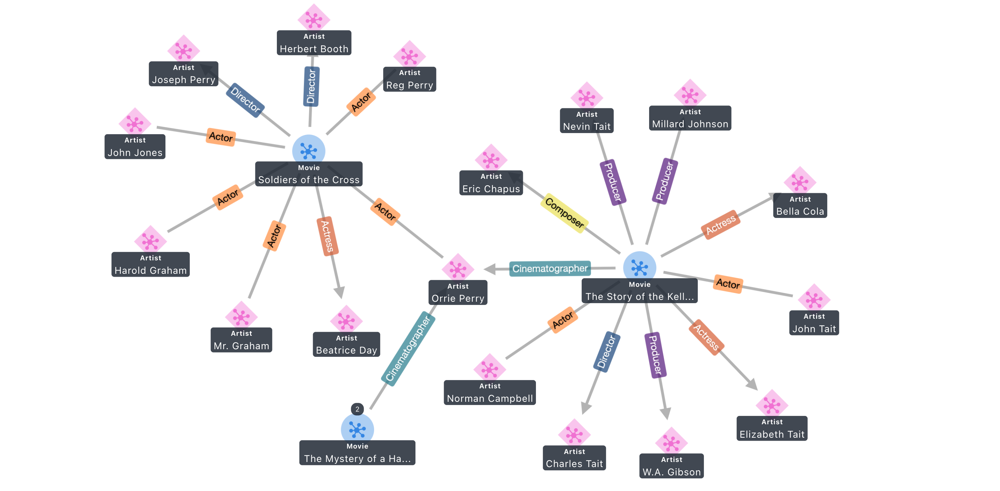
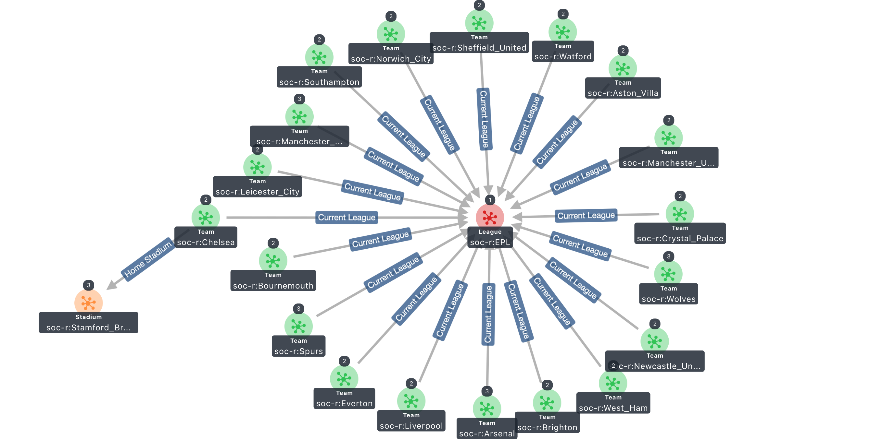

# Graph Explorer

The Graph Explorer project provides a React-based web application that enables users to visualize both property graph and RDF data and explore connections between data without having to write graph queries. You can connect to a graph database that supports either the [W3C RDF/SPARQL](https://www.w3.org/TR/sparql11-overview/) open standard or the open source [Apache TinkerPop Gremlin Server](https://tinkerpop.apache.org/).

To get started, you can deploy Graph Explorer on a local machine using [Docker Desktop](https://www.docker.com/products/docker-desktop/), or in the cloud using [Amazon EC2](https://aws.amazon.com/ec2/) or a container service like [Amazon ECS](https://aws.amazon.com/ecs/).




## Getting Started

This project contains the code needed to create a Docker image of the Graph Explorer. The image will create the Graph Explorer application and proxy server that will be served over the standard HTTP or HTTPS ports (HTTPS by default). The proxy server will be created automatically, but will only be necessary if you are connecting to Neptune. Gremlin-Server and BlazeGraph can be connected to directly. Additionally, the image will create a self-signed certificate that can be optionally used.

There are many ways to deploy the Graph Explorer application. The following instructions detail how to deploy graph-explorer onto an Amazon EC2 instance and use it as a proxy server with SSH tunneling to connect to Amazon Neptune. Note that this README is not an official recommendation on network setups as there are many ways to connect to Amazon Neptune from outside of the VPC, such as setting up a load balancer or VPC peering.

### Prerequisites:

- Provision an Amazon EC2 instance that will be used to host the application and connect to Neptune as a proxy server. For more details, see instructions [here](https://github.com/aws/graph-notebook/tree/main/additional-databases/neptune).
- Ensure the Amazon EC2 instance can send and receive on ports `22` (SSH), `8182` (Neptune), and `443` or `80` depending on protocol used (graph-explorer).
- Open an SSH client and connect to the EC2 instance.
- Download and install the necessary command line tools such as `git` and `docker`.

### Steps to install Graph Explorer:

1. To download the source project, run `git clone https://github.com/aws/graph-explorer/`. Navigate to the newly created `graph-explorer` directory.
2. To build the image, run `docker build -t graph-explorer .` from the root directory. If you receive an error relating to the docker service not running, run `service docker start`.
3. Run `docker run -p 80:80 -p 443:443 --env HOST={hostname-or-ip-address} graph-explorer` to run the docker container.
4. Now, open a browser and type in the public URL of your EC2 instance accessing the explorer endpoint (e.g., `https://ec2-1-2-3-4.us-east-1.compute.amazonaws.com/explorer`). You will receive a warning as the SSL certificate used is self-signed.
5. Since the application is set to use HTTPS by default and contains a self-signed certificate, you will need to add the Graph Explorer certificates to the trusted certificates directory and manually trust them. See [HTTPS Connections](#https-connections) section.
6. After completing the trusted certification step and refreshing the browser, you should now see the Connections UI. See below description on Connections UI to configure your first connection to Amazon Neptune.

### Troubleshooting

1. If the container does not start, or immediately stops, use `docker logs graph-explorer` to check the container console logs for any related error messages that might provide guidance on why graph-explorer did not start.
2. If you are having issues connecting graph-explorer to your graph database, use your browser's Developer Tools feature to monitor both the browser console and network calls to determine if here are any errors related to connectivity.

## Features

#### _Connections UI:_

You can create and manage connections to graph databases using this feature. Connections is accessible as the first screen after deploying the application, when you click `Open Connections` on the top-right. Click `+` on the top-right to add a new connection. You can also edit and delete connections.

- **Add a new connection:**

  - **Name:** Enter a name for your connection (e.g., `MyNeptuneCluster`).
  - **Graph Type:** Choose a graph data model that corresponds to your graph database.
  - **Public or proxy endpoint:** Provide the publicly accessible endpoint URL for a graph database, e.g., Gremlin Server. If connecting to Amazon Neptune, then provide a proxy endpoint URL that is accessible from outside the VPC, e.g., EC2.
    - **Note:** For connecting to Amazon Neptune, ensure that the graph connection URL is in the format `https://[NEPTUNE_ENDPOINT]:8182`, and that the proxy endpoint URL is either `https://[EC2_PUBLIC_HOSTNAME]:443` or `http://[EC2_PUBLIC_HOSTNAME]:80`, depending on the protocol used. Ensure that you don't end either of the URLs with `/`.
  - **Using proxy server:** Check this box if using a proxy endpoint.
  - **Graph connection URL:** Provide the endpoint for the graph database
  - **AWS IAM Auth Enabled:** Check this box if connecting to Amazon Neptune using IAM Auth and SigV4 signed requests
  - **AWS Region:** Specify the AWS region where the Neptune cluster is hosted (e.g., us-east-1)

- **Available Connections:** Once a connection is created, this section will appear as a left-hand pane. When you create more than one connection to a graph database, you can only connect to and visualize from one graph database endpoint at a time. To select the active database, toggle the “Active” switch.

- **Connection Details:** Once a connection is created, this section will appear as a right-hand information pane for a selected connection. It shows details such as the connection name, graph data model type, endpoint and a summary of the graph data, such as the count of nodes, edges, and a list of node types.
- **Last Synchronization:** When a connection is created, Graph Explorer will perform a scan of the graph to provide summary data. To re-synchronize after data has changed on your graph, select a connection, and then click the “refresh” button next to “Last Synchronization” text.
- **Data Explorer UI:** Under a listed node type, you can click on the ‘>’ arrow to get to the “Data Explorer” view. This allows you to see a sample list of nodes under this type and choose one or more nodes to “Send to Explorer” for getting started quickly if you are new to the data.

#### _Graph Explorer UI:_

You can search, browse, expand, customize views of your graph data using Graph Explorer, which is the main UI of this application. Once you create a connection, you can click “Open Graph Explorer” on the top-right to navigate here. There are several key features on this UI:

- **Top Bar UI:**
  - **Search bar:** If a user wants to start without using the Data Explorer, they can go directly to the search bar and use the search to visualize a starting node in the graph.
  - **Toggles:** You can toggle to show/hide the Graph View and/or Table View for screen real-estate management.
  - **Open Connections:** This takes the user back to Connections UI.
- **Graph View UI:** The graph visualization canvas that you can interact with. Double-click to expand the first-order neighbors of a node.
  - **Layout drop-down & reset:** You can display graph data using standard graph layouts in the Graph View. You can use the circular arrow to reset the physics of a layout.
  - **Screenshot:** Download a picture of the current window in Graph View.
  - **Zoom In/Out & Clear:** To help users quickly zoom in/out or clear the whole canvas in the Graph View.
  - **Legend (i):** This displays an informational list of icons, colors, and display names available.
- **Right-hand Pane UI:** There are 5-6 functions in the collapsible right-hand pane of Graph Explorer:
  - **Details View** shows details about a selected node/edge such as properties etc.
  - **Entities Filter** is used to control the display of nodes and edges that are already expanded in the Graph View; click to hide or show nodes/edges.
  - **Expand** is used when expanding will result in 10+ neighbors and control the meaningful expansion. You will need to select a number as the limit to expand to. You can also add text filters for expansion.
  - **Node Styling** of node display options (e.g., color, icon, the property to use for the displayed name).
  - **Edge Styling** of edge display options (e.g., color, icon, the property to use for the displayed name).
  - **Namespaces (RDF only):** This RDF-specific configuration feature allows you to shorten the display of Resource URIs within the app based on auto-generated prefixes, commonly-used prefix libraries, or custom prefixes set by the user. Order of priority is set to Custom > Common > Auto-generated.
- **Table View UI:** This collapsible view shows a row-column display of the data in the Graph View. You can use filters in the Table to show/hide elements in the Graph View, and you can export the table view into a CSV or JSON file. The following columns are available for filtering on property graphs (RDF graphs in parentheses):

  - Node ID (Resource URI)
  - Node Type (Class)
  - Edge Type (Predicate)
  - Source ID (Source URI)
  - Source Type (Source Class)
  - Target ID (Target URI)
  - Target Type (Target Class)
  - Display Name - Set in the Node/Edge Styling panes
  - Display Description - Set in the Node/Edge Styling panes
  - Total Neighbors - Enter an integer to be used as the >= limit

- **Additional Table View UI Features**
  - Visibility - manually show or hide nodes or edges
  - All Nodes / All Edges (or All Resources / All Predicates) dropdown - allows you to display a list of either nodes or edges and control display/filter on them
  - Download - You can download the current Table View as a CSV or JSON file with additional customization options
  - Default columns - You can set which columns you want to display
  - Paging of rows

## Connections

The Graph Explorer supports visualizing both **property graphs** and **RDF graphs**. You can connect to Amazon Neptune or you can also connect to open graph databases that implement an Apache TinkerPop Gremlin Server endpoint or the SPARQL 1.1 protocol, such as Blazegraph. For additional details on connecting to different graph databases, see [Connections](./additionaldocs/connections.md).

### Providing a Default Connection

To provide a default connection such that initial loads of the graph explorer always result with the same starting connection, modify the `docker run ...` command to either take in a JSON configuration or runtime environment variables. If you provide both a JSON configuration and environmental variables, the JSON will be prioritized.

#### Valid ENV connection variables, their defaults, and their descriptions:

- Required:
  - `PUBLIC_OR_PROXY_ENDPOINT` - `None` - See [Add a New Connection](#connections-ui)
- Optional
  - `GRAPH_TYPE` - `None` - If not specified, multiple connections will be created for every available graph type / query language. See [Add a New Connection](#connections-ui)
  - `USING_PROXY_SERVER` - `False` - See [Add a New Connection](#connections-ui)
  - `IAM` - `False` - See [Add a New Connection](#connections-ui)
  - `PROXY_SERVER_HTTPS_CONNECTION` - `True` - Controls whether the server uses SSL or not
  - `GRAPH_EXP_HTTPS_CONNECTION` - `True` - Controls whether the Graph Explorer uses SSL or not
- Conditionally Required:
  - Required if `USING_PROXY_SERVER=True`
    - `GRAPH_CONNECTION_URL` - `None` - See [Add a New Connection](#connections-ui)
  - Required if `USING_PROXY_SERVER=True` and `IAM=True`
    - `AWS_REGION` - `None` - See [Add a New Connection](#connections-ui)

#### JSON Configuration Approach:

First, create a `config.json` file containing values for the connection attributes:

```
{
     "PUBLIC_OR_PROXY_ENDPOINT": "https://public-endpoint",
     "GRAPH_CONNECTION_URL": "https://cluster-cqmizgqgrsbf.us-west-2.neptune.amazonaws.com:8182",
     "USING_PROXY_SERVER": true, (Can be string or boolean)
     "IAM": true, (Can be string or boolean)
     "AWS_REGION": "us-west-2",
     "GRAPH_TYPE": "gremlin" (Possible Values: "gremlin", "sparql", "opencypher"),
     "PROXY_SERVER_HTTPS_CONNECTION": true, (Can be string or boolean),
     "GRAPH_EXP_HTTPS_CONNECTION": true (Can be string or boolean)
}
```

Pass the `config.json` file path to the `docker run` command.

```
docker run -p 80:80 -p 443:443 --env HOST={hostname-or-ip-address} -v /path/to/config.json:/graph-explorer/config.json graph-explorer` 
```

#### Environment Variable Approach:

Provide the desired connection variables directly to the `docker run` command, as follows:

``` 
docker run -p 80:80 -p 443:443 \
 --env HOST={hostname-or-ip-address} \
 --env PUBLIC_OR_PROXY_ENDPOINT=https://public-endpoint \
 --env GRAPH_TYPE=gremlin \
 --env USING_PROXY_SERVER=true \
 --env IAM=false \
 --env GRAPH_CONNECTION_URL=https://cluster-cqmizgqgrsbf.us-west-2.neptune.amazonaws.com:8182 \
 --env AWS_REGION=us-west-2 \
 --env PROXY_SERVER_HTTPS_CONNECTION=true \
 graph-explorer
```

## Development

For development guidance, see [Development](./additionaldocs/development.md).

## Security

You can use the Graph Explorer to connect to a publicly accessible graph database endpoint, or connect to a proxy endpoint that redirects to a private graph database endpoint.

Graph Explorer supports the HTTPS protocol by default and provides a self-signed certificate as part of the Docker image. You can choose to use HTTP instead by changing the [environment variable default settings](./additionaldocs/development.md#environment-variables).

### HTTPS Connections

If either of the Graph Explorer or the proxy-server are served over an HTTPS connection (which it is by default), you will have to bypass the warning message from the browser due to the included certificate being a self-signed certificate. You can bypass by manually ignoring them from the browser or downloading the correct certificate and configuring them to be trusted. Alternatively, you can provide your own certificate. The following instructions can be used as an example to bypass the warnings for Chrome, but note that different browsers and operating systems will have slightly different steps.

1. Download the certificate directly from the browser. For example, if using Google Chrome, click the “Not Secure” section on the left of the URL bar and select “Certificate is not valid” to show the certificate. Then click Details tab and click Export at the bottom.
2. Once you have the certificate, you will need to trust it on your machine. For MacOS, you can open the Keychain Access app. Select System under System Keychains. Then go to File > Import Items... and import the certificate you downloaded in the previous step.
3. Once imported, select the certificate and right-click to select "Get Info". Expand the Trust section, and change the value of "When using this certificate" to "Always Trust".
4. You should now refresh the browser and see that you can proceed to open the application. For Chrome, the application will remain “Not Secure” due to the fact that this is a self-signed certificate. If you have trouble accessing Graph Explorer after completing the previous step and reloading the browser, consider running a docker restart command and refreshing the browser again.

Note: To get rid of the “Not Secure” warning, see [Using self-signed certificates on Chrome](./additionaldocs/development.md#using-self-signed-certificates-on-chrome).

### Connection Cache

Setting up a new connection (or editing an existing connection) allows you to enable a cache for the connector requests. The cache store is configured to use the browser IndexedDB that allows you to make use of data stored between sessions. The time that the data stored in the cache is also configurable, by default it has a lifetime of 10 minutes.

The purpose of the cache is to avoid making multiple requests to the database with the same criteria. Therefore, a request with particular parameters will be cached at most the time set just with the response obtained. After that time, if the exact same request is made again, the response will be updated and stored again.

## Authentication

Authentication for Amazon Neptune connections is enabled using the [SigV4 signing protocol](https://docs.aws.amazon.com/general/latest/gr/signature-version-4.html).

To use AWS IAM authentication, you must run requests through a proxy endpoint, such as an EC2 instance, where credentials are resolved and where requests are signed.

To set up a connection in Graph Explorer UI with AWS IAM auth enabled on Neptune, check Using Proxy-Server, then check AWS IAM Auth Enabled and type in the AWS Region where the Neptune cluster is hosted (e.g., us-east-1).

For further information on how AWS credentials are resolved in Graph Explorer, refer to this [documentation](https://docs.aws.amazon.com/AWSJavaScriptSDK/latest/AWS/CredentialProviderChain.html).

## Logging

Logs are, by default, sent to the console and will be visible as output to the docker logs. If you want to access the full set of logs, you can run `docker logs {container name or id}`. The log level will be set via the `LOG_LEVEL` env variable at `/packages/graph-explorer/.env` where the possible options, from highest to lowest, are `error`, `warn`, `info`, `debug`, and `trace` such that `error` is the highest level and will only include logs labeled as errors and `trace` the lowest and will include any type of log. By default, the log level is set to `info` and the only type of logs generated are those of `error`, `info`, or `debug`. If you need more detailed logs, you can change the log level from `info` in the default .env file to `debug` and the logs will begin printing the error's stack trace.

Within node-server.js, you'll notice three things.

1. A proxyLogger object - This is responsible for actually recording the logs.
2. An errorHandler - This automatically sends errors to the proxyLogger and can log extra information by adding wanted text to the error object at a key called extraInfo. 
3. An endpoint called `/logger` - This is how you would log things from the browser. It needs a log level and message header passed and you can then expect to see the message logged at the provided log level.

## Contributing Guidelines

See [CONTRIBUTING](./CONTRIBUTING.md) for more information.

## License

This project is licensed under the Apache-2.0 License.
