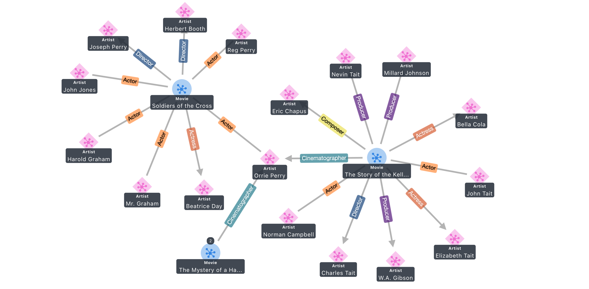
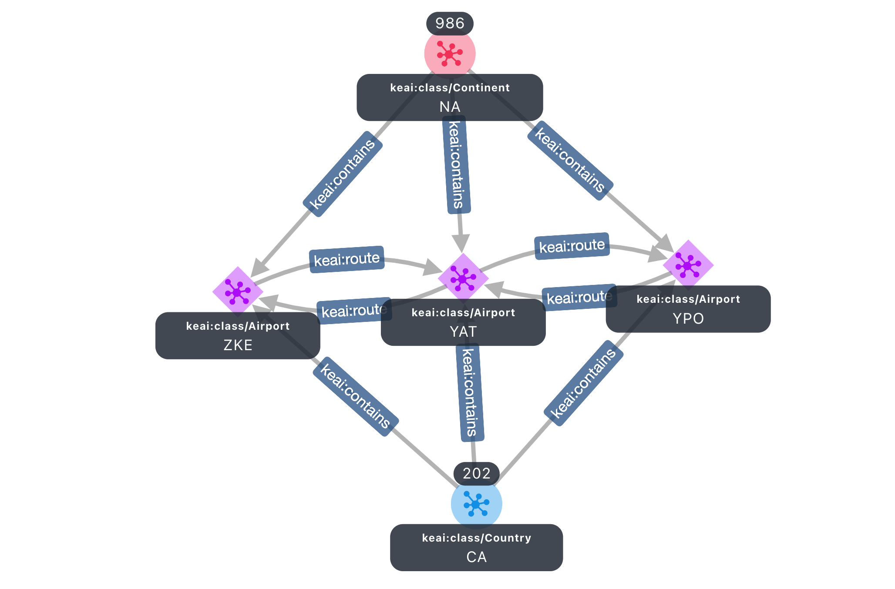

# Graph Explorer
The Graph Explorer project provides a React-based web application that enables users to visualize both property graph and RDF data and explore connections between data without having to write graph queries. You can connect to a graph database that supports either the [W3C RDF/SPARQL](https://www.w3.org/TR/sparql11-overview/) open standard or the open source [Apache TinkerPop Gremlin Server](https://tinkerpop.apache.org/).
<<<<<<< HEAD

To get started, you can deploy Graph Explorer on a local machine using [Docker Desktop](https://www.docker.com/products/docker-desktop/), or in the cloud using a container service such as [Amazon ECS](https://aws.amazon.com/ecs/). The Graph Explorer image is hosted on [Amazon ECR](https://aws.amazon.com/ecr/), and can also be pulled from [DockerHub](https://hub.docker.com/). 

## Getting Started

This project contains the code needed to create a Docker image of the Graph Explorer. The image will create the Graph Explorer application to communicate through port `5173` and a proxy server through port `8182`. The proxy server will be created automatically, but will only be necessary if you are connecting to Neptune. Gremlin-Server and BlazeGraph can be connected to directly. Additionally, the image will create a self-signed certificate that can be optionally used when PROXY_SERVER_HTTPS_CONNECTION or GRAPH_EXP_HTTPS_CONNECTION are set to true (default behavior). 

There are many ways to deploy the Graph Explorer application. The following instructions detail how to deploy graph-explorer onto an Amazon EC2 instance and use it as a proxy server with SSH tunneling to connect to Amazon Neptune. Note that this README is not an official recommendation on network setups as there are many ways to connect to Amazon Neptune from outside of the VPC, such as setting up a load balancer or VPC peering.

### Prerequisites:

* Provision an Amazon EC2 instance that will be used to host the application and connect to Neptune as a proxy server. For more details, see instructions here: https://github.com/aws/graph-notebook/tree/main/additional-databases/neptune
* Ensure the Amazon EC2 instance can send and receive on ports `22` (SSH), `8182` (Neptune), and `5173` (graph-explorer).
* Open an SSH client and connect to the EC2 instance.
* Download and install the necessary command line tools such as `git`  and `docker`.

### Steps to install Graph Explorer:

1. To download the source project, run `git clone https://github.com/aws/graph-explorer/`  
2. To build the image, run `docker build --build-arg host=$(hostname -i) -t graph-explorer .` from the root directory.
3. To run the image in a container, run `docker run -dit -p 5173:5173 -p 8182:8182 --name {insert_container_name} graph-explorer`. Optional, can be run as long as the image is there.
4. Since the application is set to use HTTPS by default and contains a self-signed certificate, you will need to add the Graph Explorer certificates to the trusted certificates directory and manually trust them. (**STEP TO BE REWRITTEN IN DETAIL**).
5. Now, open a browser and type in the public URL of your EC2 instance on port `5173` (e.g., `https://ec2-1-2-3-4.us-east-1.compute.amazonaws.com:5173`). You will receive a warning as the SSL certificate used is self-signed. Click to proceed anyway.
6. You should now see the Connections UI. See below description on Connections UI to configure your first connection to Amazon Neptune.

## Features

#### _Connections UI:_
You can create and manage connections to graph databases using this feature. Connections is accessible as the first screen after deploying the application, when you click `Open Connections` on the top-right. Click `+` on the top-right to add a new connection. You can also edit and delete connections. 

* __Add a new connection:__
   *  __Name:__ Enter a name for your connection (e.g., `MyNeptuneCluster`). 
   *  __Graph Type:__ Choose a graph data model that corresponds to your graph database. 
   *  __Public Endpoint:__ Provide the publicly accessible endpoint URL for a graph database, e.g., Gremlin Server. If connecting to Amazon Neptune, then provide a proxy endpoint URL that is accessible from outside the VPC, e.g., EC2.
   * __Public or proxy endpoint:__ Provide the publicly accessible endpoint URL for a graph database, e.g., Gremlin Server. If connecting to Amazon Neptune, then provide a proxy endpoint URL that is accessible from outside the VPC, e.g., EC2. 
      * **Note:** For connecting to Amazon Neptune, ensure that both the proxy endpoint and the graph connection URL begin with `https://` and end with `:8182`. Ensure that you don't end the URLs with `/`.
   * __Using proxy server:__ Check this box if using a proxy endpoint.
   * __Graph connection URL:__ Provide the endpoint for the graph database
   * __AWS IAM Auth Enabled:__ Check this box if connecting to Amazon Neptune using IAM Auth and SigV4 signed requests
   * __AWS Region:__ Specify the AWS region where the Neptune cluster is hosted (e.g., us-east-1)

* __Available Connections:__ Once a connection is created, this section will appear as a left-hand pane. When you create more than one connection to a graph database, you can only connect to and visualize from one graph database endpoint at a time. To select the active database, toggle the “Active” switch.

 * __Connection Details:__ Once a connection is created, this section will appear as a right-hand information pane for a selected connection. It shows details such as the connection name, graph data model type, endpoint and a summary of the graph data, such as the count of nodes, edges, and a list of node types.
 * __Last Synchronization:__ When a connection is created, Graph Explorer will perform a scan of the graph to provide summary data. To re-synchronize after data has changed on your graph, select a connection, and then click the “refresh” button next to “Last Synchronization” text.
 * __Data Explorer UI:__ Under a listed node type, you can click on the ‘>’ arrow to get to the “Data Explorer” view. This allows you to see a sample list of nodes under this type and choose one or more nodes to “Send to Explorer” for getting started quickly if you are new to the data.
#### _Graph Explorer UI:_
You can search, browse, expand, customize views of your graph data using Graph Explorer, which is the main UI of this application. Once you create a connection, you can click “Open Graph Explorer” on the top-right to navigate here. There are several key features on this UI:
* __Top Bar UI:__
    * __Search bar:__ If a user wants to start without using the Data Explorer, they can go directly to the search bar and use the search to visualize a starting node in the graph.
    * __Toggles:__ You can toggle to show/hide the Graph View and/or Table View for screen real-estate management.
    * __Open Connections:__ This takes the user back to Connections UI.
* __Graph View UI:__ The graph visualization canvas that you can interact with. Double-click to expand the first-order neighbors of a node. 
    * __Layout drop-down & reset:__ You can display graph data using standard graph layouts in the Graph View. You can use the circular arrow to reset the physics of a layout.
     * __Screenshot:__ Download a picture of the current window in Graph View.
     * __Zoom In/Out & Clear:__ To help users quickly zoom in/out or clear the whole canvas in the Graph View.
     * __Legend (i):__ This displays an informational list of icons, colors, and display names available.
* __Right-hand Pane UI:__ There are 5-6 functions in the collapsible right-hand pane of Graph Explorer: 
     * __Details View__ shows details about a selected node/edge such as properties etc. 
     * __Entities Filter__ is used to control the display of nodes and edges that are already expanded in the Graph View; click to hide or show nodes/edges.
     * __Expand__ is used when expanding will result in 10+ neighbors and control the meaningful expansion. You will need to select a number as the limit to expand to. You can also add text filters for expansion.
     * __Node Styling__ of node display options (e.g., color, icon, the property to use for the displayed name). 
     * __Edge Styling__ of edge display options (e.g., color, icon, the property to use for the displayed name). 
     * __Namespaces (RDF only):__ This RDF-specific configuration feature allows you to shorten the display of Resource URIs within the app based on auto-generated prefixes, commonly-used prefix libraries, or custom prefixes set by the user. Order of priority is set to Custom > Common > Auto-generated.
* __Table View UI:__ This collapsible view shows a row-column display of the data in the Graph View. You can use filters in the Table to show/hide elements in the Graph View, and you can export the table view into a CSV or JSON file. The following columns are available for filtering on property graphs (RDF graphs in parentheses):
     * Node ID (Resource URI)
     * Node Type (Class)
     * Edge Type (Predicate)
     * Source ID (Source URI)
     * Source Type (Source Class)
     * Target ID (Target URI)     
     * Target Type (Target Class)
     * Display Name - Set in the Node/Edge Styling panes
     * Display Description - Set in the Node/Edge Styling panes
     * Total Neighbors - Enter an integer to be used as the >= limit

* __Additional Table View UI Features__
     * Visibility - manually show or hide nodes or edges
     * All Nodes / All Edges (or All Resources / All Predicates) dropdown - allows you to display a list of either nodes or edges and control display/filter on them
     * Download - You can download the current Table View as a CSV or JSON file with additional customization options
     * Default columns - You can set which columns you want to display
     * Paging of rows
=======
>>>>>>> e6c010c (12/13 10:01AM push (Address README fixes, change labels of connection page, change ENV variable prefixes, abstract node server logic))

To get started, you can deploy Graph Explorer on a local machine using [Docker Desktop](https://www.docker.com/products/docker-desktop/), or in the cloud using a container service such as [Amazon ECS](https://aws.amazon.com/ecs/). The Graph Explorer image is hosted on [Amazon ECR](https://aws.amazon.com/ecr/), and can also be pulled from [DockerHub](https://hub.docker.com/). 

<<<<<<< HEAD
=======
Upon build, the Graph Explorer will be run at port 5173 and the proxy-server at port 8182. The proxy-server will be created automatically, but will only be necessary if you are connecting to Neptune. Gremlin-Server and BlazeGraph can be connected to directly. 

#### Supported Graph Types
- Labelled Property Graph (PG) using Gremlin
- Resource Description Framework (RDF) using SPARQL

## Development

>>>>>>> e6c010c (12/13 10:01AM push (Address README fixes, change labels of connection page, change ENV variable prefixes, abstract node server logic))
### Requirements
- pnpm >=7.9.3
- node >=16.15.1

### Supported Graph Types
- Labelled Property Graph (PG) using Gremlin
- Resource Description Framework (RDF) using SPARQL 

### Run in development mode
- `pnpm i`
- `pnpm start`

### Build for production
- `pnpm i`
- `pnpm build`
<<<<<<< HEAD
<<<<<<< HEAD
- `dist` folder is created in the graph-explorer directory.
=======
- `dist` folder is created in the client directory.
>>>>>>> 00a6590 (12/08 5:31PM CT push)
=======
- `dist` folder is created in the graph-explorer directory.
>>>>>>> beca7aa (12/09 12:22PM push)
- Serve the static site using the method of your choice,
for example, using `serve` npm package.

### Environment variables

<<<<<<< HEAD
<<<<<<< HEAD
<<<<<<< HEAD
You can find a template for the following environment variables at `/packages/graph-explorer/.env`. All variables described below are optional and will default to the given values.

- `GRAPH_EXP_ENV_ROOT_FOLDER`: Base folder for the public files. By default, `/` (`string`). 
- `GRAPH_EXP_CONNECTION_NAME`: Default connection name. Blank by default (`string`).
- `GRAPH_EXP_CONNECTION_ENGINE`: Default connection query engine work with the instance. By default, `gremlin` (`gremlin | sparql`).
- `GRAPH_EXP_HTTPS_CONNECTION`: Uses the self-signed cert to serve the Graph Explorer over https if true. By default `true` (`boolean`).
- `PROXY_SERVER_HTTPS_CONNECTION`: Uses the self-signed cert to serve the proxy-server over https if true. By default `true` (`boolean`).
<<<<<<< HEAD
=======
You can find a template for the following environment variables at `/packages/client/.env`.
=======
You can find a template for the following environment variables at `/packages/graph-explorer/.env`.
>>>>>>> beca7aa (12/09 12:22PM push)
=======
You can find a template for the following environment variables at `/packages/graph-explorer/.env`. All variables described below are optional and will default to the given values.
>>>>>>> e6c010c (12/13 10:01AM push (Address README fixes, change labels of connection page, change ENV variable prefixes, abstract node server logic))

- `GRAPH_EXP_ENV_ROOT_FOLDER`: Base folder for the public files. By default, `/` (`string`). 
- `GRAPH_EXP_CONNECTION_NAME`: Default connection name. Blank by default (`string`).
- `GRAPH_EXP_CONNECTION_ENGINE`: Default connection query engine work with the instance. By default, `gremlin` (`gremlin | sparql`).
- `HTTPS_PROXY_SERVER_CONNECTION`: Creates self-signed cert if true. Provide a https url for `Public URL` in the connection pane if true. By default `true` (`boolean`).
=======
>>>>>>> d9d360e (12/14 7:50PM push (Address some requested label changes, adding https to graph explorer url, adding format to sparql endpoint))

### Docker Instructions

The docker image contains the code needed to create a runnable instance of the Explorer inside of a container. The image will create the Graph Explorer communicating through port 5173 and the proxy-server through port 8182. Additionally, it will create a self-signed cert that can be optionally used when `PROXY_SERVER_HTTPS_CONNECTION` or `GRAPH_EXP_HTTPS_CONNECTION` are set to true (default behavior).

- To build the image, `docker build --build-arg host=$(hostname -i) -t graph-explorer .` from the root directory. Required.
- To run the image in a container, run `docker run -dit -p 5173:5173 -p 8182:8182 --name {container_name} graph-explorer`. Optional, can be run as long as the image is there.
>>>>>>> 00a6590 (12/08 5:31PM CT push)

## Connection

### Connecting to Neptune
<<<<<<< HEAD
<<<<<<< HEAD
- Ensure that Graph Explorer has access to the Neptune instance by being in the same VPC or VPC peering. 
=======
- Ensure that graph-explorer has access to the Neptune instance by being in the same VPC or VPC peering. 
>>>>>>> e6c010c (12/13 10:01AM push (Address README fixes, change labels of connection page, change ENV variable prefixes, abstract node server logic))
=======
- Ensure that Graph Explorer has access to the Neptune instance by being in the same VPC or VPC peering. 
>>>>>>> d9d360e (12/14 7:50PM push (Address some requested label changes, adding https to graph explorer url, adding format to sparql endpoint))
- If authentication is enabled, read query privileges are needed (See ReadDataViaQuery managed policy [here](https://docs.aws.amazon.com/neptune/latest/userguide/iam-data-access-examples.html#iam-auth-data-policy-example-read-query).

### Connecting to Gremlin-Server
- The Graph Explorer currently supports only HTTP(S) connections. When connecting to Gremlin-Server, ensure it is configured with a channelizer that support HTTP(S) (i.e. [Channelizer Documentation](https://tinkerpop.apache.org/javadocs/current/full/org/apache/tinkerpop/gremlin/server/Channelizer.html)). The Gremlin Server configuration can be usually found at: /conf/gremlin-server.yaml.
- Remove “.withStrategies(ReferenceElementStrategy)” from `/scripts/generate-modern.groovy` so that properties are returned.
- Change `gremlin.tinkergraph.vertexIdManager` and `gremlin.tinkergraph.edgeIdManager` in `/conf/tinkergraph-empty.properties` to support string ids. You can use `ANY`.
- Build and run the docker container as normal.

### Connecting to BlazeGraph
<<<<<<< HEAD
<<<<<<< HEAD
- Build and run the docker container as normal and connect the proxy-server to BlazeGraph and your workbench to the proxy-server.
- If using docker, ensure that the container running the workbench can properly access the container running BlazeGraph. You can find documentation on how to connect containers via docker networks [here](https://docs.docker.com/network/).

### Using HTTPS
- Self-signed certs will automatically resolve the hostname, so unless you have specific requirements, there are no extra steps here. 
- If you would like to modify the cert files, be aware that the Dockerfile is making automatic modifications on line 15 and 16, so you will need to remove these lines.
<<<<<<< HEAD

### Using the Proxy-Server
- When creating a connection, insert the url to access your proxy-server, which is `http(s)://localhost:8182` from the context of the host machine, into the Public URL field. Check `Connecting to Proxy-Server` since you won't be using the proxy with Gremlin-Server, and fill in the Graph Connection URL with the endpoint that the proxy-server should make requests to. Ensure that you don't end the Graph Connection URLs with `/`.

### HTTPS Connections
- If either of the Graph Explorer or the proxy-server are served over an https connection, you will have to bypass the warning message from the browser due to the certs being self-signed by retrieving the needed certs to trust from `/packages/graph-explorer-proxy-server/cert-info/` or by manually ignoring them from the browser. Once you retrive these cert files, you should add them to your trusted certs on your computer. Each OS is different, but a tutorial can be found via a quick google search. If you only serve the proxy-server over https and want to ignore the error in the browser, you might need to directly navigate to the proxy-server to ignore the cert error. 
=======
- Build and run the docker container as normal and connect the proxy server to BlazeGraph and your workbench to the proxy server.
=======
- Build and run the docker container as normal and connect the proxy-server to BlazeGraph and your workbench to the proxy-server.
>>>>>>> d9d360e (12/14 7:50PM push (Address some requested label changes, adding https to graph explorer url, adding format to sparql endpoint))
- If using docker, ensure that the container running the workbench can properly access the container running BlazeGraph. You can find documentation on how to connect containers via docker networks [here](https://docs.docker.com/network/).

### Using HTTPS
- Navigate to `/packages/graph-explorer-proxy-server/cert-info/` and in the following files, you'll need to insert your CN along with the DNS values.
- Navigate to `/Dockerfile` and on line 14 insert your CN.
=======
>>>>>>> 03b76a3 (12/16 11:10AM push (Address README changes and add automatic host resolution for certs))

<<<<<<< HEAD
### Using the Proxy Server
<<<<<<< HEAD
- When creating a connection, insert the url to access your proxy server, which is `http(s)://localhost:8182` from the context of the host machine, into the Public URL field. Check `Neptune or BlazeGraph` since you won't be using the proxy with Gremlin-Server, and fill in the Graph Connection URL with the endpoint that the proxy server should make requests to. Ensure that you don't end the Graph Connection URLs with `/`.
>>>>>>> 00a6590 (12/08 5:31PM CT push)
=======
- When creating a connection, insert the url to access your proxy server, which is `http(s)://localhost:8182` from the context of the host machine, into the Public URL field. Check `Connecting to Proxy-Server` since you won't be using the proxy with Gremlin-Server, and fill in the Graph Connection URL with the endpoint that the proxy server should make requests to. Ensure that you don't end the Graph Connection URLs with `/`.
>>>>>>> e6c010c (12/13 10:01AM push (Address README fixes, change labels of connection page, change ENV variable prefixes, abstract node server logic))
=======
### Using the Proxy-Server
- When creating a connection, insert the url to access your proxy-server, which is `http(s)://localhost:8182` from the context of the host machine, into the Public URL field. Check `Connecting to Proxy-Server` since you won't be using the proxy with Gremlin-Server, and fill in the Graph Connection URL with the endpoint that the proxy-server should make requests to. Ensure that you don't end the Graph Connection URLs with `/`.

### HTTPS Connections
<<<<<<< HEAD
- If either of the Graph Explorer or the proxy-server are served over an https connection, you will have to bypass the warning message from the browser due to the certs being self-signed by retrieving the needed certs to trust from `/packages/graph-explorer-proxy-server/cert-info/` or by manually ignoring them from the browser. If you only serve the proxy-server over https and want to ignore the error in the browser, you might need to directly navigate to the proxy-server to ignore the cert error. 
>>>>>>> d9d360e (12/14 7:50PM push (Address some requested label changes, adding https to graph explorer url, adding format to sparql endpoint))
=======
- If either of the Graph Explorer or the proxy-server are served over an https connection, you will have to bypass the warning message from the browser due to the certs being self-signed by retrieving the needed certs to trust from `/packages/graph-explorer-proxy-server/cert-info/` or by manually ignoring them from the browser. Once you retrive these cert files, you should add them to your trusted certs on your computer. Each OS is different, but a tutorial can be found via a quick google search. If you only serve the proxy-server over https and want to ignore the error in the browser, you might need to directly navigate to the proxy-server to ignore the cert error. 
>>>>>>> 03b76a3 (12/16 11:10AM push (Address README changes and add automatic host resolution for certs))

## Authentication

Authentication is enabled using the SigV4 signing process for AWS Neptune connections found [here](https://docs.aws.amazon.com/general/latest/gr/signature-version-4.html).

### Use
- To use auth, you must run requests through the proxy-server. This is where credentials are resolved and the signing logic is.
- For further information on how to properly have credentials resolved, refer to this [documentation](https://docs.aws.amazon.com/AWSJavaScriptSDK/latest/AWS/CredentialProviderChain.html)
- To use the SharedIniFileCredentials or ProcessCredentials, place your `.aws` folder at the root of the project before creating the docker container.
<<<<<<< HEAD
<<<<<<< HEAD
- To set up a connection with auth enabled, click `Connecting to Proxy-Server`, then `AWS IAM Auth Enabled` and insert the correct region.
=======
- To set up a connection with auth enabled, click `Neptune or BlazeGraph`, then `Neptune Authorization Enabled` and insert the correct region.
>>>>>>> 00a6590 (12/08 5:31PM CT push)
=======
- To set up a connection with auth enabled, click `Connecting to Proxy-Server`, then `AWS IAM Auth Enabled` and insert the correct region.
>>>>>>> e6c010c (12/13 10:01AM push (Address README fixes, change labels of connection page, change ENV variable prefixes, abstract node server logic))

### Potential Errors
- If the explorer crashes, you can recreate the container or run `pnpm start` inside of `/packages/graph-explorer`.
- If the proxy-server crashes, you can recreate the container or run `pnpm start` inside of `/packages/graph-explorer-proxy-server`
- If the proxy-server fails to start, check that the provided endpoint is properly spelled and that you have access to from the environment you are trying to run in. If you are in a different VPC, consider VPC Peering.

## License
This project is licensed under the Apache-2.0 License.
