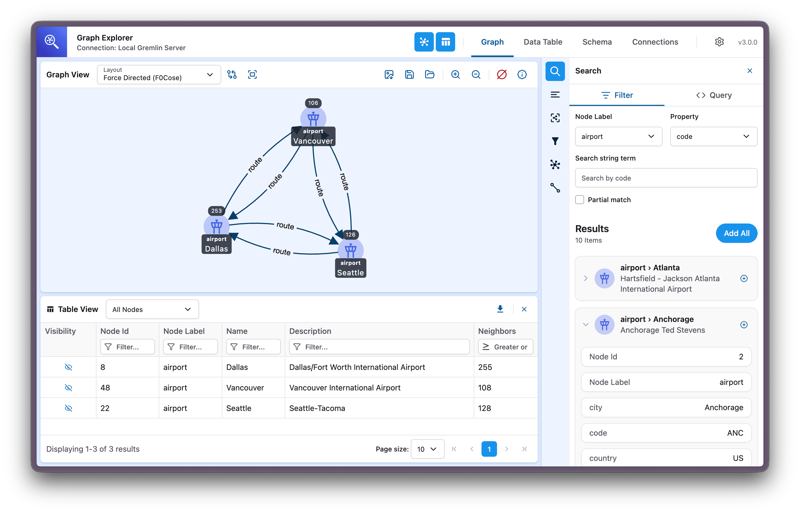
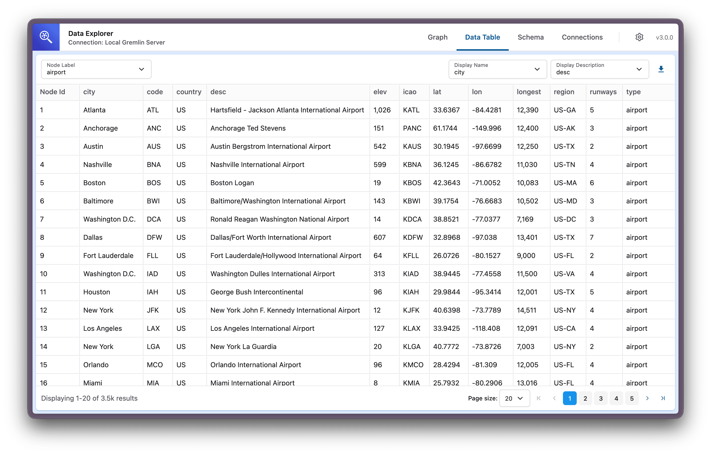
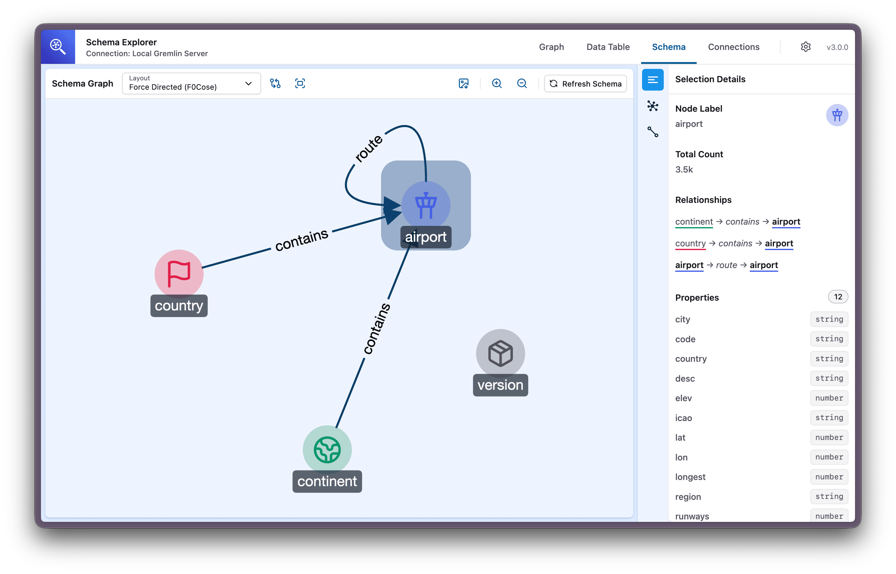

# Graph Explorer

Graph Explorer is a React-based web application that makes it easy to visualize and explore graph data, no query language knowledge required. Search for nodes, expand connections, and discover relationships across your graph database through an intuitive visual interface.

Connect to graph databases that support [Apache TinkerPop Gremlin](https://tinkerpop.apache.org/) or [W3C RDF/SPARQL](https://www.w3.org/TR/sparql11-overview/) over HTTP, or [openCypher](https://opencypher.org) via [Amazon Neptune](https://aws.amazon.com/neptune/).

## Explore Your Data

Graph Explorer provides three integrated views for working with your graph database, all in one app.

### Graph View

Search, visualize, and explore connections between nodes with an interactive graph layout. Expand neighbors, filter by type, and run custom queries, all from a single view.



### Data Explorer

Browse all nodes for a given type in a paginated table. View every property at a glance and send nodes directly to the graph view for further exploration.



### Schema Explorer

Understand your data model at a glance. See node types, their relationships, and property details rendered as an interactive schema graph.



### Flexible Deployment

Run Graph Explorer wherever it fits your workflow: as a Docker container, on an Amazon EC2 instance, through Amazon SageMaker, or locally from source during development. Configure multiple connections to different databases and switch between them seamlessly. See [Getting Started](#getting-started) for setup guides.

## Learn More

- [Getting Started](./docs/getting-started/README.md) - Set up Graph Explorer with Docker, EC2, or from source
- [Features Overview](./docs/features/README.md) - Detailed guide to all features and functionality
- [Guides](./docs/guides) - Database connections, deployment, and troubleshooting
- [Roadmap](./ROADMAP.md) - See what's planned for future releases
- [Discussions](https://github.com/aws/graph-explorer/discussions) - Ask questions, share ideas, and connect with the community
- [Submit an Issue](https://github.com/aws/graph-explorer/issues/new/choose) - Report bugs or request new features
- [Contributing](./CONTRIBUTING.md) - Learn how to contribute to Graph Explorer
- [Changelog](./Changelog.md) - See what's changed in recent releases

## Getting Started

There are many ways to deploy and run Graph Explorer. If you are new to graph databases and Graph Explorer, we recommend that you check out the [Getting Started](./docs/getting-started/README.md) guide.

- [Local Docker Setup](./docs/getting-started/README.md#local-docker-setup) - A quick start guide to deploying Graph Explorer locally using the official Docker image.
- [Amazon EC2 Setup](./docs/getting-started/README.md#amazon-ec2-setup) - A quick start guide to setting up Graph Explorer on Amazon EC2 with Neptune.
- [Local Development](./docs/getting-started/README.md#local-development-setup) - A quick start guide building the Docker image from source code.
- [Troubleshooting](./docs/guides/troubleshooting.md) - A collection of helpful tips if you run in to issues while setting up Graph Explorer.
- [Samples](./samples) - A collection of Docker Compose files that show various ways to configure and use Graph Explorer.

## Connections

Graph Explorer supports visualizing both **property graphs** and **RDF graphs**. You can connect to Amazon Neptune or you can also connect to open graph databases that implement an Apache TinkerPop Gremlin endpoint or the SPARQL 1.1 protocol, such as Blazegraph. For additional details on connecting to different graph databases, see [Guides](./docs/guides).

### Providing a Default Connection

To provide a default connection such that initial loads of Graph Explorer always result with the same starting connection, modify the `docker run ...` command to either take in a JSON configuration or runtime environment variables. If you provide both a JSON configuration and environmental variables, the JSON will be prioritized.

#### Environment Variables

These are the valid environment variables used for the default connection, their defaults, and their descriptions.

- Required:
  - `PUBLIC_OR_PROXY_ENDPOINT` - `None` - See [Add a New Connection](#connections-ui)
- Optional
  - `GRAPH_TYPE` - `None` - If not specified, multiple connections will be created for every available query language. See [Add a New Connection](#connections-ui)
  - `USING_PROXY_SERVER` - `False` - See [Add a New Connection](#connections-ui)
  - `IAM` - `False` - See [Add a New Connection](#connections-ui)
  - `GRAPH_EXP_HTTPS_CONNECTION` - `True` - Controls whether Graph Explorer uses SSL or not
  - `PROXY_SERVER_HTTPS_CONNECTION` - `True` - Controls whether the server uses SSL or not
  - `GRAPH_EXP_FETCH_REQUEST_TIMEOUT` - `240000` - Controls the timeout for the fetch request. Measured in milliseconds (i.e. 240000 is 240 seconds or 4 minutes).
  - `GRAPH_EXP_NODE_EXPANSION_LIMIT` - `None` - Controls the limit for node counts and expansion queries.
- Conditionally Required:
  - Required if `USING_PROXY_SERVER=True`
    - `GRAPH_CONNECTION_URL` - `None` - See [Add a New Connection](#connections-ui)
  - Required if `USING_PROXY_SERVER=True` and `IAM=True`
    - `AWS_REGION` - `None` - See [Add a New Connection](#connections-ui)
    - `SERVICE_TYPE` - `neptune-db`, Set this as `neptune-db` for Neptune database or `neptune-graph` for Neptune Analytics.

#### JSON Configuration Approach

First, create a `config.json` file containing values for the connection attributes:

```js
{
  "PUBLIC_OR_PROXY_ENDPOINT": "https://public-endpoint",
  "GRAPH_CONNECTION_URL": "https://cluster-cqmizgqgrsbf.us-west-2.neptune.amazonaws.com:8182",
  "USING_PROXY_SERVER": true,
  "IAM": true,
  "SERVICE_TYPE": "neptune-db",
  "AWS_REGION": "us-west-2",
  // Possible Values are "gremlin", "sparql", "openCypher"
  "GRAPH_TYPE": "gremlin",
  "GRAPH_EXP_HTTPS_CONNECTION": true,
  "PROXY_SERVER_HTTPS_CONNECTION": true,
  // Measured in milliseconds (i.e. 240000 is 240 seconds or 4 minutes)
  "GRAPH_EXP_FETCH_REQUEST_TIMEOUT": 240000,
  "GRAPH_EXP_NODE_EXPANSION_LIMIT": 500,
}
```

Pass the `config.json` file path to the `docker run` command.

```bash
docker run -p 80:80 -p 443:443 \
 --env HOST={hostname-or-ip-address} \
 -v /path/to/config.json:/graph-explorer/config.json \
 public.ecr.aws/neptune/graph-explorer
```

#### Environment Variable Approach

Provide the desired connection variables directly to the `docker run` command, as follows:

```bash
docker run -p 80:80 -p 443:443 \
 --env HOST={hostname-or-ip-address} \
 --env PUBLIC_OR_PROXY_ENDPOINT=https://public-endpoint \
 --env GRAPH_TYPE=gremlin \
 --env USING_PROXY_SERVER=true \
 --env IAM=false \
 --env GRAPH_CONNECTION_URL=https://cluster-cqmizgqgrsbf.us-west-2.neptune.amazonaws.com:8182 \
 --env AWS_REGION=us-west-2 \
 --env SERVICE_TYPE=neptune-db \
 --env PROXY_SERVER_HTTPS_CONNECTION=true \
 --env GRAPH_EXP_FETCH_REQUEST_TIMEOUT=240000 \
 --env GRAPH_EXP_NODE_EXPANSION_LIMIT=500 \
 public.ecr.aws/neptune/graph-explorer
```

## Development

For development guidance, see [Development](./docs/development.md).

## Security

You can use Graph Explorer to connect to a publicly accessible graph database endpoint, or connect to a proxy endpoint that redirects to a private graph database endpoint.

Graph Explorer supports the HTTPS protocol by default and provides a self-signed certificate as part of the Docker image. You can choose to use HTTP instead by changing the [environment variable default settings](./docs/development.md#environment-variables).

## Permissions

Graph Explorer does not provide any mechanisms for controlling user permissions. If you are using Graph Explorer with AWS, Neptune permissions can be controlled through IAM roles.

For information about what permissions Graph Explorer requires check out the documentation on [SageMaker configuration](./docs/guides/deploy-to-sagemaker.md#minimum-database-permissions).

<!-- prettier-ignore -->
> [!CAUTION] 
> 
> By default, a Neptune Notebook will have full read & write access to Neptune data.

## Logging

Logs are, by default, sent to the console and will be visible as output to the docker logs. If you want to access the full set of logs, you can run `docker logs {container name or id}`.

The log level will be set via the `LOG_LEVEL` env variable at `/packages/graph-explorer/.env` where the possible options, from highest to lowest, are `fatal`, `error`, `warn`, `info`, `debug`, `trace`, and `silent` such that `fatal` is the highest level and will only include logs labeled as fatal and `trace` the lowest and will include any type of log. The `silent` level disables all logging.

By default, the log level is set to `info` and the only type of logs generated are those of `error`, `info`, or `debug`. If you need more detailed logs, you can change the log level from `info` in the default .env file to `debug` and the logs will begin printing the error's stack trace.

The proxy server logging is split across a few key modules:

1. `logging.ts` - Contains the `logger` instance (using pino) that is responsible for actually recording the logs.
2. `error-handler.ts` - Contains `errorHandlingMiddleware` which catches errors thrown within Express routes, logs whitelisted request headers, and sends appropriate error responses. It also contains a `handleError` function used for global error handling.
3. An endpoint called `/logger` in `node-server.ts` - This is how you would log things from the browser. It needs a log level and message header passed and you can then expect to see the message logged at the provided log level.

## Contributing Guidelines

See [CONTRIBUTING](./CONTRIBUTING.md) for more information.

## License

This project is licensed under the Apache-2.0 License.
