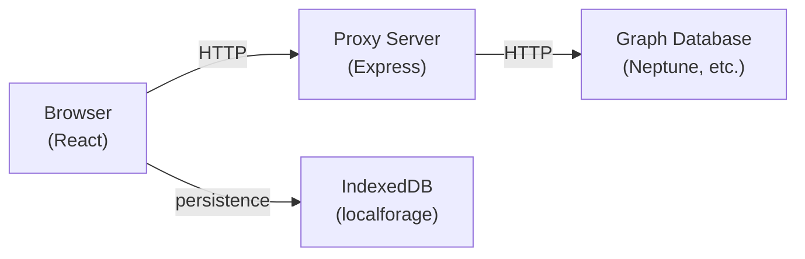

# Architecture

Graph Explorer is a client-heavy web application with a thin backend proxy. The browser does most of the work — constructing queries, managing state, and rendering the graph — while the server handles request forwarding and signing.

## Supported Graph Data Models and Query Languages

- Labelled Property Graph (PG) using Gremlin or openCypher
- Resource Description Framework (RDF) using SPARQL

## System Overview

The React client constructs queries and sends them through the proxy server using relative URLs, which forwards requests to the graph database. When connecting to Amazon Neptune, the proxy signs requests with AWS SigV4 credentials.

The proxy does not store any user data — all preferences, connections, and query history live in the browser's IndexedDB.

This architecture allows the app to work behind any reverse proxy (SageMaker, custom paths) without build-time configuration, since the client resolves API endpoints relative to its own location. The proxy can run inside a VPC alongside the database while the browser runs outside it.

Because all requests flow through the proxy, the server must have network access to the target database. If the server is in a restricted network (e.g., a private subnet with no NAT gateway), it will not be able to reach databases outside that network even if the user's browser could reach them directly.

## Monorepo Structure

The repository uses pnpm workspaces with two main packages:

- **`packages/graph-explorer`** — The React client. Contains all UI components, state management, and database query logic.
- **`packages/graph-explorer-proxy-server`** — The Express server. Handles request proxying, SigV4 signing, HTTPS termination, and serving the built client assets.

## Key Libraries

| Library                                                   | Role                | Why                                                                           |
| --------------------------------------------------------- | ------------------- | ----------------------------------------------------------------------------- |
| [Cytoscape.js](https://js.cytoscape.org/)                 | Graph rendering     | Mature canvas-based graph library with layout plugins and interaction support |
| [Jotai](https://jotai.org/)                               | Client state        | Atom-based model that avoids unnecessary re-renders in a component-heavy UI   |
| [TanStack Query](https://tanstack.com/query)              | Remote data caching | Handles caching, deduplication, and background refresh for database queries   |
| [localforage](https://localforage.github.io/localForage/) | Persistence         | Provides an async IndexedDB API for storing user data client-side             |

## Connector & Explorer Pattern

Graph Explorer supports three query languages (Gremlin, openCypher, SPARQL) through a connector abstraction. Each query language has an "explorer" that implements a common interface for operations like searching nodes, fetching neighbors, and discovering schema.

The UI code calls the explorer interface without knowing which query language is active. The active connection's query language determines which explorer handles the request. This keeps query-language-specific logic isolated from the rest of the application.
